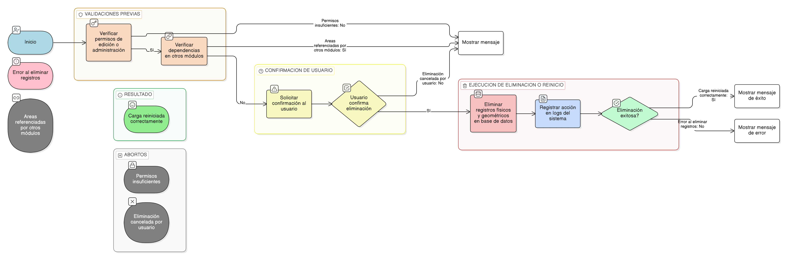

## HU-pigcct-sym-120

> **Identificador Historia de Usuario:** hu-pigcct-sym-120 \
> **Nombre Historia de Usuario:** Módulo de restauración - Eliminar o Reiniciar Carga de Áreas Restauradas.

> **Área Proyecto:** Subdirección de Ecosistemas e Información Ambiental \
> **Nombre proyecto:** Realizar la construcción temática, mejoras informáticas y optimización del Módulo de restauración del SNIF del IDEAM. \
> **Líder funcional:** Wilmer Espitia Muñoz\
> **Analista de requerimiento de TI:** Sergio Alonso Anaya Estévez

## DESCRIPCIÓN HISTORIA DE USUARIO

> **Como:** usuario autenticado.  \
> **Quiero:** eliminar todos los registros de áreas restauradas asociadas a un proyecto.   \
> **Para:** corregir errores de carga, reiniciar la información espacial o reemplazar los datos geográficos de un proyecto.

## CRITERIOS DE ACEPTACIÓN

1. **Proceso de Eliminación y Reinicio**    
    1.1.	El sistema debe solicitar confirmación antes de ejecutar la eliminación (modal de confirmación) para evitar la pérdida accidental de datos.     
    1.2.	La operación debe eliminar los registros físicos y geométricos relacionados con el proyecto en la tabla area\_restaurada.   
    1.3.	La eliminación debe realizarse solo si el área no está siendo referenciada por otros módulos del sistema (Validación de Dependencias, ver [HU-105](../HU-pigcct-sym-105/HU-pigcct-sym-105.md) Criterio 4.3 para la eliminación lógica individual). Si no hay dependencias, se realiza la eliminación física completa.     
    1.4.	Si la eliminación (o "Reinicio de Carga") es exitosa, el sistema debe mostrar el mensaje informativo: “Carga reiniciada correctamente”.     
    1.5.	Si ocurre un error durante la eliminación de los registros (Ej: falla en la base de datos), el sistema debe mostrar el mensaje: “Error al eliminar registros”.
2. **Trazabilidad y Seguridad**     
    2.1.	Toda acción de eliminación debe registrarse en logs (log\_sistema) con: usuario, hora, id\_proyecto y la acción (Ej: REINICIO\_CARGA\_AREAS).   
    2.2.	El usuario debe contar con los permisos de edición/administración para el proyecto antes de ejecutar esta funcionalidad.

## DIAGRAMA DE SECUENCIA

## DIAGRAMA DE FLUJO DEL PROCESO

## ANEXOS

- Esquema de eliminación en cascada o validación de dependencias para la tabla area\_restaurada.

