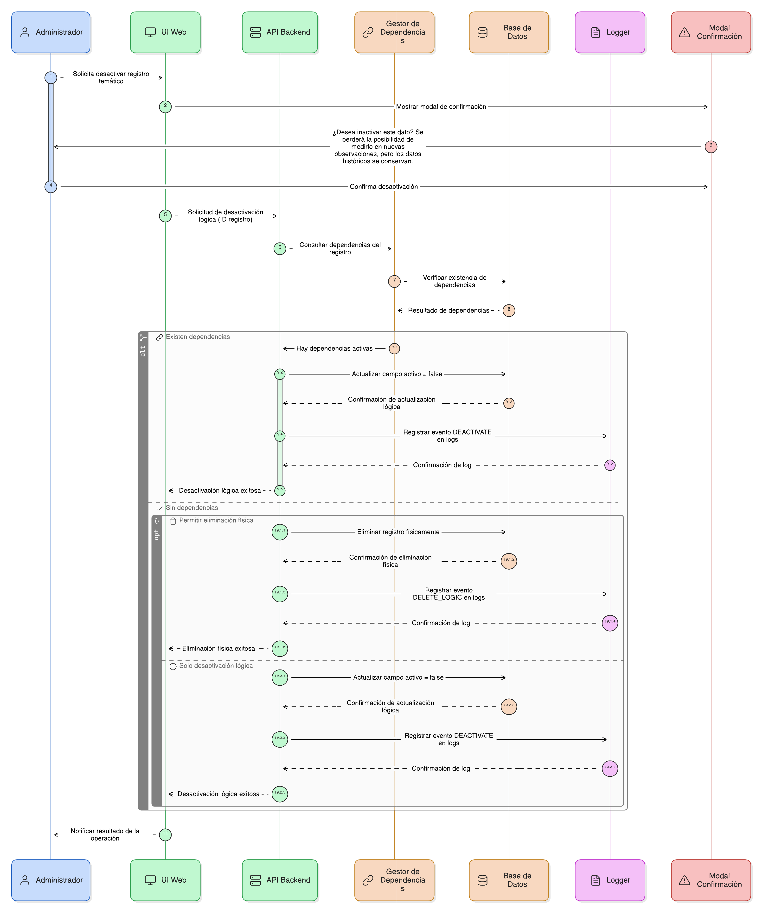
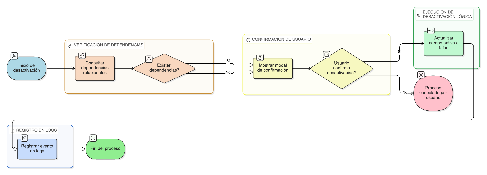

# HU-PIGCCT-SYM-122  
## Épica: Gestión de eventos y validación de información del PIGCCT  
### Validar evento por la entidad

---

## DESCRIPCIÓN HISTORIA DE USUARIO

> **Como:** usuario validador de entidad.  
> **Quiero:** poder validar o rechazar eventos enviados a revisión.  
> **Para:** aprobar la información registrada y garantizar su calidad antes de que sea revisada por la CAR.

---

## CRITERIOS DE ACEPTACIÓN

### 1. Acceso a la funcionalidad de validación
1.1 El sistema debe permitir el acceso a la funcionalidad de validación únicamente a usuarios con rol de **"validador de entidad"**.  
1.2 La opción de validación debe estar disponible desde un módulo específico de validación o gestión de eventos.  
1.3 El validador debe poder ver todos los eventos que están en estado **"en validación por entidad"**.

### 2. Visualización de eventos pendientes de validación
2.1 El sistema debe mostrar una lista de eventos pendientes de validación por la entidad, con información relevante:
- Identificador del evento
- Tipo de afectación (create/update)
- Tabla y objeto afectado
- Usuario que creó el registro
- Usuario que envió a validación
- Fecha de envío
- Estado actual

2.2 La lista debe ser filtrable y ordenable por diferentes criterios (fecha, usuario, tabla, etc.).

### 3. Revisión detallada del evento
3.1 El validador debe poder seleccionar un evento para ver su información completa.  
3.2 El sistema debe mostrar claramente:
- **Para eventos tipo create**: El contenido completo del registro nuevo (valor_nuevo).
- **Para eventos tipo update**: Una comparación lado a lado o resaltada de valor_anterior vs valor_nuevo.

3.3 El sistema debe mostrar el contexto del registro (por ejemplo, si es un indicador_accion, mostrar información de la acción asociada).

### 4. Opciones de validación
4.1 El validador debe tener dos opciones principales:
- **Aprobar** el evento
- **Rechazar** el evento

4.2 Ambas opciones deben requerir confirmación antes de ejecutarse.

### 5. Proceso de aprobación
5.1 Al aprobar un evento, el sistema debe actualizar los siguientes campos:
- **validado_por_entidad**: Establecer en **true**.
- **fch_validacion_entidad**: Fecha y hora de la validación.
- **estado_registro**: Cambiar a **"validado por entidad - pendiente CAR"** o estado equivalente.

5.2 El validador puede opcionalmente agregar un comentario de aprobación en el campo **observacion**.

5.3 El sistema debe aplicar los cambios del evento al registro principal si no se habían aplicado aún, o marcar el registro como "validado por entidad".

### 6. Registro de observaciones
6.1 El sistema debe permitir al validador registrar observaciones tanto al aprobar como al rechazar.  
7.2 Las observaciones deben almacenarse en el campo **observacion** de la tabla evento.  
7.3 Las observaciones deben ser visibles para:
- El usuario que creó el registro
- El validador de la CAR (si el evento es posteriormente enviado a validación CAR)
- Otros validadores con permisos apropiados

### 8. Validación de permisos
8.1 El sistema debe validar que el usuario validador tenga permisos para validar eventos de la entidad específica del registro.  
8.2 Un validador de una entidad **no debe poder validar** eventos de otra entidad.

### 8. Notificaciones
8.1 Al aprobar o rechazar un evento, el sistema debe generar notificaciones:
- **Al usuario creador**: informando sobre la decisión de validación.
- **Al validador CAR** (solo si fue aprobado): notificando que hay un nuevo evento pendiente de validación CAR.

### 9. Trazabilidad
9.1 El sistema debe registrar en logs:
- Usuario validador
- Acción realizada (aprobar/rechazar)
- Fecha y hora
- Identificador del evento
- Observaciones registradas

### 10. Restricciones
10.1 El sistema **no debe permitir** validar eventos que ya hayan sido validados previamente por la entidad.  
10.2 El sistema **no debe permitir** validar eventos que no hayan sido enviados formalmente a validación.  
10.3 Solo eventos en estado **"en validación por entidad"** deben ser validables.

### 11. Validación masiva
11.1 Opcionalmente, el sistema puede permitir seleccionar múltiples eventos y aprobarlos en una sola operación (útil para registros similares o repetitivos).  
11.2 El rechazo masivo debe requerir una observación general aplicable a todos los eventos seleccionados.

---

### Resultado esperado

Un **evento validado correctamente** por el validador de entidad, con los campos validado_por_entidad, fch_validacion_entidad, estado_registro y observacion actualizados apropiadamente, generando notificaciones correspondientes y avanzando el flujo de validación.

---

## DIAGRAMA DE SECUENCIA

## DIAGRAMA DE FLUJO DEL PROCESO

