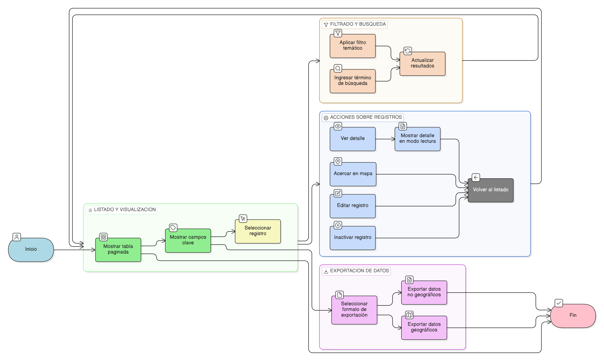

## HU-pigcct-sym-123

> **Identificador Historia de Usuario:** hu-pigcct-sym-123 \
> **Nombre Historia de Usuario:** Módulo de restauración - Listado, Visualización y Exportación de Registros Temáticos.

> **Área Proyecto:** Subdirección de Ecosistemas e Información Ambiental \
> **Nombre proyecto:** Realizar la construcción temática, mejoras informáticas y optimización del Módulo de restauración del SNIF del IDEAM. \
> **Líder funcional:** Wilmer Espitia Muñoz\
> **Analista de requerimiento de TI:** Sergio Alonso Anaya Estévez

## DESCRIPCIÓN HISTORIA DE USUARIO

> **Como:** : usuario del sistema.     \
> **Quiero:** ver un listado paginado de los elementos temáticos (proyectos, áreas) con sus campos clave y opciones de acción.     \
> **Para:** consultar rápidamente el alcance de la información y poder exportar los datos en los formatos requeridos.

## CRITERIOS DE ACEPTACIÓN

1.	**Visualización en Tabla**  
        1.1. Se debe mostrar una tabla paginada que liste los registros de un elemento temático (Ej: Proyectos o Áreas).      
        1.2. La tabla debe mostrar campos mínimos que permitan identificar el registro rápidamente.

2.	**Funcionalidades de Acción**   
    2.1. La tabla debe incluir columnas de acciones con al menos las siguientes opciones (dependiendo del elemento):    
    - **Ver** (Para mostrar el detalle).    
    - **Acercar** en el mapa (Para geolocalizar el elemento, si aplica).    
    - **Editar** (Ver [HU-107](../HU-pigcct-sym-107/HU-pigcct-sym-107.md)).   
    - **Inactivar** (Ver [HU-108](../HU-pigcct-sym-108/HU-pigcct-sym-108.md)).

3.	**Filtrado y Búsqueda**     
        3.1. Se debe permitir el filtrado por campos temáticos para refinar los resultados (Ej: Filtrar Proyectos por "Estado" o Áreas por "Municipio").

4.	**Detalle del Registro**    
        4.1. Al hacer clic en la acción “Ver”, el sistema debe mostrar el detalle completo de la información del registro, cargando su formulario de origen en modo lectura.

 5.	**Exportación de Datos**    
    5.1. La tabla debe soportar la funcionalidad de exportación en diferentes formatos:
    - Formatos NO GEOGRÁFICOS (CSV, XLSX, PDF) para la información tabular/atributiva.  
    - Formatos GEOGRÁFICOS (Shapefile, GeoJSON, KML) solo para elementos que contengan geometría asociada (Ej: Áreas de Restauración).
    

## DIAGRAMA DE SECUENCIA

## DIAGRAMA DE FLUJO DEL PROCESO

## ANEXOSs

- Protocolo de conversión de geometría a formatos de exportación (Shapefile/GeoJSON).
