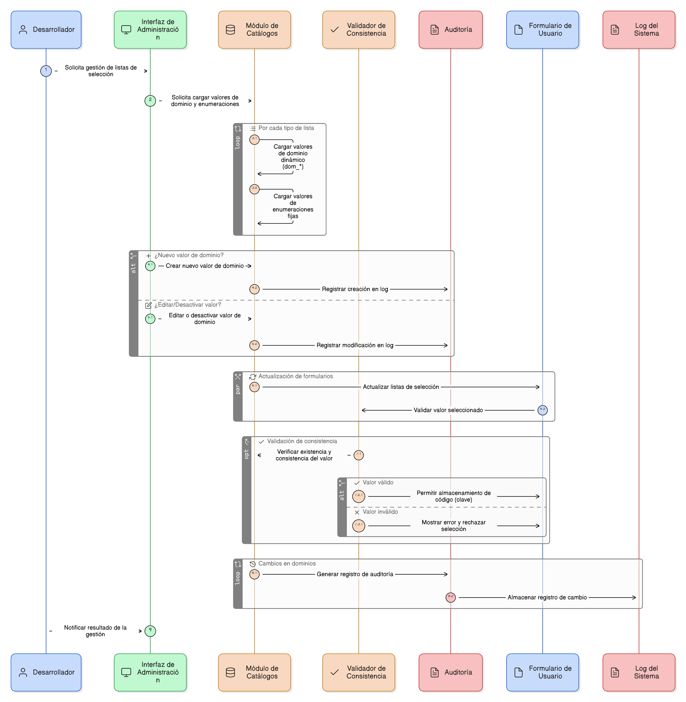
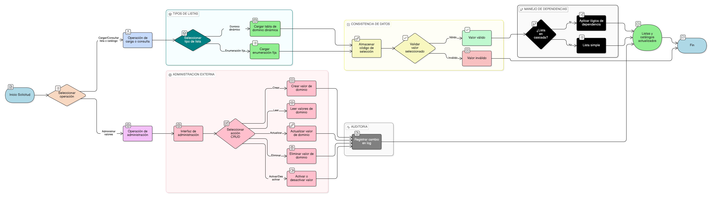

## HU-pigcct-sym-124

> **Identificador Historia de Usuario:** hu-pigcct-sym-124 \
> **Nombre Historia de Usuario:** Módulo de restauración - Gestión integral de dominios y catálogos

> **Área Proyecto:** Subdirección de Ecosistemas e Información Ambiental \
> **Nombre proyecto:** Realizar la construcción temática, mejoras informáticas y optimización del Módulo de restauración del SNIF del IDEAM. \
> **Líder funcional:** Wilmer Espitia Muñoz\
> **Analista de requerimiento de TI:** Sergio Alonso Anaya Estévez

## DESCRIPCIÓN HISTORIA DE USUARIO

> **Como:** desarrollador del sistema. \
> **Quiero:**  implementar una infraestructura centralizada para la gestión de todas las listas de selección y catálogos de datos.   \
> **Para:** asegurar la consistencia, la validez, la trazabilidad y la actualidad de las opciones disponibles en todos los formularios del sistema.

## CRITERIOS DE ACEPTACIÓN

1. **Soporte de Tipos de Listas**  
   1.1 El sistema debe soportar la carga de valores de Tablas de Dominio Dinámicas (dom_*) y de Enumeraciones Fijas.  

2. **Consistencia de Datos**  
   2.1 Todos los campos de selección deben almacenar el código (clave) y no el texto visible.    
   2.2. Se deben aplicar validaciones para asegurar que el valor seleccionado exista y sea consistente.  

3. **Manejo de Dependencias**  
   3.1. Se debe implementar la lógica para gestionar la dependencia jerárquica entre listas (listas en cascada).
   
4. **Administración Externa**  
   4.1 Debe existir una interfaz de administración para gestionar (CRUD y Activar/Desactivar) los valores de dominio sin requerir cambios de código. 

5. **Auditoría**  
   5.1 Todos los cambios en los dominios deben generar un registro en el log del sistema.

## DIAGRAMA DE SECUENCIA

## DIAGRAMA DE FLUJO DEL PROCESO

## ANEXOS

- Listado de dominios.
