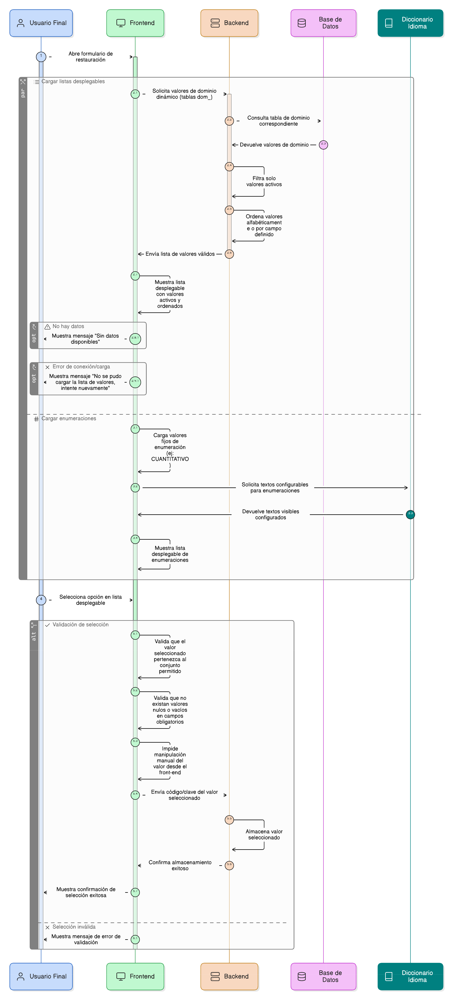
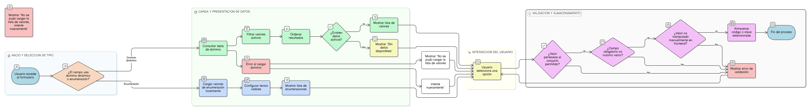

## HU-pigcct-sym-125

> **Identificador Historia de Usuario:** hu-pigcct-sym-125 \
> **Nombre Historia de Usuario:** Módulo de restauración - Carga y consumo de valores de dominio dinámico y enumeraciones

> **Área Proyecto:** Subdirección de Ecosistemas e Información Ambiental \
> **Nombre proyecto:** Realizar la construcción temática, mejoras informáticas y optimización del Módulo de restauración del SNIF del IDEAM. \
> **Líder funcional:** Wilmer Espitia Muñoz\
> **Analista de requerimiento de TI:** Sergio Alonso Anaya Estévez

## DESCRIPCIÓN HISTORIA DE USUARIO

> **Como:** usuario final. \
> **Quiero:** ver listas desplegables en los formularios que me muestren opciones actualizadas y válidas.  \
> **Para:** poder seleccionar la opción correcta de manera rápida y sin errores de digitación.

## CRITERIOS DE ACEPTACIÓN

1. **Carga de Dominios Dinámicos (Tablas dom_)**  
   1.1 El sistema debe consultar la tabla de dominio correspondiente al cargar el formulario.    
   1.2. Filtro de Activo: Solo deben mostrarse valores con estado activo = true.   
   1.3. Ordenamiento: Los valores deben cargarse en orden alfabético o según el campo orden definido.     
   1.4. Almacenamiento: El valor seleccionado debe almacenarse con el código/clave del dominio.    
   1.5. UX en Falla: Si no hay datos, mostrar “Sin datos disponibles”. En caso de error de conexión/carga mostrar “No se pudo cargar la lista de valores, intente nuevamente”.

2. **Carga de Valores Fijos (Enumeraciones)**  
   2.1 Los valores de enumeración (Ej: CUANTITATIVO) deben cargarse directamente sin requerir conexión a la base de datos.    
   2.2. Configuración: Los textos visibles deben poder configurarse (mediante archivo de idioma o diccionario).

3. **Validación y Seguridad**  
   3.1. Validar que el valor seleccionado pertenezca al conjunto permitido (tanto en tablas de dominio como en enumeraciones).    
   3.2. Validar que no existan valores nulos o vacíos en campos obligatorios.    
   3.3. El sistema debe impedir la manipulación manual del valor (value) desde el front-end antes de ser enviado.
   

## DIAGRAMA DE SECUENCIA

## DIAGRAMA DE FLUJO DEL PROCESO

## ANEXOS

- Protocolo API de consulta genérica para tablas de dominio (filtrado por activo y orden).
