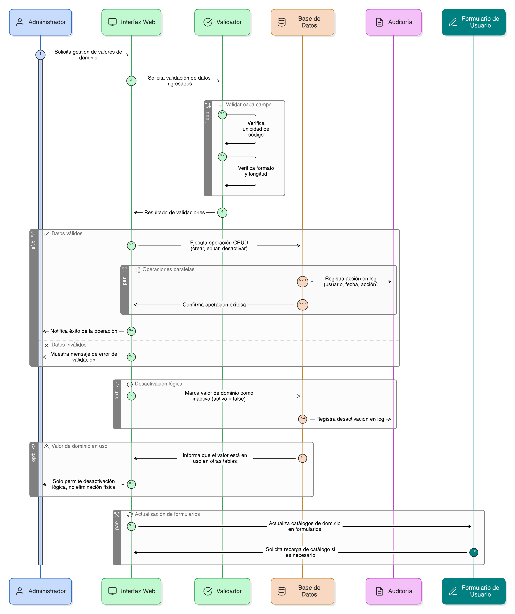

## HU-pigcct-sym-126

> **Identificador Historia de Usuario:** hu-pigcct-sym-126 \
> **Nombre Historia de Usuario:** Módulo de restauración - Administración (CRUD) y auditoría de tablas de dominio

> **Área Proyecto:** Subdirección de Ecosistemas e Información Ambiental \
> **Nombre proyecto:** Realizar la construcción temática, mejoras informáticas y optimización del Módulo de restauración del SNIF del IDEAM. \
> **Líder funcional:** Wilmer Espitia Muñoz\
> **Analista de requerimiento de TI:** Sergio Alonso Anaya Estévez

## DESCRIPCIÓN HISTORIA DE USUARIO

> **Como:** administrador del sistema.  \
> **Quiero:** tener una interfaz para agregar, editar o desactivar valores de las tablas de dominio (dom_*).  \
> **Para:** mantener los catálogos de datos actualizados sin necesidad de intervención de código y asegurar la trazabilidad de los cambios.

## CRITERIOS DE ACEPTACIÓN

1. **Interfaz de Administración**  
   1.1 El sistema debe proveer una interfaz que permita las operaciones CRUD (Crear, Consultar, Editar, Desactivar) sobre los valores de dominio.     
   1.2. Los formularios de dominio deben reflejar el cambio en los formularios que usan ese dominio de inmediato o tras recargar la página.

2. **Validaciones de Administración**  
   2.1 Unicidad: Validar la unicidad de códigos de dominio (clave).    
   2.2. Formato: Validar la longitud y tipo de datos de los valores ingresados.     
   2.3. Integridad Referencial: No se permite la eliminación física de valores que estén en uso en otras tablas (sólo la desactivación lógica).

3. **Gestión de Uso y Actividad**  
   3.1. El sistema debe permitir desactivar (activo = false) un valor de dominio.   
   3.2. Si un valor se desactiva y está siendo usado en registros existentes, el sistema debe permitir que el registro siga mostrando el valor, pero debe impedir su selección en nuevos formularios o registros.

4. **Auditoría (Log)**  
   4.1. Cada cambio (creación, modificación, desactivación) debe registrarse en el log del sistema (ver HU-083) con el usuario, fecha y acción correspondiente.

## DIAGRAMA DE SECUENCIA

## DIAGRAMA DE FLUJO DEL PROCESO

## PROTOTIPO PRELIMINAR

## ANEXOS

- Requerimiento de roles y permisos para acceder a la interfaz de administración de dominios.
