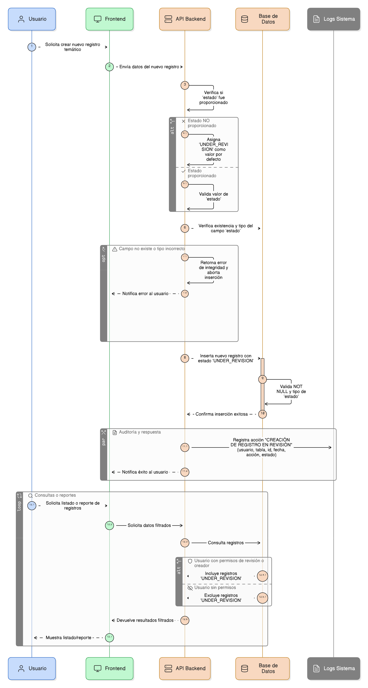
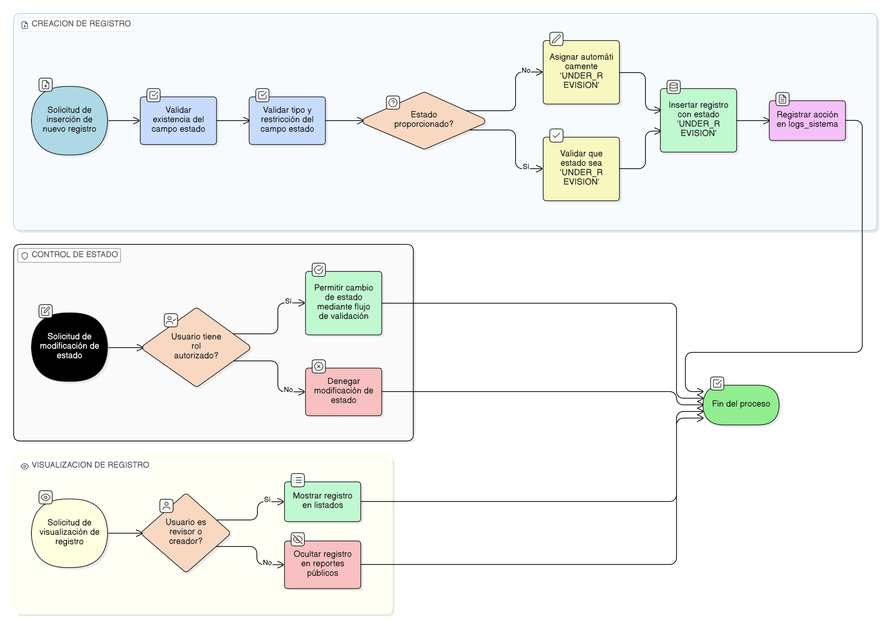

# HU-PIGCCT-SYM-128  
## Épica: Gestión de eventos y validación de información del PIGCCT  
### Comparar valor anterior y nuevo

---

## DESCRIPCIÓN HISTORIA DE USUARIO

> **Como:** usuario validador (de entidad o CAR).  
> **Quiero:** ver claramente los valores anteriores y nuevos de un registro cuando reviso un evento tipo update.  
> **Para:** evaluar el impacto del cambio propuesto y tomar una decisión informada sobre su aprobación o rechazo.

---

## CRITERIOS DE ACEPTACIÓN

### 1. Identificación de eventos tipo update
1.1 El sistema debe identificar eventos con **tipo_afectacion_enm = "update"**.  
1.2 Para estos eventos, debe estar disponible la funcionalidad de comparación de valores.  
1.3 Los eventos tipo "create" no requieren comparación (solo tienen valor_nuevo).

### 2. Acceso a la comparación
2.1 La comparación de valores debe estar disponible desde:
- La lista de eventos pendientes de validación
- El detalle de un evento específico
- El historial de eventos de una acción (HU-127)

2.2 Debe haber un botón o enlace claro como "Comparar cambios", "Ver diferencias" o "Comparar versiones".

### 3. Visualización lado a lado
3.1 El sistema debe mostrar los valores anterior y nuevo en una interfaz de comparación lado a lado:
- **Columna izquierda**: Valor anterior (Before)
- **Columna derecha**: Valor nuevo (After)

3.2 Cada columna debe mostrar claramente su etiqueta correspondiente.

### 4. Resaltado de diferencias
4.1 El sistema debe resaltar visualmente los campos que cambiaron:
- **Campos sin cambios**: Mostrar en color gris o con menor énfasis
- **Campos eliminados**: Resaltar en rojo (solo en valor_anterior)
- **Campos modificados**: Resaltar en amarillo/naranja en ambos lados
- **Campos nuevos**: Resaltar en verde (solo en valor_nuevo)

4.2 El resaltado debe ser suficientemente claro para identificar cambios rápidamente.

### 5. Formato de presentación de valores
5.1 Los valores deben presentarse de manera legible:
- Si el valor es JSON: Formatearlo con indentación apropiada
- Si es texto: Mostrar con saltos de línea preservados
- Si es numérico: Mostrar con formato apropiado (decimales, separadores)
- Si es fecha: Mostrar en formato legible (dd/mm/yyyy hh:mm:ss)
- Si es booleano: Mostrar como "Sí/No" o "Verdadero/Falso"

5.2 Los campos deben mostrarse con sus etiquetas descriptivas, no solo nombres técnicos de base de datos.

### 6. Comparación campo por campo
6.1 El sistema debe mostrar una lista de campos con comparación individual:
```
Campo: Nombre del indicador
Antes: "Indicador de reducción de emisiones"
Después: "Indicador de mitigación de GEI"
```

6.2 Solo los campos que cambiaron deben resaltarse o mostrarse primero.

### 7. Opción de vista unificada
7.1 Además de la vista lado a lado, el sistema puede ofrecer una vista unificada tipo "diff":
```
Campo: Descripción
- Texto original que fue removido
+ Texto nuevo que fue agregado
  Texto que no cambió
```

7.2 Esta vista es útil para cambios en textos largos.

### 8. Manejo de valores complejos
8.1 Si el valor es un objeto JSON complejo, el sistema debe:
- Mostrar la estructura completa colapsable
- Permitir expandir/colapsar secciones
- Resaltar solo las propiedades que cambiaron dentro del objeto

8.2 Debe ser posible navegar la estructura de manera intuitiva.

### 9. Comparación de adjuntos
9.1 Para eventos sobre la tabla **adjuntos**, el sistema debe:
- Mostrar metadatos del archivo (nombre, tamaño, tipo, fecha)
- Si es posible, mostrar vista previa del archivo anterior y nuevo
- Indicar si es un archivo nuevo, actualizado o eliminado

### 10. Contexto del cambio
10.1 Además de los valores, el sistema debe mostrar:
- **Usuario que propuso el cambio**
- **Fecha del cambio**
- **Razón del cambio** (si el usuario proporcionó una justificación)
- **Contexto del registro** (información de la acción padre si aplica)

### 11. Evaluación de impacto
11.1 Para ayudar al validador, el sistema puede mostrar indicadores de impacto:
- **Cambio menor**: Solo ajustes de redacción o formato
- **Cambio moderado**: Modificación de valores numéricos o fechas
- **Cambio mayor**: Cambios estructurales o eliminación de información crítica

11.2 Estos indicadores son referenciales para ayudar en la decisión.

### 12. Acciones desde la comparación
12.1 Desde la vista de comparación, el validador debe poder:
- **Aprobar** el cambio directamente
- **Rechazar** el cambio con observaciones
- **Agregar observaciones** sobre cambios específicos
- **Volver** a la lista de eventos

12.2 Estas acciones deben estar siempre visibles y accesibles.

### 13. Comparación múltiple
13.1 Si un registro tiene múltiples eventos update consecutivos sin validar, el sistema debe permitir:
- Ver la comparación entre el último valor validado y el último cambio propuesto
- Ver cada cambio individual en el historial
- Opción para comparar cualquier dos versiones del historial

### 14. Exportación de comparación
14.1 El validador debe poder exportar la comparación a:
- **PDF**: Para documentación o respaldo
- **HTML**: Para compartir con otros validadores
- **Captura de pantalla**: Funcionalidad integrada

14.2 La exportación debe incluir todos los detalles visibles en pantalla.

### 15. Notación de cambios en campos específicos
15.1 Para campos especialmente críticos, el sistema debe marcarlos como tales:
- Campos obligatorios que cambiaron
- Campos que afectan cálculos o métricas
- Campos con restricciones de validación

15.2 Esto ayuda al validador a enfocar su atención en cambios críticos.

### 16. Comparación responsive
16.1 En dispositivos móviles o pantallas pequeñas, la comparación lado a lado debe adaptarse a:
- Vista vertical (antes arriba, después abajo)
- Navegación por pestañas entre versiones
- Mantener funcionalidad de resaltado

### 17. Performance con valores grandes
17.1 Si los valores anterior o nuevo son muy grandes (ej: documentos largos), el sistema debe:
- Implementar carga progresiva
- Mostrar resumen de cambios primero
- Permitir expandir para ver detalle completo
- Mantener rendimiento fluido

### 18. Validación de integridad
18.1 El sistema debe validar que:
- valor_anterior corresponde al estado real del registro antes del cambio
- valor_nuevo contiene información válida y consistente
- No hay corrupción de datos en ninguno de los valores

18.2 Si detecta inconsistencias, debe alertar al validador.

### 19. Ayuda contextual
19.1 El sistema debe proporcionar tooltips o ayuda contextual explicando:
- Qué significa cada color/resaltado
- Cómo interpretar la comparación
- Qué considerar al validar cambios

---

### Resultado esperado

Una **interfaz de comparación clara e intuitiva** que permita a los validadores ver fácilmente las diferencias entre el valor anterior y el valor nuevo de un registro, con resaltado visual de cambios, información contextual, y acciones integradas para aprobar o rechazar, facilitando la toma de decisiones informadas sobre los cambios propuestos en el PIGCCT.

---

## DIAGRAMA DE SECUENCIA




## DIAGRAMA DE FLUJO DEL PROCESO


