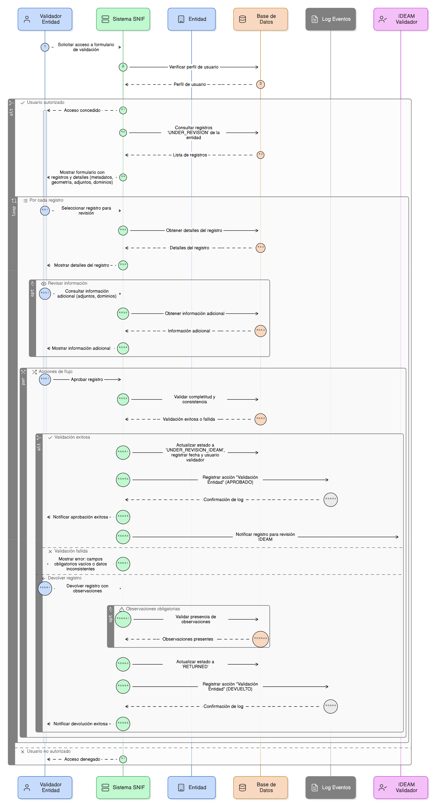
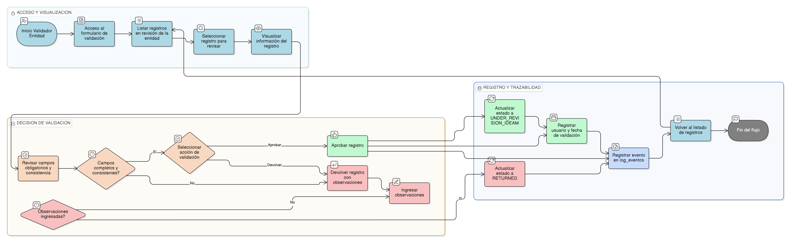

# HU-PIGCCT-SYM-130  
## Épica: Autenticación, gestión de usuarios, y control de acceso del sistema PIGCCT  
### Bloquear usuario por intentos fallidos

---

## DESCRIPCIÓN HISTORIA DE USUARIO

> **Como:** sistema de seguridad.  
> **Quiero:** bloquear el acceso de un usuario tras múltiples intentos fallidos de autenticación.  
> **Para:** prevenir accesos no autorizados mediante ataques de fuerza bruta y proteger las cuentas de usuario.

---

## CRITERIOS DE ACEPTACIÓN

### 1. Configuración de número máximo de intentos
1.1 El sistema debe permitir configurar el **número máximo de intentos fallidos** permitidos antes de bloquear una cuenta.  
1.2 El valor recomendado debe ser entre **3 y 5 intentos**.  
1.3 Este parámetro debe ser configurable por un administrador del sistema sin requerir cambios en el código.

### 2. Contador de intentos fallidos
2.1 El sistema debe mantener un contador de intentos fallidos por usuario.  
2.2 El contador debe incrementarse cada vez que:
- Se proporciona una contraseña incorrecta para un usuario válido
- Se intenta acceder con un usuario que no existe (para prevenir enumeración, pero sin notificarlo)

2.3 El contador debe almacenarse de forma segura en la base de datos.

### 3. Reinicio del contador
3.1 El contador de intentos fallidos debe reiniciarse a cero cuando:
- El usuario inicia sesión exitosamente
- Un administrador desbloquea la cuenta manualmente
- Transcurre el período de bloqueo temporal (si aplica)

3.2 El reinicio debe registrarse en logs de auditoría.

### 4. Bloqueo al superar el límite
4.1 Cuando el número de intentos fallidos alcanza o supera el límite configurado, el sistema debe:
- **Bloquear la cuenta del usuario** inmediatamente
- Actualizar el estado del usuario en Strapi (campo `blocked: true`)
- Registrar fecha y hora del bloqueo
- Registrar razón del bloqueo: "Múltiples intentos fallidos"

4.2 El bloqueo debe aplicarse antes del siguiente intento de inicio de sesión.

### 5. Tipos de bloqueo
5.1 El sistema debe soportar dos tipos de bloqueo configurables:
- **Bloqueo temporal**: La cuenta se desbloquea automáticamente después de un período (ej: 30 minutos, 1 hora)
- **Bloqueo permanente**: La cuenta permanece bloqueada hasta que un administrador la desbloquee manualmente

5.2 El tipo de bloqueo debe ser configurable por el administrador del sistema.

### 6. Mensaje genérico al usuario
6.1 Cuando se bloquea una cuenta, el sistema debe mostrar un **mensaje genérico** al usuario:
```
"Por seguridad, tu cuenta ha sido bloqueada. Por favor, contacta al administrador del sistema."
```

6.2 El mensaje **no debe revelar**:
- Cuántos intentos fallidos se realizaron
- Si la cuenta está bloqueada temporal o permanentemente
- El tiempo restante para desbloqueo (si es temporal)

### 7. Notificación al usuario legítimo
7.1 El sistema debe enviar un **correo electrónico de notificación** al propietario de la cuenta cuando esta sea bloqueada.  
7.2 El correo debe incluir:
- Fecha y hora del bloqueo
- Número de intentos fallidos realizados
- Instrucciones para contactar al administrador si no fue él quien intentó acceder
- Advertencia sobre posible intento de acceso no autorizado

### 8. Notificación a administradores
8.1 El sistema debe notificar a los administradores cuando se bloquea una cuenta.  
8.2 La notificación debe incluir:
- Usuario bloqueado
- Fecha y hora del bloqueo
- Número de intentos fallidos
- Dirección IP de los intentos
- Opción rápida para desbloquear si es necesario

### 9. Desbloqueo manual por administrador
9.1 Solo usuarios con rol de **administrador del sistema** deben poder desbloquear cuentas.  
9.2 El proceso de desbloqueo debe incluir:
- Selección del usuario bloqueado desde un listado
- Confirmación de la acción de desbloqueo
- Opción para agregar comentario o justificación
- Reinicio automático del contador de intentos fallidos

9.3 El desbloqueo debe registrarse en logs de auditoría con información del administrador que lo realizó.

### 10. Desbloqueo automático temporal
10.1 Si se configura bloqueo temporal, el sistema debe:
- Calcular la fecha/hora de desbloqueo automático al momento del bloqueo
- Almacenar esta información en la base de datos
- Verificar si el período ha transcurrido al intentar nuevo inicio de sesión
- Desbloquear automáticamente si el tiempo configurado ya pasó
- Reiniciar el contador de intentos fallidos al desbloquear

### 11. Prevención de enumeración de usuarios
11.1 El sistema debe mostrar el mismo mensaje genérico tanto para:
- Usuarios existentes bloqueados
- Usuarios que no existen

11.2 Esto previene que atacantes identifiquen usuarios válidos del sistema.

### 12. Alertas de seguridad
12.1 Si un usuario experimenta múltiples bloqueos en un período corto (ej: 3 bloqueos en 24 horas), el sistema debe:
- Generar una alerta de seguridad de alta prioridad
- Notificar a los administradores
- Sugerir acciones como: verificar con el usuario, cambio obligatorio de contraseña, revisión de seguridad

### 13. Registro en auditoría
13.1 Todos los eventos relacionados con bloqueos deben registrarse en logs de auditoría:
- Cada intento fallido con timestamp e IP
- Momento del bloqueo con razón
- Desbloqueos (manual o automático)
- Usuario/administrador que realizó el desbloqueo

---

### Resultado esperado

Un **sistema de bloqueo automático** que protege las cuentas de usuario mediante el bloqueo tras múltiples intentos fallidos, con configuración flexible de límites y tipos de bloqueo, notificaciones apropiadas, desbloqueo manual por administradores, y registro completo de auditoría para análisis de seguridad.

---

## DIAGRAMA DE SECUENCIA




## DIAGRAMA DE FLUJO DEL PROCESO


