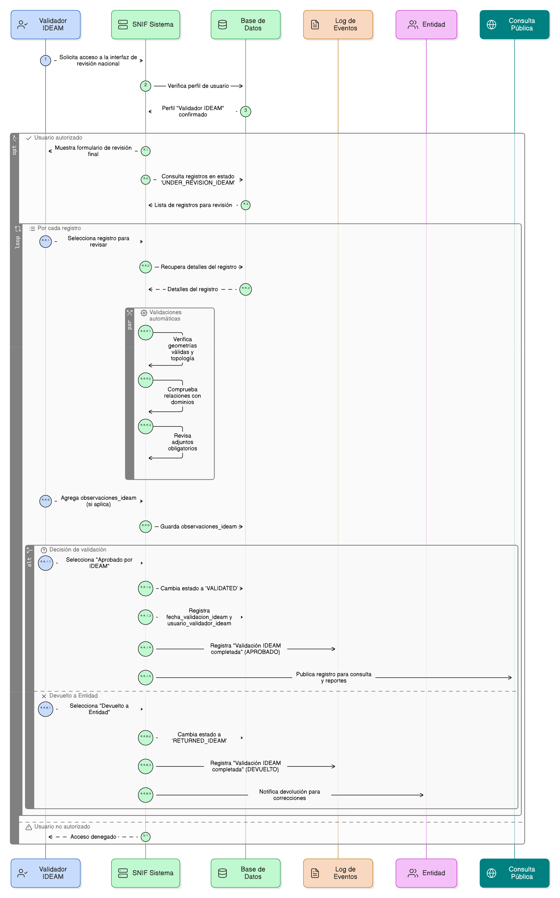
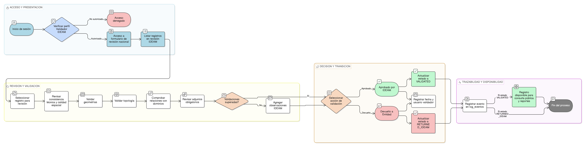

# HU-PIGCCT-SYM-131  
## Épica: Autenticación, gestión de usuarios, y control de acceso del sistema PIGCCT  
### Recuperar contraseña

---

## DESCRIPCIÓN HISTORIA DE USUARIO

> **Como:** usuario del sistema que olvidó su contraseña.  
> **Quiero:** poder recuperar el acceso a mi cuenta.  
> **Para:** restablecer mi contraseña y volver a utilizar el sistema PIGCCT sin necesidad de contactar al administrador.

---

## CRITERIOS DE ACEPTACIÓN

### 1. Acceso a la funcionalidad de recuperación
1.1 El sistema debe proporcionar un enlace visible **"¿Olvidaste tu contraseña?"** en la pantalla de inicio de sesión.  
1.2 Al hacer clic, el usuario debe ser redirigido a un formulario de recuperación de contraseña.  
1.3 La funcionalidad debe estar disponible en todo momento, sin necesidad de autenticación.

### 2. Formulario de solicitud de recuperación
2.1 El formulario debe solicitar únicamente el **correo electrónico** registrado del usuario.  
2.2 El campo de correo debe validar el formato antes de enviar la solicitud.  
2.3 Debe incluir un captcha o mecanismo similar para prevenir abuso automatizado.

### 3. Validación del correo electrónico
3.1 Al enviar el formulario, el sistema debe verificar si el correo electrónico existe en la base de datos.  
3.2 **Importante**: Independientemente de si el correo existe o no, el sistema debe mostrar el mismo mensaje genérico:
```
"Si el correo electrónico está registrado, recibirás un enlace de recuperación en los próximos minutos."
```

3.3 Esto previene la enumeración de usuarios del sistema.

### 4. Generación de enlace seguro
4.1 Si el correo existe, el sistema debe generar un **token único y seguro** de recuperación.  
4.2 El token debe:
- Ser generado aleatoriamente con alta entropía
- Tener una longitud mínima de 32 caracteres
- Ser único (no reutilizable)
- Estar asociado únicamente al usuario solicitante

4.3 El token debe almacenarse en la base de datos con información del usuario y fecha de creación.

### 5. Tiempo de expiración del enlace
5.1 El enlace de recuperación debe tener un **tiempo de expiración configurable** (recomendado: 1-2 horas).  
5.2 La fecha de expiración debe calcularse al momento de generar el token.  
5.3 Después de expirar, el enlace no debe ser válido y el usuario debe solicitar uno nuevo.

### 6. Enlace de un solo uso
6.1 El token de recuperación debe ser válido para **un solo uso**.  
6.2 Una vez que el usuario restablezca su contraseña exitosamente, el token debe invalidarse.  
6.3 Si el token ya fue usado, debe mostrarse mensaje: "Este enlace ya fue utilizado. Solicita uno nuevo si es necesario."

### 7. Envío de correo electrónico
7.1 El sistema debe enviar un correo electrónico al usuario con:
- Asunto claro: "Recuperación de contraseña - Sistema PIGCCT"
- Mensaje indicando que se solicitó recuperación de contraseña
- **Enlace seguro de recuperación** con el token embebido
- Tiempo de validez del enlace
- Advertencia de seguridad si el usuario no solicitó esto
- Instrucciones claras de qué hacer

7.2 El correo debe enviarse desde una dirección institucional oficial verificada.

### 8. Verificación del token
8.1 Al acceder al enlace, el sistema debe verificar:
- El token es válido y existe en la base de datos
- El token no ha expirado (comparar fecha actual vs fecha de expiración)
- El token no ha sido usado previamente

8.2 Si alguna validación falla, mostrar mensaje apropiado y opción para solicitar nuevo enlace.

### 9. Contenido del correo electrónico
9.1 El correo debe incluir:
```
Hola [Nombre Usuario],

Recibimos una solicitud para restablecer la contraseña de tu cuenta en el Sistema PIGCCT.

Para restablecer tu contraseña, haz clic en el siguiente enlace:

[ENLACE DE RECUPERACIÓN]

Este enlace es válido por 2 horas y solo puede usarse una vez.

Si no solicitaste este cambio, ignora este correo y tu contraseña permanecerá sin cambios. 
Por seguridad, te recomendamos cambiar tu contraseña si sospechas que alguien más intentó acceder a tu cuenta.

Equipo PIGCCT
```

### 10. Registro de auditoría
10.1 Cada solicitud de recuperación debe registrarse en logs de auditoría con:
- Correo electrónico solicitante
- Fecha y hora de solicitud
- Dirección IP de origen
- Si el correo existe o no (solo en logs, no al usuario)
- Token generado (hasheado en logs)

10.2 Los eventos de recuperación exitosa también deben registrarse.

### 11. Seguridad del proceso
11.1 Todo el proceso debe ejecutarse sobre **HTTPS**.  
11.2 El token nunca debe transmitirse en texto plano excepto en el enlace del correo.  
11.3 El sistema debe prevenir ataques de timing para detectar usuarios válidos.

### 12. Notificación de cambio exitoso
12.1 Después de restablecer exitosamente la contraseña, el sistema debe:
- Enviar un correo de confirmación al usuario
- Notificar que la contraseña fue cambiada con fecha y hora
- Sugerir acciones si el usuario no realizó el cambio

### 13. Manejo de usuarios bloqueados
13.1 Si el usuario está bloqueado (ver HU-130), el proceso de recuperación debe:
- No revelar que la cuenta está bloqueada
- Mostrar el mismo mensaje genérico
- No enviar correo de recuperación
- Registrar el intento en logs de seguridad

### 14. Integración con Strapi
14.1 El sistema debe utilizar la funcionalidad de recuperación de contraseña de Strapi:
```
POST /api/auth/forgot-password
Body: { "email": "usuario@example.com" }
```

14.2 Debe manejar apropiadamente las respuestas y errores de Strapi.

---

### Resultado esperado

Un **proceso seguro de recuperación de contraseña** que permite a usuarios solicitar restablecimiento mediante correo electrónico registrado, genera enlaces seguros de un solo uso con tiempo de expiración, envía instrucciones claras por correo, previene enumeración de usuarios y abuso del sistema, y registra todas las acciones para auditoría.

---

## DIAGRAMA DE SECUENCIA




## DIAGRAMA DE FLUJO DEL PROCESO




## PROTOTIPO PRELIMINAR


