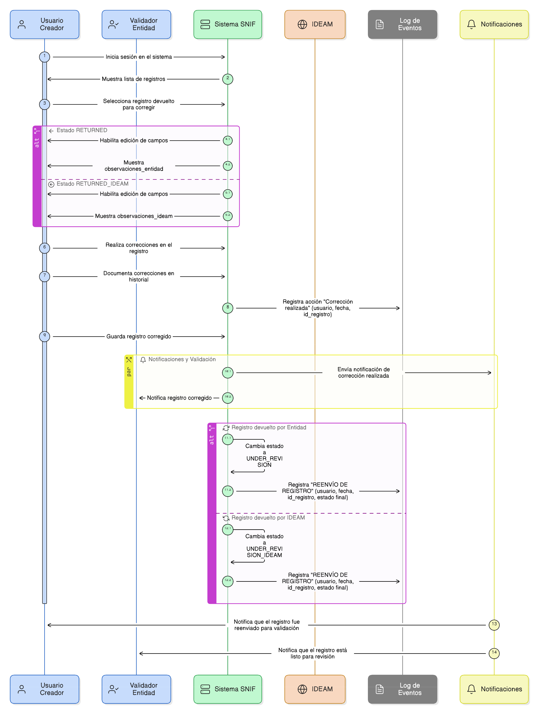
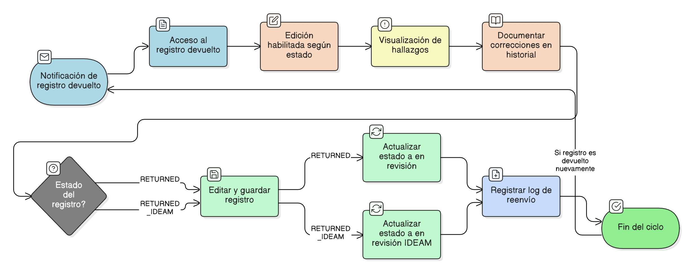

# HU-PIGCCT-SYM-132  
## Épica: Autenticación, gestión de usuarios, y control de acceso del sistema PIGCCT  
### Restablecer contraseña

---

## DESCRIPCIÓN HISTORIA DE USUARIO

> **Como:** usuario que recibió un enlace de recuperación de contraseña.  
> **Quiero:** poder definir una nueva contraseña segura.  
> **Para:** volver a acceder al sistema PIGCCT y proteger mi cuenta con una contraseña actualizada.

---

## CRITERIOS DE ACEPTACIÓN

### 1. Acceso al formulario de restablecimiento
1.1 El usuario debe acceder al formulario mediante el **enlace seguro** recibido por correo electrónico (ver HU-131).  
1.2 El sistema debe validar automáticamente el token incluido en el enlace antes de mostrar el formulario.  
1.3 Si el token es inválido, expirado o ya usado, debe mostrarse mensaje de error con opción para solicitar nuevo enlace.

### 2. Campos del formulario
2.1 El formulario debe solicitar:
- **Nueva contraseña**: Campo de tipo password
- **Confirmar contraseña**: Campo de tipo password para validar coincidencia

2.2 Debe incluir un botón para "Mostrar/Ocultar contraseña" en ambos campos.  
2.3 Debe incluir un indicador visual de la fortaleza de la contraseña en tiempo real.

### 3. Política de contraseñas
3.1 El sistema debe implementar una política de contraseñas que requiera:
- **Longitud mínima**: 8 caracteres (recomendado: 10-12)
- **Al menos una letra mayúscula** (A-Z)
- **Al menos una letra minúscula** (a-z)
- **Al menos un número** (0-9)
- **Al menos un carácter especial** (@, #, $, %, &, *, etc.)

3.2 Los requisitos deben ser configurables por el administrador del sistema.

### 4. Validación de fortaleza de contraseña
4.1 El sistema debe evaluar la fortaleza de la contraseña en tiempo real mientras el usuario escribe.  
4.2 Debe mostrar indicador visual con niveles:
- **Débil** (Rojo): No cumple política mínima
- **Moderada** (Amarillo): Cumple política pero es predecible
- **Fuerte** (Verde): Cumple política y es segura

4.3 El sistema no debe permitir enviar el formulario con contraseña débil.

### 5. Validación de coincidencia
5.1 El sistema debe validar que los campos "Nueva contraseña" y "Confirmar contraseña" sean idénticos.  
5.2 Si no coinciden, mostrar mensaje de error: "Las contraseñas no coinciden".  
5.3 El botón de envío debe estar deshabilitado mientras las contraseñas no coincidan.

### 6. Restricción de contraseñas recientes
6.1 **Opcional**: El sistema puede mantener un historial de las últimas N contraseñas del usuario (recomendado: 3-5).  
6.2 Si se implementa, el sistema debe validar que la nueva contraseña no sea igual a ninguna de las últimas N contraseñas.  
6.3 Mostrar mensaje: "No puedes reutilizar una contraseña reciente. Elige una diferente."

6.4 Las contraseñas en el historial deben almacenarse hasheadas, nunca en texto plano.

### 7. Restricción de contraseñas comunes
7.1 El sistema debe rechazar contraseñas que estén en una lista de contraseñas comunes/débiles (ej: "password123", "12345678", "qwerty", etc.).  
7.2 Mostrar mensaje: "Esta contraseña es demasiado común. Elige una más segura."

### 8. Validación de datos personales
8.1 El sistema debe rechazar contraseñas que contengan:
- Nombre del usuario
- Apellido del usuario
- Correo electrónico del usuario
- Nombre de la entidad

8.2 Mostrar mensaje: "La contraseña no debe contener tu información personal."

### 9. Actualización de contraseña en Strapi
9.1 Al enviar el formulario válido, el sistema debe:
- Utilizar el endpoint de Strapi para restablecer contraseña
- Enviar el token de recuperación y la nueva contraseña
- Validar la respuesta de Strapi

9.2 Endpoint de Strapi:
```
POST /api/auth/reset-password
Body: {
  "code": "[TOKEN]",
  "password": "[NUEVA_CONTRASEÑA]",
  "passwordConfirmation": "[CONFIRMACIÓN]"
}
```

### 10. Hash seguro de la contraseña
10.1 La contraseña debe ser hasheada por Strapi antes de almacenarse en la base de datos.  
10.2 Debe utilizarse el algoritmo de hash de Strapi (bcrypt o similar).  
10.3 La contraseña en texto plano nunca debe almacenarse permanentemente.

### 11. Respuesta exitosa
11.1 Si el restablecimiento es exitoso, el sistema debe:
- Mostrar mensaje de confirmación: "Tu contraseña ha sido actualizada exitosamente"
- Invalidar el token de recuperación usado
- Redirigir automáticamente a la página de inicio de sesión después de 3-5 segundos
- Optar por ofrecer inicio de sesión automático con las nuevas credenciales

### 12. Invalidación de sesiones activas
12.1 Al cambiar la contraseña, el sistema debe invalidar todas las sesiones activas del usuario en otros dispositivos.  
12.2 Los tokens JWT previamente emitidos deben invalidarse o agregarse a una lista negra.  
12.3 Esto garantiza que si alguien tenía acceso no autorizado, lo pierda inmediatamente.

### 13. Notificación por correo
13.1 Después de restablecer exitosamente la contraseña, el sistema debe enviar un correo de confirmación al usuario.  
13.2 El correo debe incluir:
- Confirmación de que la contraseña fue cambiada
- Fecha y hora del cambio
- Dirección IP desde donde se realizó (opcional)
- Advertencia de contactar al administrador si el usuario no realizó el cambio

### 14. Manejo de errores
14.1 El sistema debe manejar apropiadamente diferentes errores:
- **Token expirado**: "Este enlace ha expirado. Solicita uno nuevo."
- **Token inválido**: "Este enlace no es válido. Verifica que lo hayas copiado correctamente."
- **Token ya usado**: "Este enlace ya fue utilizado. Solicita uno nuevo si es necesario."
- **Error del servidor**: "Ocurrió un error. Intenta nuevamente en unos momentos."

14.2 Siempre debe proporcionar un enlace para solicitar nuevo enlace de recuperación.

### 15. Registro en auditoría
15.1 El proceso de restablecimiento debe registrarse en logs de auditoría:
- Usuario que restableció contraseña
- Fecha y hora del restablecimiento
- Dirección IP de origen
- Token utilizado (hasheado)
- Éxito o falla de la operación

### 16. Indicadores visuales de política
16.1 Junto al campo de contraseña, debe mostrarse claramente los requisitos:
```
Tu contraseña debe contener:
✓ Al menos 8 caracteres
✓ Una letra mayúscula
✓ Una letra minúscula
✓ Un número
✓ Un carácter especial
```

16.2 Los requisitos deben marcarse dinámicamente (✓/✗) mientras el usuario escribe.

### 17. Seguridad del formulario
17.1 El formulario debe transmitirse únicamente sobre **HTTPS**.  
17.2 Debe incluir protección CSRF (Cross-Site Request Forgery).  
17.3 Debe validar tanto en el frontend como en el backend.

### 18. Límite de tiempo en el formulario
18.1 Una vez que el usuario accede al formulario, debe tener un tiempo razonable para completarlo (ej: 15 minutos).  
18.2 Si el tiempo se agota, el token debe invalidarse y el usuario debe solicitar uno nuevo.

### 19. Accesibilidad
19.1 El formulario debe ser accesible y cumplir con estándares WCAG.  
19.2 Debe incluir etiquetas apropiadas, mensajes de error claros y navegación por teclado.

---

### Resultado esperado

Un **formulario seguro de restablecimiento de contraseña** que valida políticas de complejidad, previene reutilización de contraseñas recientes, proporciona retroalimentación visual de fortaleza, actualiza la contraseña en Strapi de forma segura, invalida sesiones activas, notifica al usuario por correo, y registra todas las acciones para auditoría.

---

## DIAGRAMA DE SECUENCIA




## DIAGRAMA DE FLUJO DEL PROCESO


