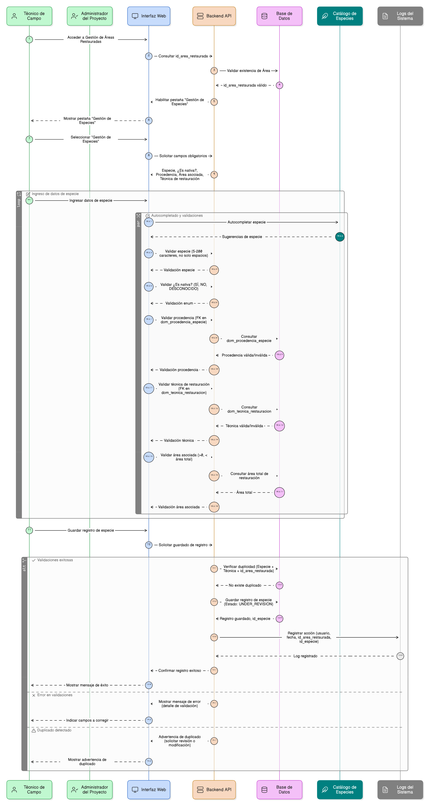
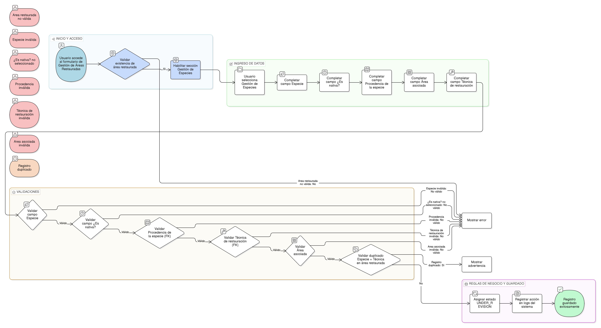

# HU-PIGCCT-SYM-133  
## Épica: Autenticación, gestión de usuarios, y control de acceso del sistema PIGCCT  
### Crear usuario del sistema

---

## DESCRIPCIÓN HISTORIA DE USUARIO

> **Como:** administrador del sistema.  
> **Quiero:** poder crear usuarios del sistema.  
> **Para:** permitir el acceso a las entidades y actores involucrados en la gestión del PIGCCT.

---

## CRITERIOS DE ACEPTACIÓN

### 1. Acceso a la funcionalidad de creación
1.1 Solo usuarios con rol de **administrador del sistema** deben poder acceder a la funcionalidad de crear usuarios.  
1.2 La opción debe estar disponible desde un módulo de **Administración de Usuarios** en el menú principal.  
1.3 El sistema debe validar los permisos antes de mostrar el formulario de creación.

### 2. Formulario de creación de usuario
2.1 El formulario debe incluir los siguientes campos obligatorios:
- **Nombre de usuario**: Único en el sistema, alfanumérico, sin espacios
- **Correo electrónico**: Formato válido, único en el sistema
- **Nombre completo**: Nombre y apellidos del usuario
- **Entidad**: Selección desde catálogo de entidades (ver HU-134)
- **Rol**: Selección de rol(es) asignado(s) (ver HU-135)
- **Información de contacto**: Teléfono, dirección (opcional)
- **Estado**: Activo/Inactivo

2.2 Todos los campos obligatorios deben estar claramente marcados con asterisco (*).

### 3. Validación de nombre de usuario
3.1 El sistema debe validar que el nombre de usuario:
- Sea único (no exista otro usuario con el mismo nombre)
- Tenga longitud mínima de 4 caracteres
- Tenga longitud máxima de 50 caracteres
- Solo contenga letras, números, guiones (-) y guiones bajos (_)
- No contenga espacios ni caracteres especiales
- No sea una palabra reservada del sistema

3.2 Si la validación falla, mostrar mensaje específico del error.

### 4. Validación de correo electrónico
4.1 El sistema debe validar que el correo electrónico:
- Tenga formato válido (contiene @, dominio válido)
- Sea único (no esté registrado en otro usuario)
- Pertenezca a un dominio institucional válido (opcional)

4.2 El correo será utilizado para notificaciones y recuperación de contraseña.

### 5. Generación de contraseña inicial
5.1 Al crear el usuario, el sistema debe:
- **Opción A**: Generar automáticamente una contraseña temporal aleatoria
- **Opción B**: Permitir al administrador definir una contraseña inicial

5.2 Si se genera automáticamente, debe cumplir la política de contraseñas (ver HU-132).

5.3 El sistema debe marcar al usuario con estado **"debe cambiar contraseña en primer inicio de sesión"**.

### 6. Asignación de entidad
6.1 El administrador debe seleccionar la **entidad** a la que pertenece el usuario desde un catálogo.  
6.2 Todo usuario debe estar asociado a una y solo una entidad (ver HU-134).  
6.3 La entidad puede ser:
- Una CAR (Corporación Autónoma Regional)
- Una entidad municipal
- Una entidad departamental
- Otra entidad participante del PIGCCT

### 7. Asignación de rol
7.1 El administrador debe seleccionar uno o más roles para el usuario (ver HU-135).  
7.2 Los roles disponibles deben cargarse desde Strapi.  
7.3 El sistema debe permitir roles múltiples si la política institucional lo permite.  
7.4 Al menos un rol debe ser asignado obligatoriamente.

### 8. Información de contacto
8.1 El formulario debe incluir campos opcionales para:
- Teléfono fijo
- Teléfono móvil
- Dirección física
- Cargo o posición en la entidad

8.2 Esta información facilita la comunicación y coordinación.

### 9. Estado del usuario
9.1 Al crear el usuario, el administrador debe definir el estado inicial:
- **Activo**: El usuario puede iniciar sesión inmediatamente (después del primer cambio de contraseña)
- **Inactivo**: El usuario está creado pero no puede iniciar sesión hasta ser activado

9.2 El estado puede cambiarse posteriormente por el administrador.

### 10. Creación en Strapi
10.1 El sistema debe crear el usuario en Strapi utilizando su API:
```
POST /api/users
Body: {
  "username": "nombre_usuario",
  "email": "correo@entidad.gov.co",
  "password": "[contraseña_generada]",
  "role": [ID_ROL],
  "blocked": false/true,
  "confirmed": false
}
```

10.2 El sistema debe manejar errores de Strapi apropiadamente.

### 11. Almacenamiento de datos adicionales
11.1 Además de crear el usuario en Strapi, el sistema debe almacenar datos complementarios en su propia base de datos:
- Entidad asociada
- Información de contacto
- Fecha de creación
- Administrador que creó el usuario
- Metadata adicional del sistema PIGCCT

11.2 Debe mantenerse sincronización entre Strapi y la base de datos propia.

### 12. Envío de credenciales
12.1 Después de crear el usuario exitosamente, el sistema debe enviar un correo electrónico con:
- Nombre de usuario asignado
- Contraseña temporal (si aplica) o instrucciones para establecer contraseña
- Enlace para primer acceso al sistema
- Instrucciones para cambiar la contraseña
- Información de contacto de soporte

12.2 El correo debe enviarse desde una dirección institucional verificada.

### 13. Confirmación de cuenta
13.1 Opcionalmente, el sistema puede requerir que el usuario confirme su cuenta mediante un enlace de activación.  
13.2 El usuario debe hacer clic en el enlace recibido por correo antes de poder iniciar sesión.  
13.3 El enlace de confirmación debe tener tiempo de expiración (ej: 48 horas).

### 14. Cambio obligatorio de contraseña
14.1 En el primer inicio de sesión, el sistema debe obligar al usuario a cambiar su contraseña temporal.  
14.2 No debe permitir el acceso completo al sistema hasta completar el cambio de contraseña.

### 15. Validación de duplicados
15.1 Antes de crear el usuario, el sistema debe verificar que no existe:
- Otro usuario con el mismo nombre de usuario
- Otro usuario con el mismo correo electrónico
- Inconsistencias en Strapi vs base de datos propia

15.2 Si se detecta duplicado, mostrar mensaje claro y rechazar la creación.

### 16. Mensajes de confirmación
16.1 Al crear exitosamente el usuario, el sistema debe:
- Mostrar mensaje de éxito: "Usuario creado exitosamente"
- Mostrar detalles del usuario creado (nombre, correo, rol, entidad)
- Ofrecer opciones: "Crear otro usuario" o "Ir a lista de usuarios"

### 17. Manejo de errores
17.1 El sistema debe manejar errores comunes:
- Error de conexión con Strapi → "Error al comunicarse con el servidor. Intenta nuevamente."
- Usuario duplicado → "El nombre de usuario o correo ya está registrado."
- Error al enviar correo → "Usuario creado pero no se pudo enviar el correo. Reenviar correo."
- Error de permisos → "No tienes permisos para crear usuarios."

### 18. Auditoría de creación
18.1 El sistema debe registrar en logs de auditoría:
- Administrador que creó el usuario
- Fecha y hora de creación
- Datos del usuario creado (sin contraseña)
- IP desde donde se realizó la creación
- Rol y entidad asignados

### 19. Validación de permisos de entidad
19.1 Opcionalmente, un administrador de entidad puede tener permisos limitados para crear usuarios solo de su entidad.  
19.2 Un administrador del sistema completo puede crear usuarios de cualquier entidad.

### 20. Carga masiva de usuarios
20.1 Opcionalmente, el sistema puede permitir carga masiva de usuarios mediante archivo Excel/CSV.  
20.2 El archivo debe contener todas las columnas obligatorias.  
20.3 El sistema debe validar todos los registros antes de crear usuarios.  
20.4 Debe generar reporte de usuarios creados exitosamente y errores encontrados.

---

### Resultado esperado

Un **usuario creado correctamente** en Strapi y en la base de datos del sistema, con nombre de usuario, correo electrónico, entidad, rol, información de contacto y estado asignados, recibiendo notificación por correo con sus credenciales y con registro completo en auditoría del administrador que lo creó.

---

## DIAGRAMA DE SECUENCIA




## DIAGRAMA DE FLUJO DEL PROCESO


