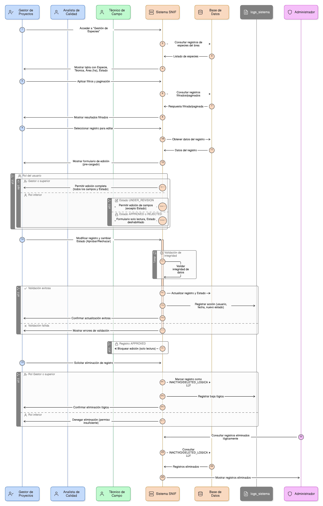
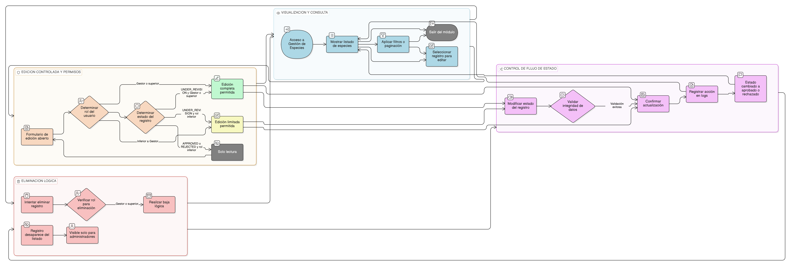

## HU-pigcct-sym-134
> **Identificador Historia de Usuario:** HU-pigcct-sym-134 \
> **Nombre Historia de Usuario:** Módulo de restauración - Gestión, Edición Controlada y Aprobación de Especies

> **Área Proyecto:** Subdirección de Ecosistemas e Información Ambiental \
> **Nombre proyecto:** Realizar la construcción temática, mejoras informáticas y optimización del Módulo de restauración del SNIF del IDEAM. \
> **Líder funcional:** Wilmer Espitia Muñoz\
> **Analista de requerimiento de TI:** Sergio Alonso Anaya Estévez

## DESCRIPCIÓN HISTORIA DE USUARIO

> **Como:** Gestor de Proyectos o Analista de Control de Calidad (con rol superior). \
> **Quiero:** visualizar, editar y cambiar el estado (aprobar/rechazar) de los registros de especies ingresados por los Técnicos de Campo en las Áreas de Restauración. \
> **Para:** asegurar la calidad de los datos y validar que las especies, técnicas y procedencias registradas cumplan con la estrategia de restauración del proyecto.

## CRITERIOS DE ACEPTACIÓN

1. **Visualización y Consulta (Listado)**  
    1.1 Dado que el usuario accede a la pestaña "Gestión de Especies" de un área restaurada, entonces el sistema debe mostrar un listado tabular con todos los registros de especies asociados, incluyendo al menos: Especie, Técnica de restauración, Área asociada (ha), y el Estado actual.  

    1.2 Dado que la lista es extensa, cuando el usuario la consulta, entonces el sistema debe ofrecer opciones de filtrado (por Especie, Técnica, y Estado) y paginación para mejorar el rendimiento y la usabilidad.  
    
    1.3 Dado que el usuario selecciona un registro en el listado, entonces se debe abrir el formulario de edición (el mismo de creación, pero pre-cargado) para modificar la información.

2. **Edición Controlada y Permisos (RN8, CA7)**  
    2.1 Dado que un usuario con rol "Gestor" o superior intenta editar un registro en cualquier estado (UNDER_REVISION, APPROVED, REJECTED), entonces el sistema debe permitirle modificar todos los campos del formulario, incluyendo el Estado. 

    2.2 Dado que un usuario con rol inferior a "Gestor" (e.g., "Técnico") intenta editar un registro, entonces el sistema solo debe permitirle modificar los campos si el Estado actual es UNDER_REVISION.  

    2.3 Dado que un usuario con rol inferior intenta editar un registro cuyo estado es APPROVED o REJECTED, entonces el formulario de edición debe mostrarse en modo solo lectura y los campos de Estado (Aprobar/Rechazar) deben estar deshabilitados.

3. **Control de Flujo (Cambio de Estado)**  
    3.1 Dado que un usuario con rol "Gestor" o superior edita un registro, cuando modifica el Estado a APPROVED o REJECTED, entonces el sistema debe aplicar la validación de integridad de datos completa antes de confirmar la actualización.  

    3.2 Dado que el Estado de un registro cambia (creación, edición, aprobación, rechazo), el sistema debe registrar la acción en los logs_sistema con el usuario, la fecha y el nuevo estado (RN9).  

    3.3 Dado que un registro es APPROVED, entonces el sistema no debe permitir que sea editado por usuarios de rol inferior a "Gestor" (ver CA 2.2 y 2.3).

4. **Eliminación (Baja Lógica)**  
    4.1 Dado que un usuario con rol "Gestor" o superior intenta eliminar un registro de especie, entonces el sistema debe realizar una baja lógica (marcarlo como INACTIVO o DELETED_LOGICALLY) en lugar de eliminarlo físicamente de la base de datos (RN9). El registro debe desaparecer del listado por defecto, pero ser visible para administradores.

## DIAGRAMA DE SECUENCIA

## DIAGRAMA DE FLUJO DEL PROCESO

## ANEXOS

- Wireframe: Gestión, Edición Controlada y Aprobación de Especies.
- [HU-pigcct-sym-133](/content/historias_usuario/HU-pigcct-sym-133/HU-pigcct-sym-133.md) (Creación de Registro de Especie).
- Documento de dominios (dom_procedencia_especie, dom_tecnica_restauracion).
- Definición de Roles y Permisos (Gestor vs. Técnico).

