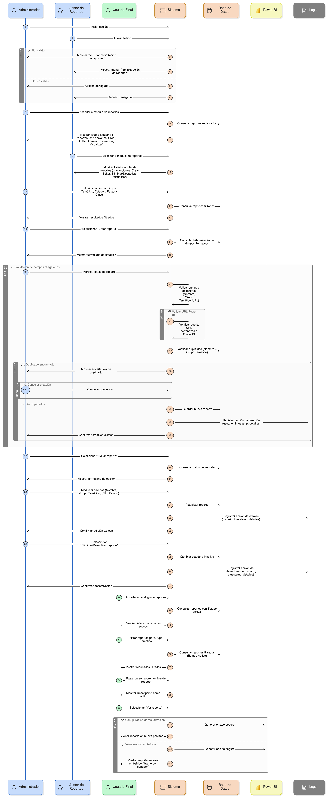
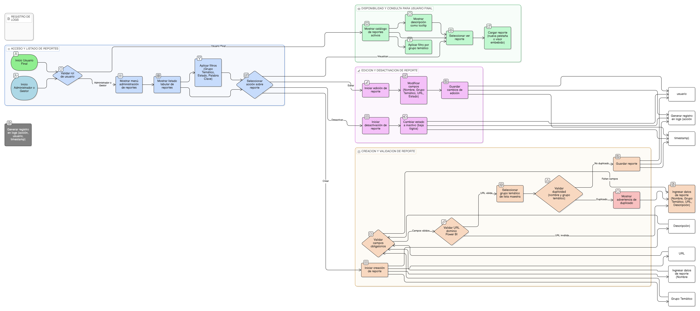

## HU-pigcct-sym-135
> **Identificador Historia de Usuario:** HU-pigcct-sym-135 \
> **Nombre Historia de Usuario:** Módulo de restauración - Administración de Reportes (Creación y Gestión de Reportes de Power BI)

> **Área Proyecto:** Subdirección de Ecosistemas e Información Ambiental \
> **Nombre proyecto:** Realizar la construcción temática, mejoras informáticas y optimización del Módulo de restauración del SNIF del IDEAM. \
> **Líder funcional:** Wilmer Espitia Muñoz\
> **Analista de requerimiento de TI:** Sergio Alonso Anaya Estévez

## DESCRIPCIÓN HISTORIA DE USUARIO

> **Como:** Administrador de la Plataforma o Gestor de Reportes. \
> **Quiero:** registrar, editar y desactivar reportes de Power BI, incluyendo su metadato y vinculación a un Grupo Temático. \
> **Para:** crear un catálogo centralizado y controlado de informes que sea accesible para los usuarios finales de la plataforma, garantizando la trazabilidad y el mantenimiento de los enlaces.

## CRITERIOS DE ACEPTACIÓN

1. **Acceso y Listado (RF-01, RF-06)**  
    1.1 Dado que el usuario accede al sistema, cuando su rol es Administrador o GestorReportes, entonces el sistema debe habilitar el menú "Administración de reportes". 

    1.2 Dado que el usuario accede al módulo, entonces el sistema debe mostrar un listado tabular de todos los reportes registrados, con acciones rápidas para Crear, Editar, Eliminar/Desactivar y Visualizar (RF-01). 

    1.3 Dado que el usuario visualiza el listado, entonces debe poder filtrar los reportes por Grupo Temático, Estado o Palabra Clave (RF-09).

2. **Creación y Validación de Campos (RF-02, RF-05)**  
    2.1 Dado que el Administrador intenta crear un nuevo reporte, cuando la acción es exitosa, entonces el sistema debe haber validado que todos los campos obligatorios (como Nombre, Grupo Temático, Enlace/URL) estén diligenciados correctamente. 

    2.2 Dado que el Administrador ingresa el campo Enlace o URL al informe en Power BI, cuando intenta guardar, entonces el sistema debe validar que la URL sea válida y contenga un enlace asociado al dominio de Power BI (RF-05).  

    2.3 Dado que el Administrador selecciona el campo Grupo temático, cuando lo hace, entonces el valor debe seleccionarse obligatoriamente de la lista maestra proveniente de la tabla dom_grupo_tematico.  
    
    2.4 Dado que el Administrador ingresa la información de un nuevo reporte, cuando intenta guardar uno con el mismo nombre y mismo grupo temático que ya existe, entonces el sistema debe mostrar una advertencia y no permitir la creación del duplicado.

3. **Gestión y Control de Estado (RF-03, RF-04, RF-07)**  
    3.1 Dado que el Administrador modifica un reporte, entonces el sistema debe permitirle editar todos los campos, incluyendo la URL, el Grupo Temático y el Estado (Activo/Inactivo) (RF-03).  
    
    3.2 Dado que el Administrador decide eliminar un reporte, entonces el sistema debe realizar una baja lógica (desactivación o cambio de estado) en lugar de un borrado físico (RF-04).  
    
    3.3 Dado que ocurre cualquier acción de gestión (crear, editar, eliminar/desactivar), entonces el sistema debe generar un registro en los logs del sistema con el detalle de la acción, el usuario responsable y el timestamp (RF-07).

4. **Disponibilidad para Usuario Final (RF-08)**  
    4.1 Dado que un usuario final accede al catálogo de reportes, cuando consulta el listado, entonces solo debe visualizar los reportes cuyo Estado es activo (true).  
    
    4.2 Dado que el usuario final visualiza el catálogo, entonces el sistema debe permitirle filtrar los reportes disponibles por Grupo Temático (RF-08).  
    
    4.3 Dado que el usuario final interactúa con el catálogo, entonces el sistema debe mostrar el campo Descripción como un tooltip o información breve al pasar el cursor sobre el nombre del reporte (RF-10).  
    
    4.4 Dado que el usuario final selecciona "Ver reporte", entonces el sistema debe cargar el informe mediante un enlace directo (abriendo en una nueva pestaña) o incrustándolo en un visor embebido seguro (iframe con sandbox) para su consulta.

## DIAGRAMA DE SECUENCIA

## DIAGRAMA DE FLUJO DEL PROCESO

## ANEXOS

- Wireframe: Administración de Reportes (Creación y Gestión de Reportes de Power BI).
- Documento de dominios (dom_grupo_tematico).
- Especificación de las credenciales y el método de autenticación para Power BI.
- Mapeo de errores de validación a mensajes específicos.

