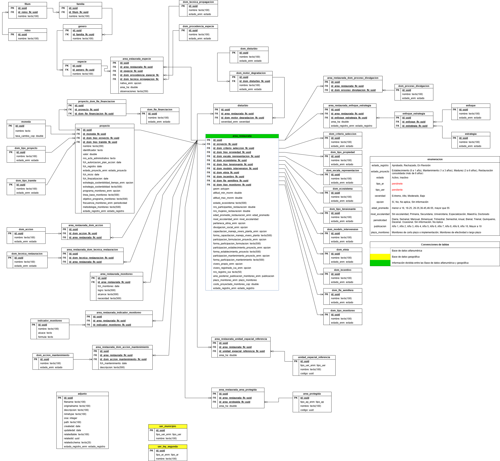

[Inicio](/README.md)

# Estructura de Datos

Este apartado describe los componentes principales que conforman la **estructura de datos del Módulo de Restauración SNIF**, incluyendo el diseño del modelo, el diccionario de datos y los procesos de migración y carga (ETLs).  
Su propósito es garantizar la coherencia, trazabilidad y calidad de la información que alimenta el sistema.

---

## a1. Diseño de Estructuras de Datos

En este subapartado se presenta el **modelo conceptual y lógico** de la base de datos, detallando las entidades, relaciones y reglas de negocio que estructuran la información de restauración.

- **Documento técnico:**
  <a href="https://docs.google.com/document/d/13uFjZgND94pLmRxh7afwYdL-oo65CgV8/edit?usp=drive_link&ouid=113521546771022809165&rtpof=true&sd=true" target="_blank">Resumen técnico Base de Datos SNIF – RESTAURACIÓN</a>

- **Modelo gráfico:**
  

> **Contenido:**
>
> - Estructura general del modelo de datos
> - Relaciones clave entre entidades
> - Principales atributos y restricciones
> - Correspondencia con los módulos funcionales del SNIF

---

## a2. Diccionario de Datos

El **diccionario de datos** documenta cada tabla, campo, tipo de dato y relación del modelo de base de datos.  
Facilita la comprensión técnica y funcional del sistema, promoviendo la interoperabilidad y la correcta implementación de procesos ETL y consultas.

- **Archivo asociado:**
  <a href="https://docs.google.com/spreadsheets/d/1WqL1h0iGXJXNGTfYGeIfhb8ROwuoUugg/edit?usp=drive_link&ouid=113521546771022809165&rtpof=true&sd=true" target="_blank">Diccionario de datos SNIF RESTAURACIÓN</a>

> **Contenido:**
>
> - Listado detallado de tablas y campos
> - Descripción funcional de cada atributo
> - Tipos de datos y reglas de validación
> - Relaciones foráneas y claves primarias

---

## a3. ETLs y Migración de Datos

Este componente aborda los **procesos de extracción, transformación y carga (ETL)** que permiten la integración y migración de información hacia el módulo de restauración.  
Describe las fuentes de datos, los esquemas de transformación y las reglas aplicadas durante la carga.

> **Contenido:**
>
> - Fuentes de datos institucionales y externas
> - Mapeo de campos y validaciones
> - Procesos automatizados de migración
> - Estrategia de control de calidad y auditoría de datos

---

## a4. Lineamientos de Desarrollo para la Base de Datos

Los **lineamientos de desarrollo** definen los criterios técnicos, normativos y de buenas prácticas que deben aplicarse en la creación, mantenimiento y actualización de la base de datos del Módulo de Restauración SNIF.

Estos lineamientos aseguran la consistencia, el rendimiento y la seguridad de la información, facilitando su interoperabilidad con otros sistemas del **IDEAM** y el **SNIF**.

- **Archivo asociado:**
  <a href="https://itim-hub.github.io/wiki_desarrollos/#/content/db/" target="_blank">Lineamientos de desarrollo - bases de datos</a>

> **Contenido:**
>
> - Estructura general de esquemas
> - Convenciones para nombres de tablas y campos
> - Normas de integridad referencial
> - Estándares de documentación y versionamiento

---

> **Nota:**  
> Toda la documentación técnica aquí referenciada forma parte del conjunto de entregables asociados al componente **Arquitectura y Estructura de Datos del SNIF Restauración**.
