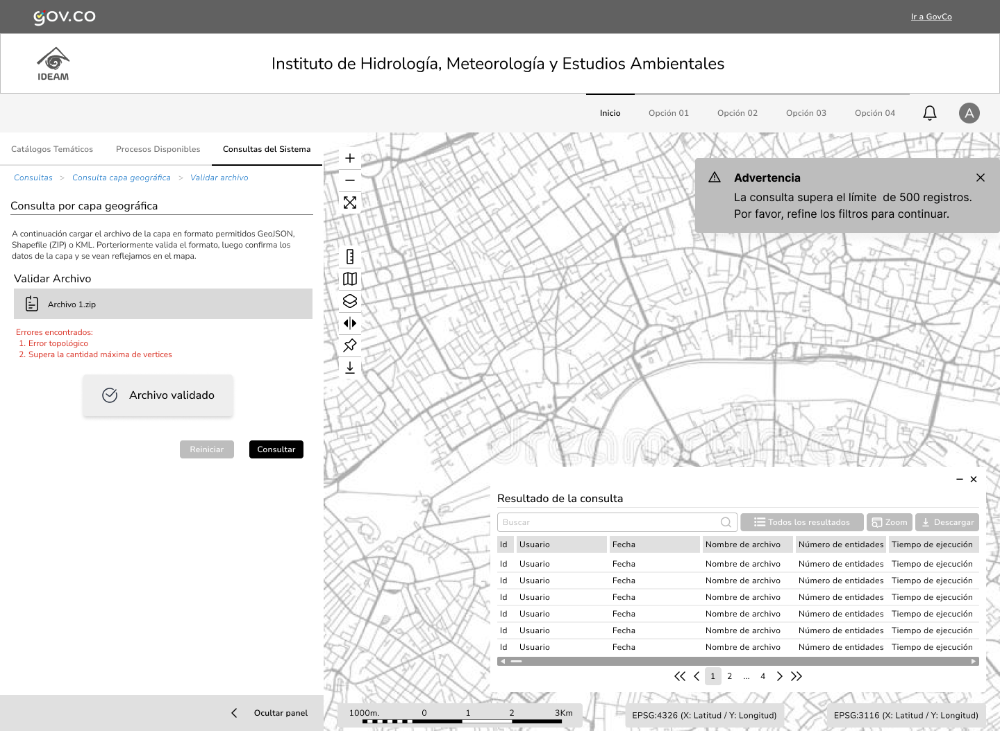

## HU-IDEAM-SNIF-REST-043

> **Identificador Historia de Usuario:** hu-ideam-snif-rest-043 \
> **Nombre Historia de Usuario:** Módulo de restauración - Ejecución de la consulta por capa geográfica

> **Área Proyecto:** Subdirección de Ecosistemas e Información Ambiental \
> **Nombre proyecto:** Realizar la construcción temática, mejoras informáticas y optimización del Módulo de restauración del SNIF del IDEAM. \
> **Líder funcional:** Wilmer Espitia Muñoz\
> **Analista de requerimiento de TI:** Sergio Alonso Anaya Estévez

## DESCRIPCIÓN HISTORIA DE USUARIO

> **Como:** usuario solicitante. \
> **Quiero:**  validar la estructura y topología de la capa cargada. \
> **Para:** evitar errores o sobrecargas durante la ejecución de la consulta.

## CRITERIOS DE ACEPTACIÓN

   1. Permitir seleccionar las capas sobre las cuales aplicar la intersección.
   2. Ejecutar la consulta espacial mediante servicio REST optimizado con índices espaciales.
   3. Limitar resultados a 500 registros con paginación.
   4. Mostrar notificación si se excede el límite.
   5. Registrar en logs: usuario, fecha, nombre de archivo, número de entidades y tiempo de ejecución.

## DIAGRAMA DE SECUENCIA

## DIAGRAMA DE FLUJO DEL PROCESO

## PROTOTIPO PRELIMINAR

## ANEXOS

- Ejemplo de consulta espacial mediante API REST.
- Ejemplo de respuesta en formato GeoJSON.
- Referencia a numeral **Consulta por Capa Geográfica** del visor geográfico.
