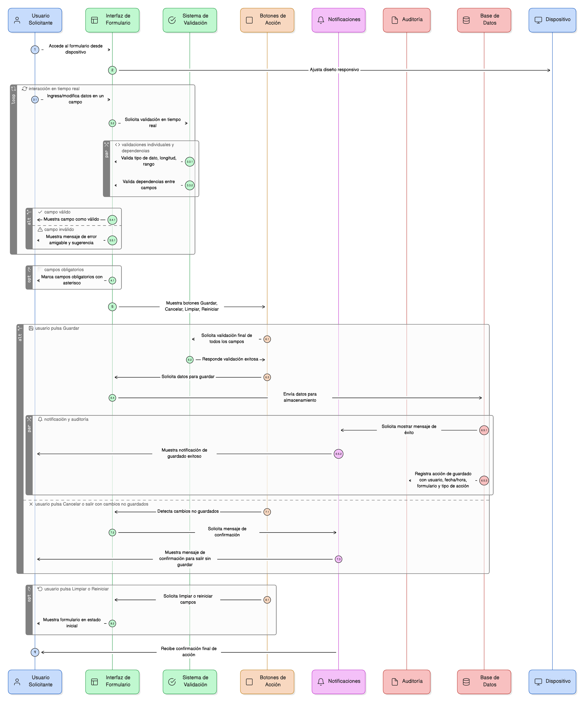
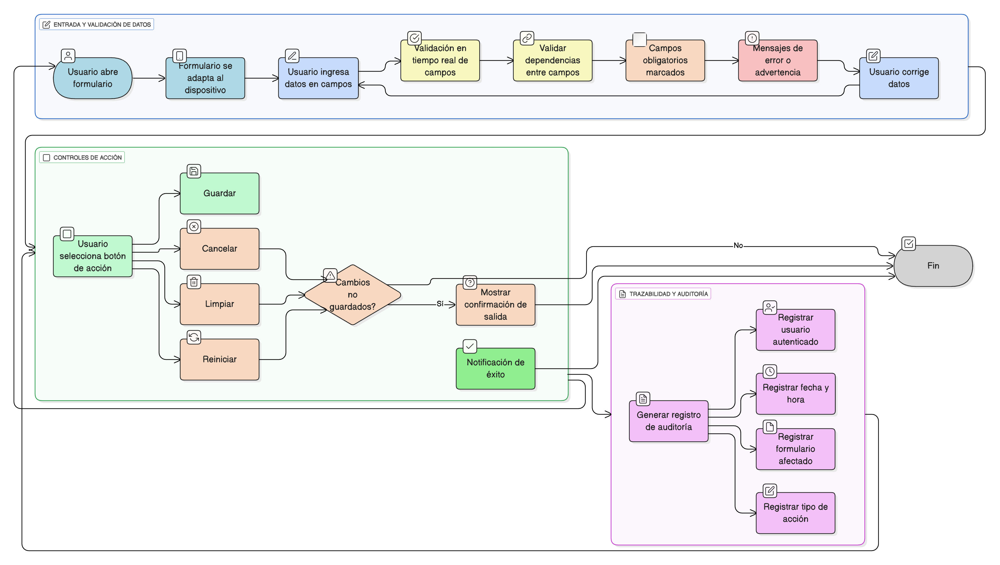

## HU-IDEAM-SNIF-REST-052
> **Identificador Historia de Usuario:** HU-IDEAM-SNIF-REST-052 \
> **Nombre Historia de Usuario:** Módulo de restauración - Estándares de Validación y Trazabilidad

> **Área Proyecto:** Subdirección de Ecosistemas e Información Ambiental \
> **Nombre proyecto:** Realizar la construcción temática, mejoras informáticas y optimización del Módulo de restauración del SNIF del IDEAM. \
> **Líder funcional:** Wilmer Espitia Muñoz\
> **Analista de requerimiento de TI:** Sergio Alonso Anaya Estévez

## DESCRIPCIÓN HISTORIA DE USUARIO

> **Como:** usuario solicitante. \
> **Quiero:** que todos los formularios incluyan validaciones en tiempo real y botones de acción claros. \
> **Para:** garantizar la integridad de los datos, asegurar una experiencia de usuario consistente y permitir la trazabilidad de todos los cambios registrados

## CRITERIOS DE ACEPTACIÓN

1. **Validaciones Generales del Sistema** 
1.1. Todos los formularios deben incluir **validaciones en tiempo** real de los campos individuales (tipos de datos, longitudes, rangos). 1.2. El sistema debe validar **dependencias entre campos** (Ej: el campo B solo puede llenarse si el campo A tiene un valor) antes de permitir el envío del formulario. 1.3. **Los campos obligatorios deben estar claramente marcados** (con asterisco *). 1.4. Los mensajes de error y advertencia deben ser **amigables** y guiar al usuario a corregir el dato.
2. **Controles de Acción (Botones)** 2.1. Los **botones principales de acción** (Guardar, Cancelar, Limpiar, Reiniciar) deben estar visibles y posicionados de forma consistente. 2.2. Al guardar exitosamente, el sistema debe mostrar una **notificación de éxito**. 2.3. Si el usuario intenta salir o cancelar con cambios no guardados, el sistema debe mostrar un **mensaje de confirmación**.
3. **Trazabilidad y Auditoría** 3.1. Cada acción de **"Guardar"** o **"Crear"** debe generar un registro de auditoría (log) en el sistema. 3.2. El registro de auditoría debe incluir: **Usuario autenticado, Fecha y hora de la acción, Formulario/Objeto afectado y Tipo de acción** (Creación/Edición).
4. **Diseño Responsivo** 4.1. Todas las interfaces y formularios deben ser **responsivos** y adaptarse a diferentes dispositivos (escritorio, tablet).

## DIAGRAMA DE SECUENCIA

## DIAGRAMA DE FLUJO DEL PROCESO

## PROTOTIPO PRELIMINAR

