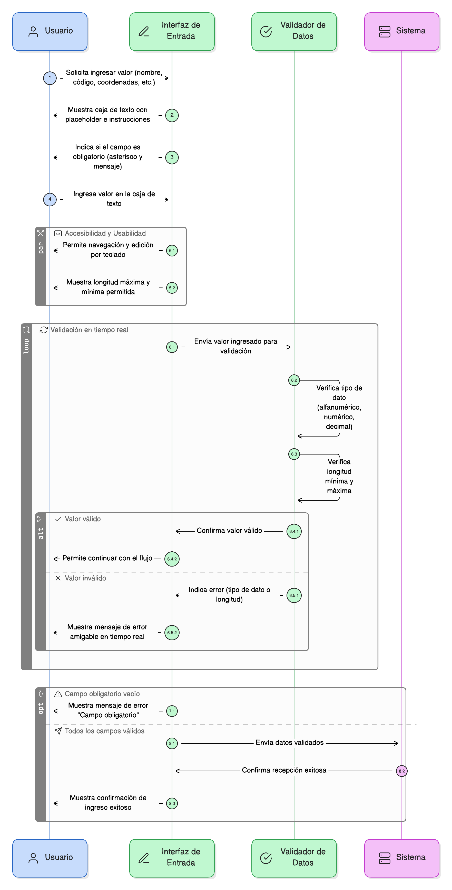
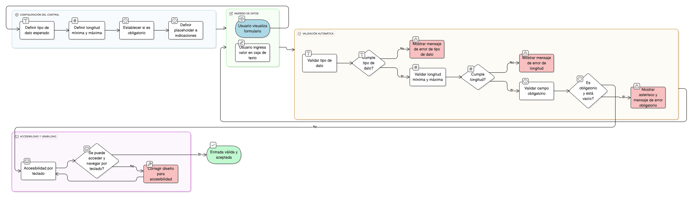

## HU-IDEAM-SNIF-REST-053
> **Identificador Historia de Usuario:** HU-IDEAM-SNIF-REST-053 \
> **Nombre Historia de Usuario:** Módulo de restauración - Caja de Texto Simple (Alfanumérico/Numérico)

> **Área Proyecto:** Subdirección de Ecosistemas e Información Ambiental \
> **Nombre proyecto:** Realizar la construcción temática, mejoras informáticas y optimización del Módulo de restauración del SNIF del IDEAM. \
> **Líder funcional:** Wilmer Espitia Muñoz\
> **Analista de requerimiento de TI:** Sergio Alonso Anaya Estévez

## DESCRIPCIÓN HISTORIA DE USUARIO

> **Como:** usuario solicitante. \
> **Quiero:** utilizar cajas de texto que validen automáticamente la entrada de datos. \
> **Para:** ingresar valores alfanuméricos o numéricos de forma controlada, garantizando que la información cumpla con los formatos y límites definidos por el sistema.

## CRITERIOS DE ACEPTACIÓN

1. **Control y Validación de Entrada** 1.1. El sistema debe disponer de cajas de texto que permitan ingresar valores **alfanuméricos o numéricos**. 1.2. El sistema debe **validar automáticamente el tipo de dato** esperado (alfanumérico, numérico, decimal, etc.). 1.3. Se debe permitir **configurar una longitud máxima y mínima** de caracteres. 1.4. Si el usuario ingresa un valor incompatible con el tipo de dato, se debe mostrar un **mensaje de error amigable** en tiempo real.
2. **Diseño y Usabilidad** 2.1. El control debe mostrar un placeholder con un ejemplo o instrucción. 2.2. Si el campo es **obligatorio**, se debe mostrar un **asterisco (*)** y un mensaje de error si está vacío. 2.3. El control debe ser **accesible mediante teclado**.
3. **Uso Típico en el Módulo** 3.1. Usos típicos: **nombre, código, coordenadas, valores numéricos** cortos.

## DIAGRAMA DE SECUENCIA

## DIAGRAMA DE FLUJO DEL PROCESO

## PROTOTIPO PRELIMINAR

