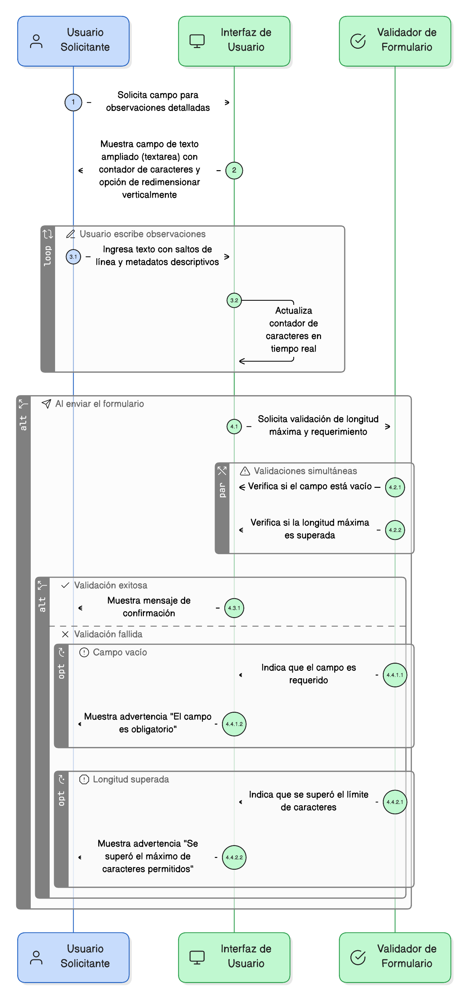
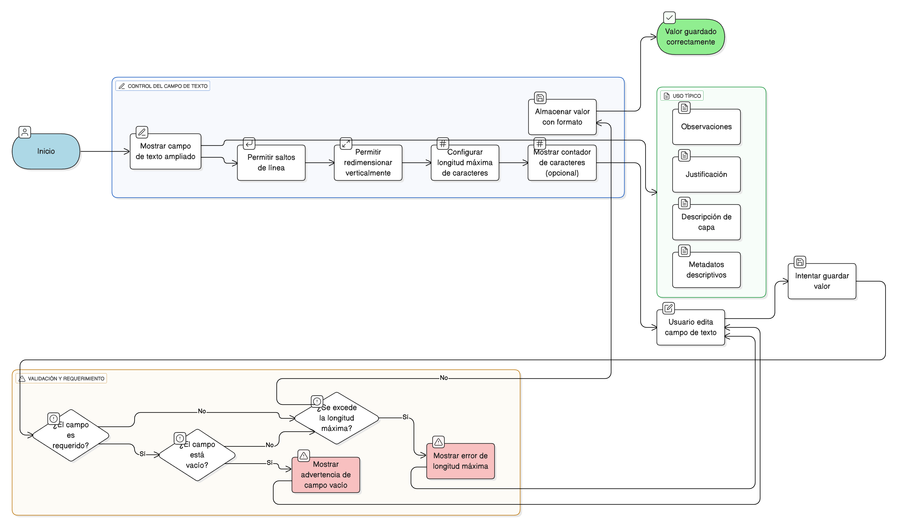

## HU-IDEAM-SNIF-REST-054
> **Identificador Historia de Usuario:** HU-IDEAM-SNIF-REST-054 \
> **Nombre Historia de Usuario:** Módulo de restauración - Área de Texto Ampliada (Textarea)

> **Área Proyecto:** Subdirección de Ecosistemas e Información Ambiental \
> **Nombre proyecto:** Realizar la construcción temática, mejoras informáticas y optimización del Módulo de restauración del SNIF del IDEAM. \
> **Líder funcional:** Wilmer Espitia Muñoz\
> **Analista de requerimiento de TI:** Sergio Alonso Anaya Estévez

## DESCRIPCIÓN HISTORIA DE USUARIO

> **Como:** usuario solicitante. \
> **Quiero:** poder escribir descripciones largas u observaciones dentro de un campo amplio. \
> **Para:** documentar adecuadamente la información con alto nivel de detalle, como justificaciones o metadatos descriptivos extensos.

## CRITERIOS DE ACEPTACIÓN

1. **Comportamiento del Control** 1.1. El sistema debe presentar un **campo de texto ampliado (textarea)** que permita **saltos de línea**. 1.2. Se debe permitir configurar una **longitud máxima** de caracteres (por ejemplo, 500) y debe tener un contador de caracteres (opcional). 1.3. El control debe permitir al usuario **redimensionar verticalmente** el área de texto. 1.4. El valor debe **guardar correctamente** el formato al almacenarse (sin cortar texto).
2. **Validación y Requerimiento** 2.1. El sistema debe validar la longitud máxima antes de enviar el formulario. 2.2. Si el campo es requerido, debe mostrar la **advertencia** de que está vacío.
3. **Uso Típico en el Módulo** 3.1. Usos típicos: **observaciones, justificación, descripción de capa y metadatos descriptivos**.

## DIAGRAMA DE SECUENCIA

## DIAGRAMA DE FLUJO DEL PROCESO

## PROTOTIPO PRELIMINAR

