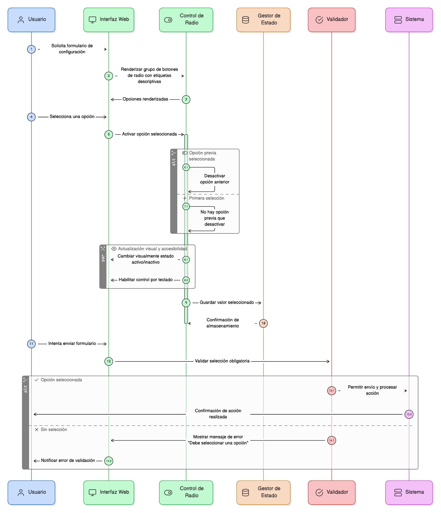
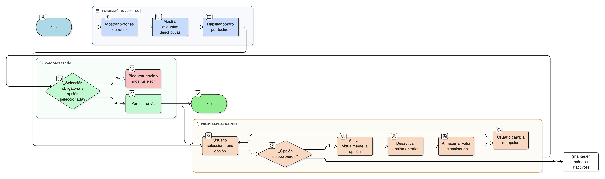

## HU-IDEAM-SNIF-REST-056
> **Identificador Historia de Usuario:** HU-IDEAM-SNIF-REST-056 \
> **Nombre Historia de Usuario:** Módulo de restauración - Botones de Radio (Radio Button)

> **Área Proyecto:** Subdirección de Ecosistemas e Información Ambiental \
> **Nombre proyecto:** Realizar la construcción temática, mejoras informáticas y optimización del Módulo de restauración del SNIF del IDEAM. \
> **Líder funcional:** Wilmer Espitia Muñoz\
> **Analista de requerimiento de TI:** Sergio Alonso Anaya Estévez

## DESCRIPCIÓN HISTORIA DE USUARIO

> **Como:** usuario del sistema. \
> **Quiero:** seleccionar una única opción dentro de un conjunto definido. \
> **Para:** realizar acciones o configurar parámetros de forma específica y sin ambigüedad.

## CRITERIOS DE ACEPTACIÓN

1. **Comportamiento del Control** 1.1. El sistema debe presentar un grupo de botones de radio que permitan seleccionar una única opción. 1.2. Al seleccionar una opción, la opción anterior debe desactivarse automáticamente. 1.3. El valor seleccionado debe almacenarse correctamente.
2. **Diseño y Usabilidad** 2.1. Cada botón de radio debe incluir etiquetas descriptivas claras. 2.2. Debe cambiar visualmente cuando está activo/inactivo. 2.3. Debe ser accesible y controlable con teclado.
3. **Validación** 3.1. Si la selección es obligatoria, se debe validar que se haya elegido una opción antes de permitir el envío.

## DIAGRAMA DE SECUENCIA

## DIAGRAMA DE FLUJO DEL PROCESO

## PROTOTIPO PRELIMINAR

