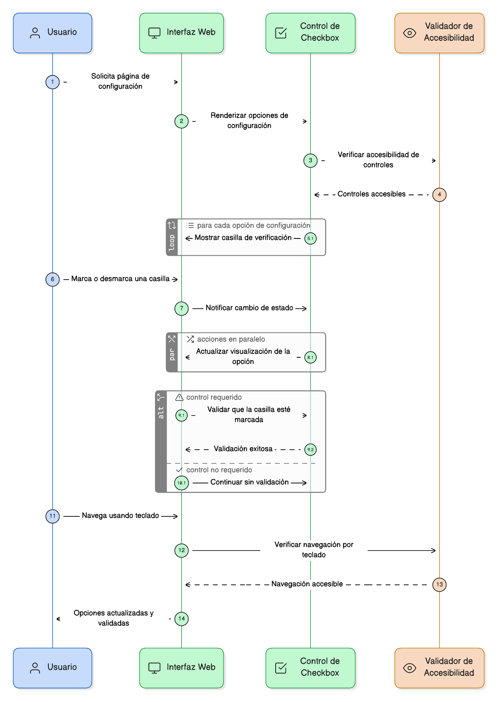
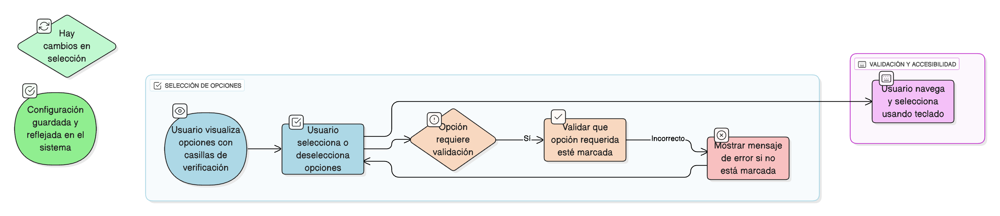

## HU-IDEAM-SNIF-REST-057
> **Identificador Historia de Usuario:** HU-IDEAM-SNIF-REST-057 \
> **Nombre Historia de Usuario:** Módulo de restauración - Casilla de Verificación (Checkbox)

> **Área Proyecto:** Subdirección de Ecosistemas e Información Ambiental \
> **Nombre proyecto:** Realizar la construcción temática, mejoras informáticas y optimización del Módulo de restauración del SNIF del IDEAM. \
> **Líder funcional:** Wilmer Espitia Muñoz\
> **Analista de requerimiento de TI:** Sergio Alonso Anaya Estévez

## DESCRIPCIÓN HISTORIA DE USUARIO

> **Como:** usuario del sistema. \
> **Quiero:** poder activar o desactivar configuraciones mediante casillas de verificación. \
> **Para:** controlar opciones visibles o parámetros del sistema, permitiendo seleccionar uno o varios ítems.

## CRITERIOS DE ACEPTACIÓN

1. **Comportamiento del Control** 1.1. El sistema debe permitir activar o desactivar una o varias opciones mediante casillas de verificación (checkbox). 1.2. Debe permitir seleccionar múltiples valores si se agrupan bajo un mismo contexto. 1.3. El control debe guardar el estado (activo/inactivo) en la base de datos. 1.4. El control debe actualizar el comportamiento del sistema en tiempo real si es necesario (Ej: mostrar/ocultar capas).
2. **Validación y Uso** 2.1. Si el control es requerido (Ej: aceptar términos), debe validarse que esté marcado antes de continuar. 2.2. Debe ser accesible mediante teclado.
3. **Uso Típico en el Módulo** 3.1. Usos típicos: Mostrar capas, activar autenticación.

## DIAGRAMA DE SECUENCIA

## DIAGRAMA DE FLUJO DEL PROCESO

## PROTOTIPO PRELIMINAR

