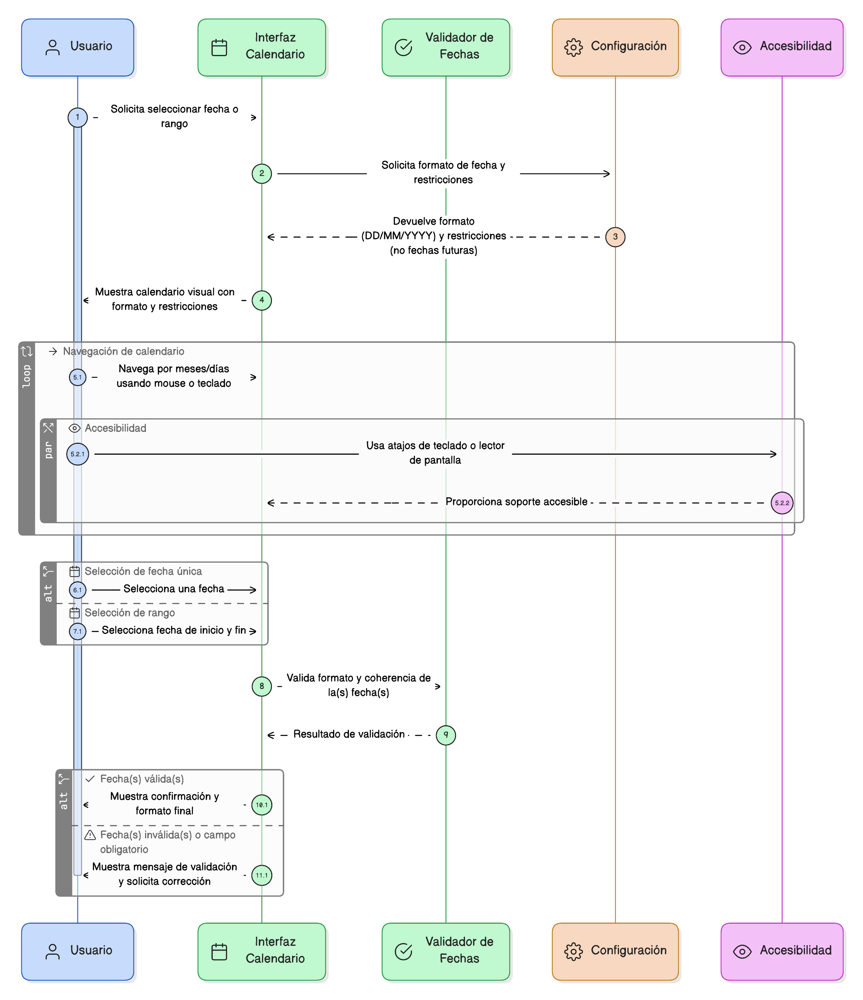
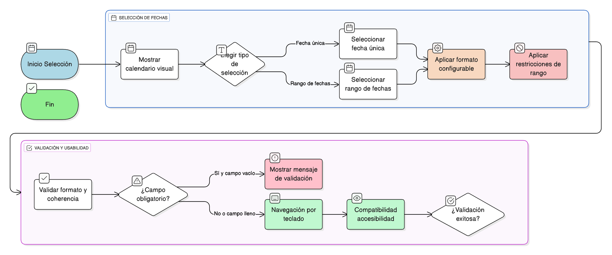

## HU-IDEAM-SNIF-REST-058
> **Identificador Historia de Usuario:** HU-IDEAM-SNIF-REST-058 \
> **Nombre Historia de Usuario:** Módulo de restauración - Selector de Fecha (Datepicker)

> **Área Proyecto:** Subdirección de Ecosistemas e Información Ambiental \
> **Nombre proyecto:** Realizar la construcción temática, mejoras informáticas y optimización del Módulo de restauración del SNIF del IDEAM. \
> **Líder funcional:** Wilmer Espitia Muñoz\
> **Analista de requerimiento de TI:** Sergio Alonso Anaya Estévez

## DESCRIPCIÓN HISTORIA DE USUARIO

> **Como:** usuario del sistema. \
> **Quiero:** seleccionar fechas a través de un calendario interactivo. \
> **Para:** evitar errores de formato, facilitar la selección de periodos válidos y gestionar información temporal de manera eficiente.

## CRITERIOS DE ACEPTACIÓN

1. **Funcionalidad del Control** 1.1. El sistema debe permitir seleccionar una fecha única o un rango de fechas desde un calendario visual. 1.2. El formato de fecha mostrado al usuario debe ser configurable (Ej: DD/MM/YYYY). 1.3. Debe permitir restricciones de rango (Ej: no fechas futuras).
2. **Validación y Usabilidad** 2.1. El sistema debe validar el formato y la coherencia de la fecha o rango seleccionado. 2.2. Si el campo de fecha es obligatorio, debe mostrar un mensaje de validación. 2.3. El control debe ser navegable por teclado y compatible con la accesibilidad.
3. **Uso Típico en el Módulo** 3.1. Usos típicos: fechas de actualización, período de vigencia del dato.

## DIAGRAMA DE SECUENCIA

## DIAGRAMA DE FLUJO DEL PROCESO

## PROTOTIPO PRELIMINAR

