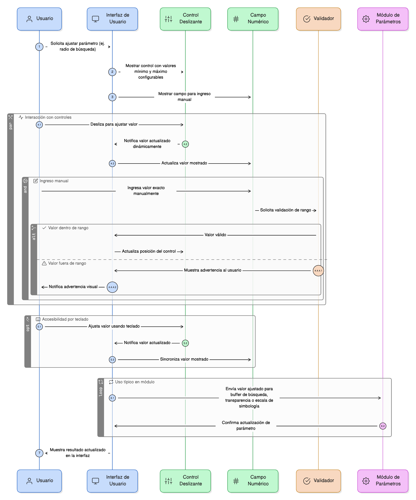
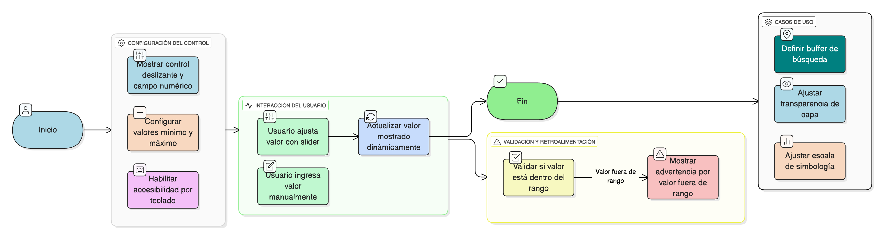

## HU-IDEAM-SNIF-REST-060
> **Identificador Historia de Usuario:** HU-IDEAM-SNIF-REST-060 \
> **Nombre Historia de Usuario:** Módulo de restauración - Control Deslizante (Slider)

> **Área Proyecto:** Subdirección de Ecosistemas e Información Ambiental \
> **Nombre proyecto:** Realizar la construcción temática, mejoras informáticas y optimización del Módulo de restauración del SNIF del IDEAM. \
> **Líder funcional:** Wilmer Espitia Muñoz\
> **Analista de requerimiento de TI:** Sergio Alonso Anaya Estévez

## DESCRIPCIÓN HISTORIA DE USUARIO

> **Como:** usuario del sistema. \
> **Quiero:** ajustar valores mediante un control deslizante o campo numérico asociado. \
> **Para:** definir parámetros como radios de búsqueda o niveles de transparencia de manera intuitiva.

## CRITERIOS DE ACEPTACIÓN

1. **Comportamiento del Control** 1.1. El sistema debe presentar un control deslizante (slider) o un campo numérico asociado. 1.2. El control debe tener valores mínimo y máximo configurables. 1.3. Se debe permitir al usuario ingresar manualmente el valor exacto en un campo de texto adyacente. 1.4. El valor mostrado debe actualizarse dinámicamente mientras se desliza el control.
2. **Validación y Uso** 2.1. Si el valor ingresado manualmente supera el rango configurado, se debe mostrar una advertencia. 2.2. El control debe ser accesible por teclado.
3. **Uso Típico en el Módulo** 3.1. Usos típicos: Definir buffer de búsqueda, transparencia de capa (0% a 100%), o escala de simbología.

## DIAGRAMA DE SECUENCIA

## DIAGRAMA DE FLUJO DEL PROCESO

## PROTOTIPO PRELIMINAR

