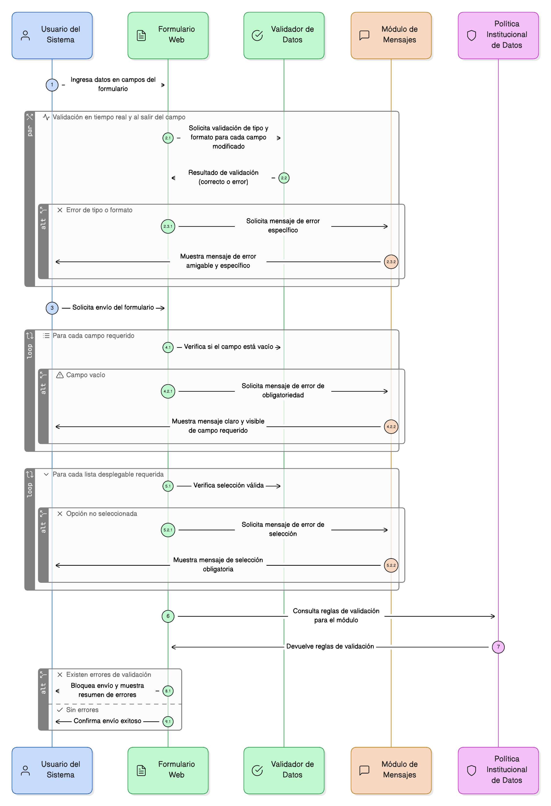
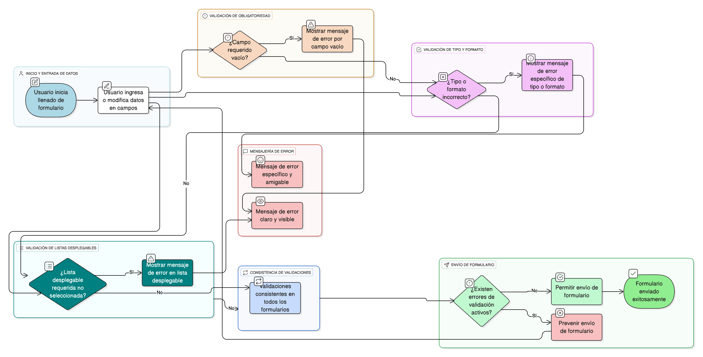

## HU-IDEAM-SNIF-REST-061
> **Identificador Historia de Usuario:** HU-IDEAM-SNIF-REST-061 \
> **Nombre Historia de Usuario:** Módulo de restauración - Política General de Validación de Datos

> **Área Proyecto:** Subdirección de Ecosistemas e Información Ambiental \
> **Nombre proyecto:** Realizar la construcción temática, mejoras informáticas y optimización del Módulo de restauración del SNIF del IDEAM. \
> **Líder funcional:** Wilmer Espitia Muñoz\
> **Analista de requerimiento de TI:** Sergio Alonso Anaya Estévez

## DESCRIPCIÓN HISTORIA DE USUARIO

> **Como:** usuario del sistema. \
> **Quiero:** que todos los campos de formularios validen automáticamente el tipo, formato y obligatoriedad de los datos ingresados. \
> **Para:** asegurar la calidad e integridad de la información en todo el módulo, de acuerdo con las políticas institucionales de datos.

## CRITERIOS DE ACEPTACIÓN

1. **Validación de Obligatoriedad (General)** 1.1. El sistema debe validar que ningún campo marcado como requerido quede vacío al intentar enviar el formulario. 1.2. El mensaje de error para campos vacíos debe ser claro y visible para el usuario.
2. **Validación en Tiempo Real y Mensajería** 2.1. Todas las validaciones de tipo y formato deben ejecutarse preferiblemente en tiempo real (mientras el usuario teclea o al salir del campo). 2.2. Los mensajes de error deben ser amigables y específicos, indicando la corrección requerida.
3. **Consistencia de Validación** 3.1. Las validaciones de los campos (texto, numérico, fecha, etc.) deben ser consistentes a lo largo de todos los formularios del módulo. 3.2. Se debe prevenir el envío del formulario mientras existan errores de validación activos.
4. **Validación de Listas Desplegables** 4.1. El sistema debe validar que, si un campo de lista desplegable es requerido, se seleccione una opción válida del listado.

## DIAGRAMA DE SECUENCIA

## DIAGRAMA DE FLUJO DEL PROCESO

## PROTOTIPO PRELIMINAR

