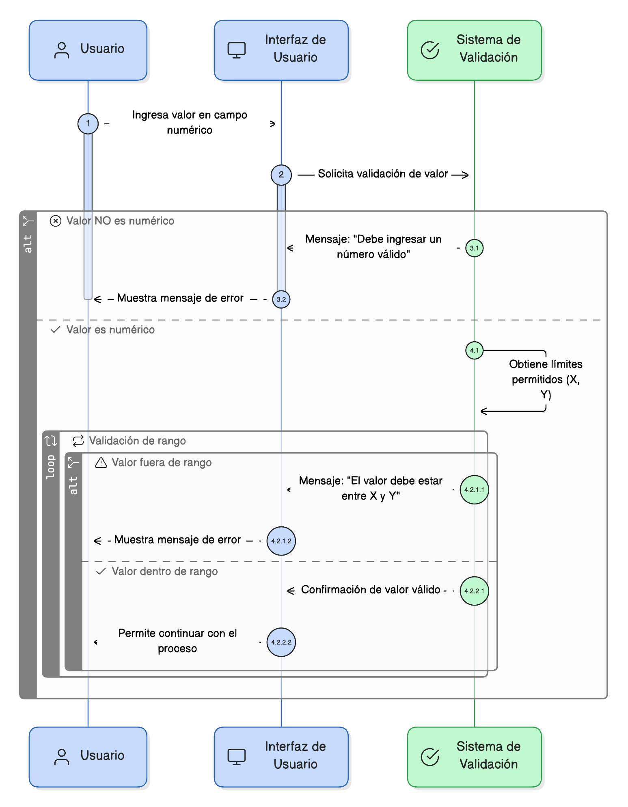
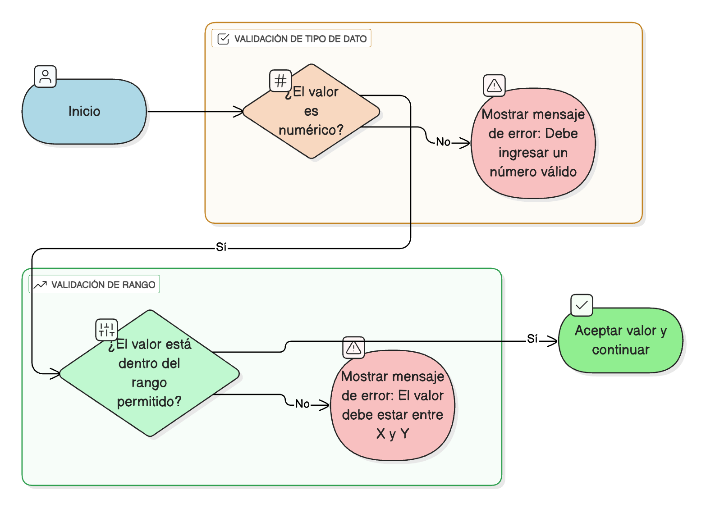

## HU-IDEAM-SNIF-REST-063
> **Identificador Historia de Usuario:** HU-IDEAM-SNIF-REST-063 \
> **Nombre Historia de Usuario:** Módulo de restauración - Validación de Tipos de Datos Numéricos (Rango)

> **Área Proyecto:** Subdirección de Ecosistemas e Información Ambiental \
> **Nombre proyecto:** Realizar la construcción temática, mejoras informáticas y optimización del Módulo de restauración del SNIF del IDEAM. \
> **Líder funcional:** Wilmer Espitia Muñoz\
> **Analista de requerimiento de TI:** Sergio Alonso Anaya Estévez

## DESCRIPCIÓN HISTORIA DE USUARIO

> **Como:** usuario del sistema. \
> **Quiero:** que los campos numéricos verifiquen el tipo de dato y su rango permitido. \
> **Para:** prevenir el ingreso de texto y garantizar que los valores caigan dentro de límites lógicos.

## CRITERIOS DE ACEPTACIÓN

1. **Validación de Tipo de Dato** 1.1. El sistema debe validar que el valor ingresado en campos numéricos sea exclusivamente numérico (entero o decimal). 1.2. Si el valor no es numérico, se debe mostrar el mensaje: "Debe ingresar un número válido".
2. **Validación de Rango** 2.1. El sistema debe validar que el valor se encuentre dentro del rango permitido (mínimo, máximo). 2.2. Si está fuera del rango, se debe mostrar el mensaje: "El valor debe estar entre X y Y" (siendo X y Y los límites).
3. **Referencia a la Política General ([HU-061](../HU-IDEAM-SNIF-REST-061/HU-IDEAM-SNIF-REST-061.md))** 3.1. Esta validación debe cumplir con los principios de la Política General de Validación.

## DIAGRAMA DE SECUENCIA

## DIAGRAMA DE FLUJO DEL PROCESO

## PROTOTIPO PRELIMINAR

