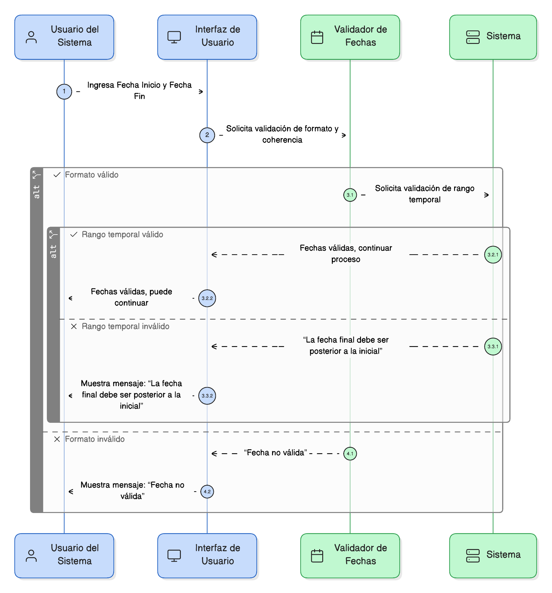
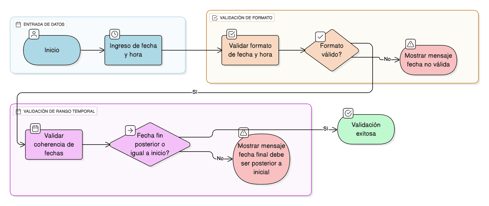

## HU-IDEAM-SNIF-REST-064
> **Identificador Historia de Usuario:** HU-IDEAM-SNIF-REST-064 \
> **Nombre Historia de Usuario:** Módulo de restauración - Validación de Fechas y Coherencia Temporal

> **Área Proyecto:** Subdirección de Ecosistemas e Información Ambiental \
> **Nombre proyecto:** Realizar la construcción temática, mejoras informáticas y optimización del Módulo de restauración del SNIF del IDEAM. \
> **Líder funcional:** Wilmer Espitia Muñoz\
> **Analista de requerimiento de TI:** Sergio Alonso Anaya Estévez

## DESCRIPCIÓN HISTORIA DE USUARIO

> **Como:** usuario del sistema. \
> **Quiero:** que los campos de fecha y hora validen el formato y la coherencia de los períodos seleccionados. \
> **Para:** asegurar que las fechas sean válidas y que los períodos definidos (inicio/fin) sean lógicos.

## CRITERIOS DE ACEPTACIÓN

1. **Validación de Formato** 1.1. El sistema debe validar que la entrada de fecha y hora cumpla con el formato ISO o local según la configuración. 1.2. Si el formato no es válido, se debe mostrar el mensaje: "Fecha no válida".
2. **Validación de Rango Temporal** 2.1. En períodos (Fecha Inicio / Fecha Fin), la fecha fin debe ser posterior o igual a la fecha inicio. 2.2. Si la fecha fin es anterior a la fecha inicio, se debe mostrar el mensaje: "La fecha final debe ser posterior a la inicial".
3. **Referencia a la Política General ([HU-061](../HU-IDEAM-SNIF-REST-061/HU-IDEAM-SNIF-REST-061.md))** 3.1. Esta validación debe cumplir con los principios de la Política General de Validación definida en la HU-061.

## DIAGRAMA DE SECUENCIA

## DIAGRAMA DE FLUJO DEL PROCESO

## PROTOTIPO PRELIMINAR

