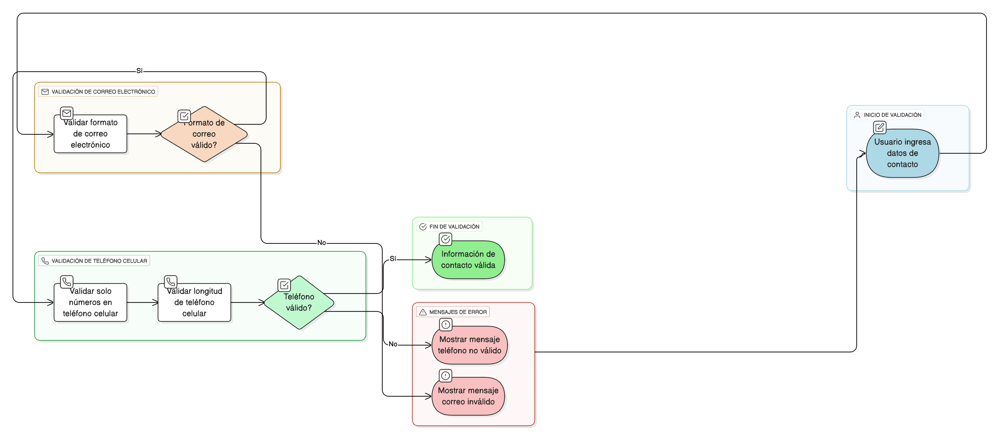

## HU-IDEAM-SNIF-REST-065
> **Identificador Historia de Usuario:** HU-IDEAM-SNIF-REST-065 \
> **Nombre Historia de Usuario:** Módulo de restauración - Validación de Campos de Contacto (Correo y Teléfono)

> **Área Proyecto:** Subdirección de Ecosistemas e Información Ambiental \
> **Nombre proyecto:** Realizar la construcción temática, mejoras informáticas y optimización del Módulo de restauración del SNIF del IDEAM. \
> **Líder funcional:** Wilmer Espitia Muñoz\
> **Analista de requerimiento de TI:** Sergio Alonso Anaya Estévez

## DESCRIPCIÓN HISTORIA DE USUARIO

> **Como:** usuario del sistema. \
> **Quiero:** que los campos de correo electrónico y teléfono/celular validen su formato y longitud. \
> **Para:** garantizar que la información de contacto registrada sea válida y usable.

## CRITERIOS DE ACEPTACIÓN

1. **Validación de Correo Electrónico** 1.1. El campo debe cumplir con el formato estándar user@dominio.com. 1.2. Si no cumple, se debe mostrar el mensaje: "Correo electrónico inválido".
2. **Validación de Teléfono/Celular** 2.1. Los campos de teléfono/celular solo deben permitir el ingreso de números. 2.2. Se debe validar una longitud permitida (Ej: entre 7 y 10 dígitos). 2.3. Si contiene letras o la longitud es inválida, se debe mostrar el mensaje: "Número de teléfono no válido".
3. **Referencia a la Política General ([HU-061](../HU-IDEAM-SNIF-REST-061/HU-IDEAM-SNIF-REST-061.md))** 3.1. Esta validación debe cumplir con los principios de la Política General de Validación definida en la HU-IDEAM-SNIF-REST-061.

## DIAGRAMA DE SECUENCIA

## DIAGRAMA DE FLUJO DEL PROCESO

## PROTOTIPO PRELIMINAR

