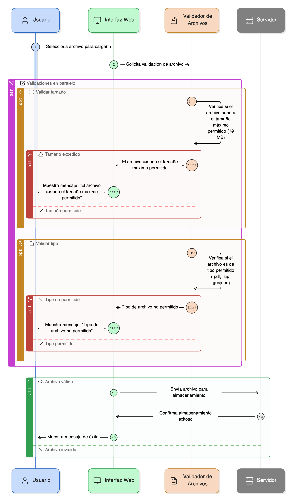
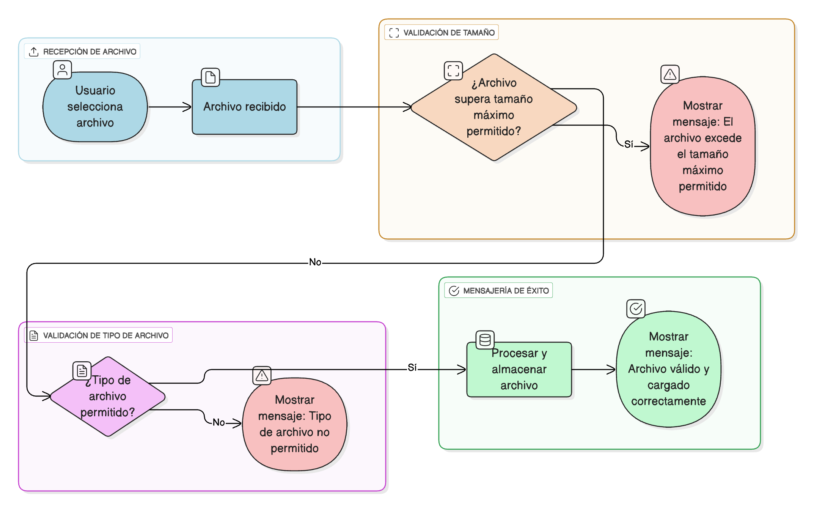

## HU-IDEAM-SNIF-REST-066
> **Identificador Historia de Usuario:** HU-IDEAM-SNIF-REST-066 \
> **Nombre Historia de Usuario:** Módulo de restauración - Validación de Archivos Adjuntos (Tipo y Tamaño)

> **Área Proyecto:** Subdirección de Ecosistemas e Información Ambiental \
> **Nombre proyecto:** Realizar la construcción temática, mejoras informáticas y optimización del Módulo de restauración del SNIF del IDEAM. \
> **Líder funcional:** Wilmer Espitia Muñoz\
> **Analista de requerimiento de TI:** Sergio Alonso Anaya Estévez

## DESCRIPCIÓN HISTORIA DE USUARIO

> **Como:** usuario del sistema. \
> **Quiero:** que los campos de carga de archivos (File Upload) validen el tipo y el tamaño de los archivos. \
> **Para:** evitar el procesamiento y almacenamiento de archivos que excedan los límites definidos o que no sean del formato permitido.

## CRITERIOS DE ACEPTACIÓN

1. **Validación de Tamaño** 1.1. El archivo adjunto no debe superar el tamaño máximo permitido (por ejemplo, 10 MB). 1.2. Si el archivo supera el límite, se debe mostrar el mensaje: "El archivo excede el tamaño máximo permitido".
2. **Validación de Tipo de Archivo** 2.1. El archivo debe corresponder a uno de los tipos/formatos admitidos (Ej: .pdf, .zip, .geojson). 2.2. Si el formato no es admitido, se debe mostrar el mensaje: "Tipo de archivo no permitido".
3. **Referencia a la Política General ([HU-061](../HU-IDEAM-SNIF-REST-061/HU-IDEAM-SNIF-REST-061.md))** 3.1. Esta validación debe cumplir con los principios de la Política General de Validación definida en la HU-061.

## DIAGRAMA DE SECUENCIA

## DIAGRAMA DE FLUJO DEL PROCESO

## PROTOTIPO PRELIMINAR

