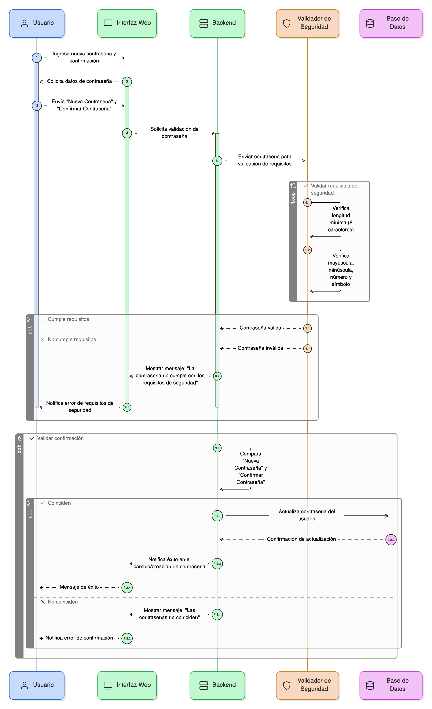

## HU-IDEAM-SNIF-REST-067
> **Identificador Historia de Usuario:** HU-IDEAM-SNIF-REST-067 \
> **Nombre Historia de Usuario:** Módulo de restauración - Validación de Contraseñas (Requisitos de Seguridad)

> **Área Proyecto:** Subdirección de Ecosistemas e Información Ambiental \
> **Nombre proyecto:** Realizar la construcción temática, mejoras informáticas y optimización del Módulo de restauración del SNIF del IDEAM. \
> **Líder funcional:** Wilmer Espitia Muñoz\
> **Analista de requerimiento de TI:** Sergio Alonso Anaya Estévez

## DESCRIPCIÓN HISTORIA DE USUARIO

> **Como:** usuario del sistema. \
> **Quiero:** que el sistema valide que mi contraseña cumpla con los patrones de seguridad. \
> **Para:** proteger mi cuenta de usuario y cumplir con las políticas de seguridad de la información.

## CRITERIOS DE ACEPTACIÓN

1. **Requisitos de Patrón de Seguridad** 1.1. El sistema debe validar que la contraseña cumpla con un mínimo de 8 caracteres. 1.2. El patrón debe incluir al menos: una mayúscula, una minúscula, un número y un símbolo. 1.3. Si la contraseña no cumple con este patrón, se debe mostrar el mensaje: "La contraseña no cumple con los requisitos de seguridad".
2. **Validación de Confirmación** 2.1. En el formulario de cambio/creación de contraseña, se debe validar que el campo "Confirmar Contraseña" sea idéntico al campo "Nueva Contraseña".
3. **Referencia a la Política General ([HU-061](../HU-IDEAM-SNIF-REST-061/HU-IDEAM-SNIF-REST-061.md))** 3.1. Esta validación debe cumplir con los principios de la Política General de Validación definida en la HU-061.

## DIAGRAMA DE SECUENCIA

## DIAGRAMA DE FLUJO DEL PROCESO

## PROTOTIPO PRELIMINAR

