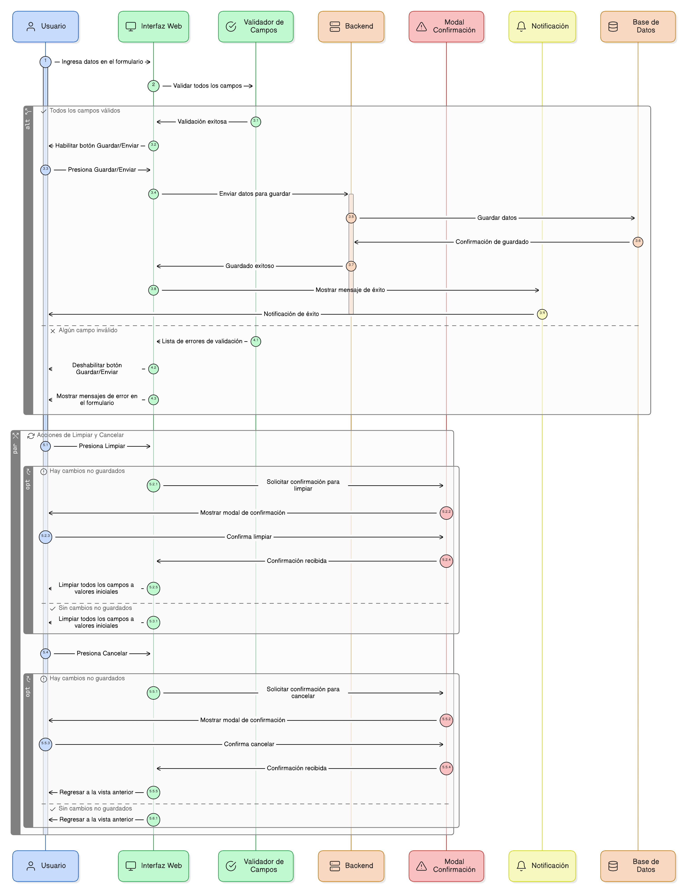
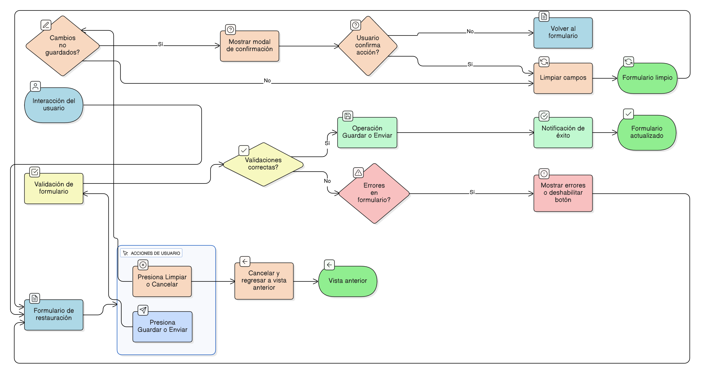

## HU-IDEAM-SNIF-REST-069

> **Identificador Historia de Usuario:** hu-ideam-snif-rest-069 \
> **Nombre Historia de Usuario:** Módulo de restauración - Funcionalidad de Botones Guardar/Enviar y Limpiar/Cancelar

> **Área Proyecto:** Subdirección de Ecosistemas e Información Ambiental \
> **Nombre proyecto:** Realizar la construcción temática, mejoras informáticas y optimización del Módulo de restauración del SNIF del IDEAM. \
> **Líder funcional:** Wilmer Espitia Muñoz\
> **Analista de requerimiento de TI:** Sergio Alonso Anaya Estévez

## DESCRIPCIÓN HISTORIA DE USUARIO

> **Como:** usuario del sistema.  \
> **Quiero:**  Que los botones de Guardar/Enviar y Limpiar/Cancelar funcionen de forma predecible. \
> **Para:** asegurar que mis datos se envían solo cuando son correctos o que puedo deshacer mi trabajo fácilmente.

## CRITERIOS DE ACEPTACIÓN

1.	**Botón Guardar/Enviar**    
    1.1. El botón de Guardar/Enviar solo debe ejecutar la operación si todas las validaciones de campos son correctas (Ver [HU-61](../HU-IDEAM-SNIF-REST-061/HU-IDEAM-SNIF-REST-061.md) a [HU-67](../HU-IDEAM-SNIF-REST-067/HU-IDEAM-SNIF-REST-067.md)).    
    1.2. Si existen errores, el botón debe deshabilitarse visualmente o mostrar los mensajes de error correspondientes en el formulario.    
    1.3. Tras una operación exitosa de Guardar, el sistema debe ejecutar el control de Notificación de Éxito (Ver [HU-71](../HU-IDEAM-SNIF-REST-071/HU-IDEAM-SNIF-REST-071.md)).

2.	**Botón Limpiar/Cancelar**  
    2.1. El sistema debe contar con un botón que permita reiniciar todos los campos a sus valores iniciales (Limpiar/Reiniciar).    
    2.2. El sistema debe contar con un botón Cancelar que detenga la operación y regrese a la vista anterior.

3.	**Control de Estado**   
    3.1. Cuando el usuario presione Limpiar/Cancelar teniendo cambios no guardados, el sistema debe invocar la Modal de Confirmación (Ver HU-070) antes de proceder.

## DIAGRAMA DE SECUENCIA

## DIAGRAMA DE FLUJO DEL PROCESO

## PROTOTIPO PRELIMINAR

## ANEXOS

- Especificación de las etiquetas de los botones de acción para cada tipo de formulario.

