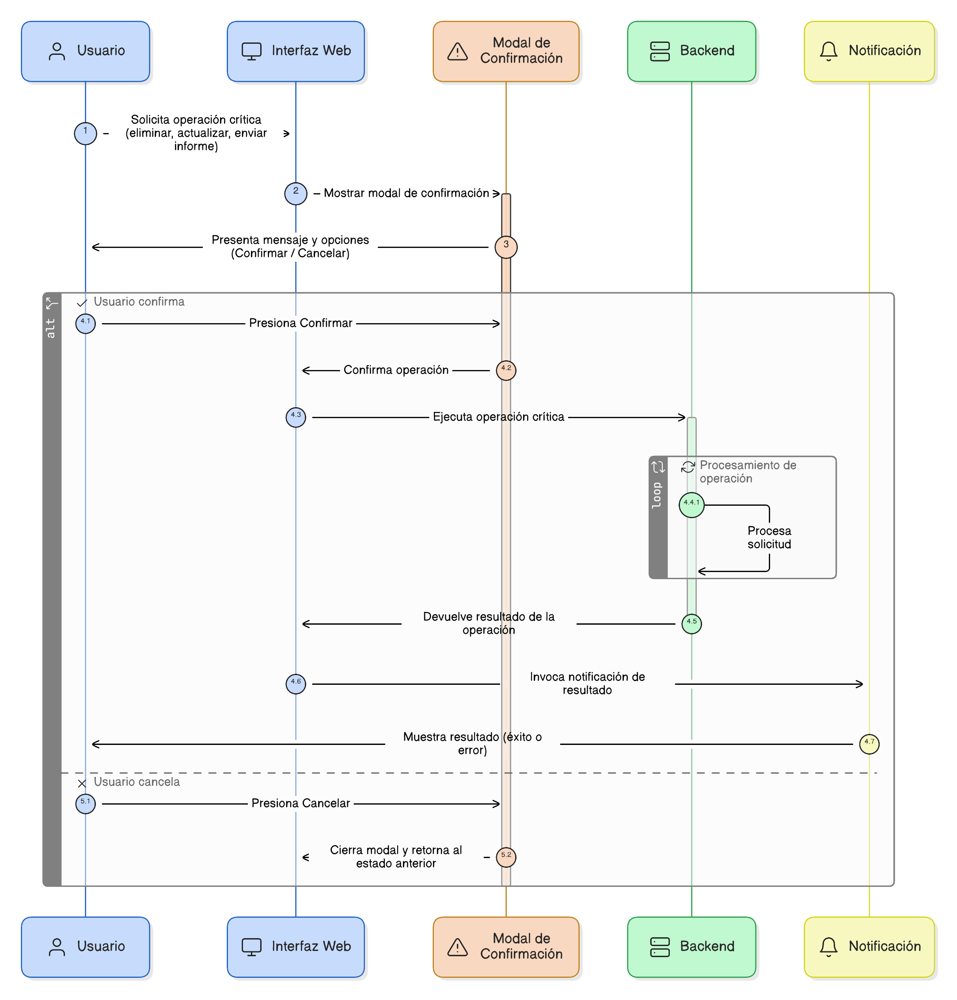
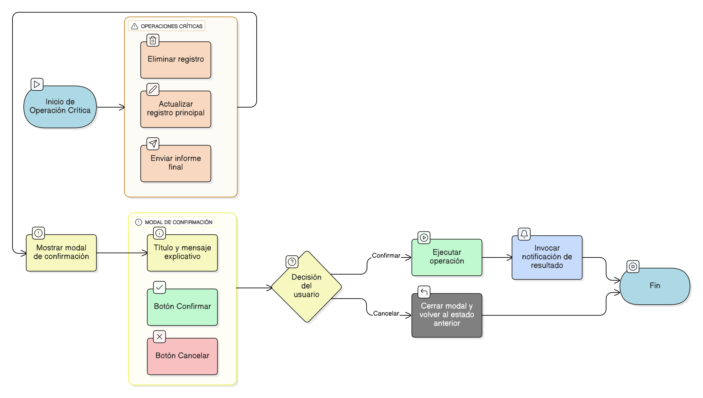

## HU-IDEAM-SNIF-REST-070

> **Identificador Historia de Usuario:** hu-ideam-snif-rest-070 \
> **Nombre Historia de Usuario:** Módulo de restauración - Modal de Confirmación para Operaciones Críticas

> **Área Proyecto:** Subdirección de Ecosistemas e Información Ambiental \
> **Nombre proyecto:** Realizar la construcción temática, mejoras informáticas y optimización del Módulo de restauración del SNIF del IDEAM. \
> **Líder funcional:** Wilmer Espitia Muñoz\
> **Analista de requerimiento de TI:** Sergio Alonso Anaya Estévez

## DESCRIPCIÓN HISTORIA DE USUARIO

> **Como:** usuario del sistema.  \
> **Quiero:**  que el sistema me solicite una confirmación antes de ejecutar operaciones destructivas o críticas.  \
> **Para:** evitar pérdidas de datos accidentales o envíos no deseados.

## CRITERIOS DE ACEPTACIÓN

1. **Uso de Modal**  
    1.1. El sistema debe mostrar una modal de confirmación para todas las operaciones consideradas críticas (Ej: Eliminar registro, Actualizar un registro principal o Enviar un informe final).    
    1.2. La modal debe detener el flujo de trabajo hasta que el usuario confirme o cancele la acción.

2.	**Contenido de la Modal**   
    2.1. La modal debe tener un título claro y un mensaje que explique la consecuencia de la acción (Ej: "¿Está seguro que desea eliminar el registro? Esta acción es irreversible.").  
    2.2. Debe ofrecer opciones claras de Confirmar (botón primario) y Cancelar (botón secundario).

3.	**Comportamiento**  
    3.1. Si el usuario selecciona Confirmar, se ejecuta la operación y se invoca la Notificación de Resultado ([HU-71](../HU-IDEAM-SNIF-REST-071/HU-IDEAM-SNIF-REST-071.md)).   
    3.2. Si el usuario selecciona Cancelar, se cierra la modal y se vuelve al estado anterior.

## DIAGRAMA DE SECUENCIA

## DIAGRAMA DE FLUJO DEL PROCESO

## PROTOTIPO PRELIMINAR

## ANEXOS

- Especificación de las etiquetas de los botones de acción para cada tipo de formulario.

