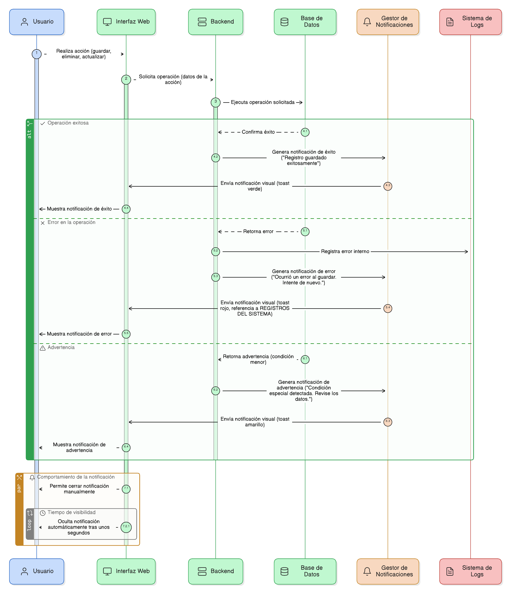

## HU-IDEAM-SNIF-REST-071

> **Identificador Historia de Usuario:** hu-ideam-snif-rest-071 \
> **Nombre Historia de Usuario:** Módulo de restauración - Notificaciones de Éxito, Error y Advertencia

> **Área Proyecto:** Subdirección de Ecosistemas e Información Ambiental \
> **Nombre proyecto:** Realizar la construcción temática, mejoras informáticas y optimización del Módulo de restauración del SNIF del IDEAM. \
> **Líder funcional:** Wilmer Espitia Muñoz\
> **Analista de requerimiento de TI:** Sergio Alonso Anaya Estévez

## DESCRIPCIÓN HISTORIA DE USUARIO

> **Como:** usuario del sistema.  \
> **Quiero:**  recibir una retroalimentación visual inmediata después de cualquier operación.  \
> **Para:** saber si la acción que realicé (guardar, eliminar, actualizar) se completó con éxito o si ocurrió un problema.

## CRITERIOS DE ACEPTACIÓN

1.	**Tipos de Notificación**   
    1.1. El sistema debe contar con notificaciones para:  
    - **Éxito**: (Verde) Confirmando que una acción se completó satisfactoriamente. 
    - **Error**: (Rojo) Indicando que la acción falló debido a un error del sistema o de la base de datos (Ver REGISTROS DEL SISTEMA). 
    - **Advertencia**: (Amarillo) Para informar sobre problemas menores o condiciones que no impiden la operación pero requieren atención.
2.	**Contenido y Visualización**   
    2.1. Las notificaciones deben ser mensajes visuales (Ej: toasts flotantes) que no detengan la interacción del usuario.  
    2.2. El mensaje de éxito debe ser amigable (Ej: “Registro guardado exitosamente”).  
    2.3. El mensaje de error debe indicar claramente el problema (Ej: “Ocurrió un error al guardar. Intente de nuevo.”).
3.	**Comportamiento**  
    3.1. Las notificaciones deben desaparecer automáticamente después de unos segundos, pero deben poder ser cerradas manualmente por el usuario.   
    3.2. Las notificaciones deben referenciar el log del sistema (REGISTROS DEL SISTEMA) cuando se trate de un error interno.

## DIAGRAMA DE SECUENCIA

## DIAGRAMA DE FLUJO DEL PROCESO

## PROTOTIPO PRELIMINAR

## ANEXOS

- Especificación de colores y duración de las notificaciones.

