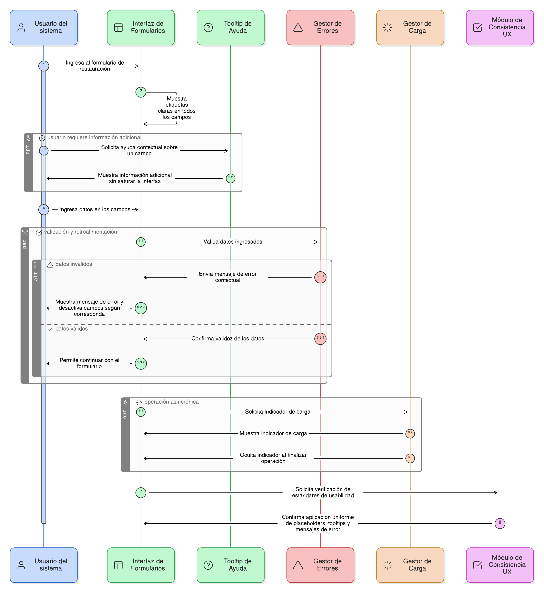
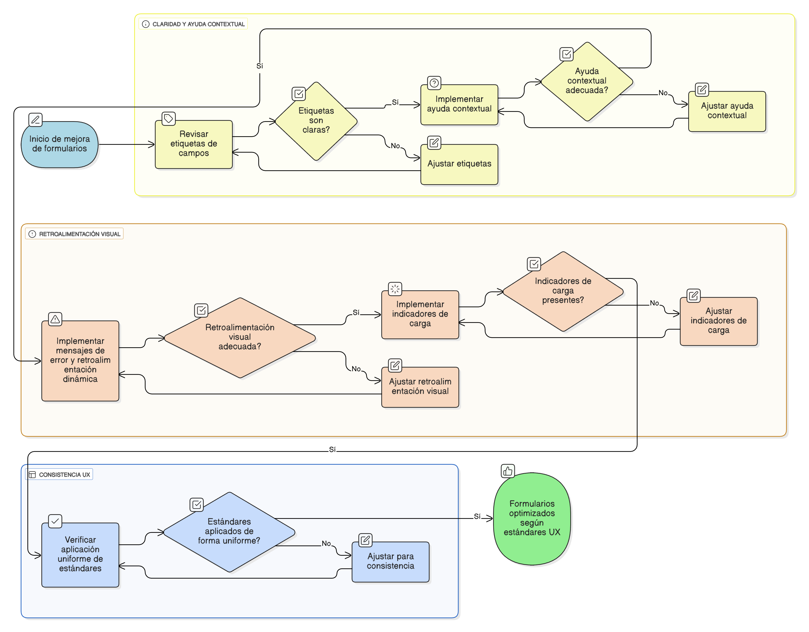

## HU-IDEAM-SNIF-REST-072

> **Identificador Historia de Usuario:** hu-ideam-snif-rest-072 \
> **Nombre Historia de Usuario:** Módulo de restauración - Estándares de Usabilidad e Interfaz (UX)

> **Área Proyecto:** Subdirección de Ecosistemas e Información Ambiental \
> **Nombre proyecto:** Realizar la construcción temática, mejoras informáticas y optimización del Módulo de restauración del SNIF del IDEAM. \
> **Líder funcional:** Wilmer Espitia Muñoz\
> **Analista de requerimiento de TI:** Sergio Alonso Anaya Estévez

## DESCRIPCIÓN HISTORIA DE USUARIO

> **Como:** usuario del sistema.  \
> **Quiero:**  que la interfaz de los formularios sea clara, consistente y me provea de ayuda contextual.  \
> **Para:** poder ingresar datos de manera eficiente, reducir errores y entender fácilmente el propósito de cada campo.

## CRITERIOS DE ACEPTACIÓN

1.	**Claridad de Etiquetas y Ayuda**   
    1.1. Todos los campos de formulario deben contar con una etiqueta clara que indique el dato solicitado.     
    1.2. Se debe implementar ayuda contextual (tooltips) para proveer información adicional sin saturar la interfaz (Ver [HU-74](../HU-IDEAM-SNIF-REST-074/HU-IDEAM-SNIF-REST-074.md)).

2.	**Retroalimentación Visual**    
    2.1. El sistema debe proveer mensajes de error contextuales y retroalimentación dinámica (desactivación de campos) para guiar al usuario.   
    2.2. Se deben mostrar indicadores de carga durante las operaciones asincrónicas (Ver [HU-76](../HU-IDEAM-SNIF-REST-076/HU-IDEAM-SNIF-REST-076.md)).

3.	**Consistencia UX**     
3.1. Los estándares de usabilidad (placeholders, tooltips, mensajes de error) deben aplicarse de manera uniforme en todos los formularios y módulos del SNIF.

## DIAGRAMA DE SECUENCIA

## DIAGRAMA DE FLUJO DEL PROCESO

## PROTOTIPO PRELIMINAR

## ANEXOS

- Guía de diseño de interfaz (UI/UX) del IDEAM.

