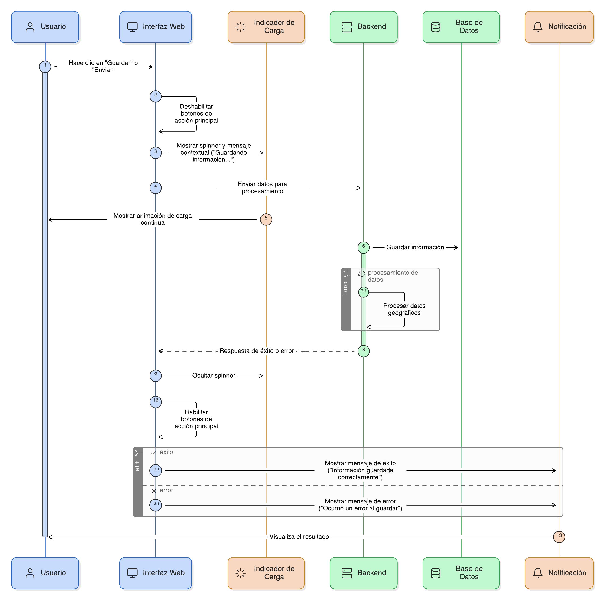
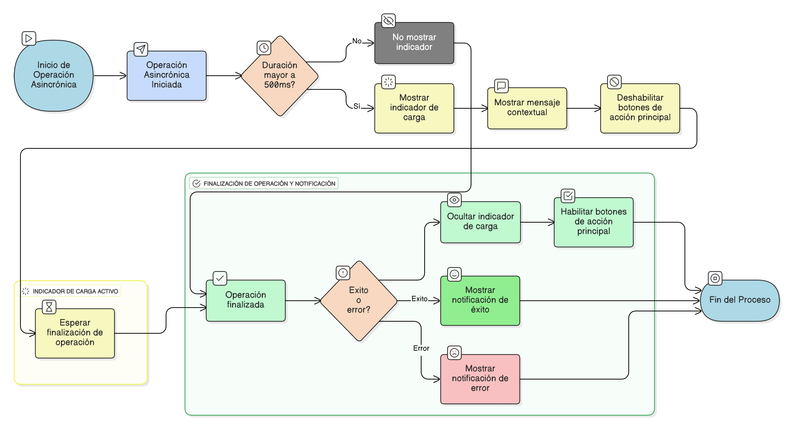

## HU-IDEAM-SNIF-REST-076

> **Identificador Historia de Usuario:** hu-ideam-snif-rest-076 \
> **Nombre Historia de Usuario:** Módulo de restauración - Indicadores de Carga y Feedback Asincrónico

> **Área Proyecto:** Subdirección de Ecosistemas e Información Ambiental \
> **Nombre proyecto:** Realizar la construcción temática, mejoras informáticas y optimización del Módulo de restauración del SNIF del IDEAM. \
> **Líder funcional:** Wilmer Espitia Muñoz\
> **Analista de requerimiento de TI:** Sergio Alonso Anaya Estévez

## DESCRIPCIÓN HISTORIA DE USUARIO

> **Como:** usuario del sistema.  \
> **Quiero:**  recibir una indicación visual clara durante el procesamiento de datos asincrónicos.  \
> **Para:** : saber que la operación está en curso, evitar clics duplicados y no abandonar la página prematuramente.

## CRITERIOS DE ACEPTACIÓN

1.	**Indicadores de Carga Visual**     
    1.1. El sistema debe mostrar un indicador de carga visible (spinner, barra de progreso o animación) durante cualquier operación asincrónica que dure más de 500ms (Ej: envío de formulario, carga de datos pesados).    
    1.2. El spinner o indicador debe estar acompañado de un mensaje contextual (Ej: “Guardando información…” o "Procesando datos geográficos...").

2.	**Comportamiento del Indicador**    
    2.1. El indicador debe aparecer inmediatamente al iniciar el proceso asincrónico.   
    2.2. El indicador debe desaparecer inmediatamente y dar paso a la Notificación de Éxito/Error (Ver [HU-71](../HU-IDEAM-SNIF-REST-071/HU-IDEAM-SNIF-REST-071.md)) al finalizar el proceso.     
    2.3. Mientras el indicador esté visible, los botones de acción principal (Guardar/Enviar) deben estar deshabilitados.

## DIAGRAMA DE SECUENCIA

## DIAGRAMA DE FLUJO DEL PROCESO

## PROTOTIPO PRELIMINAR

## ANEXOS

- Guía de estilo para el diseño de spinners y mensajes de carga.

