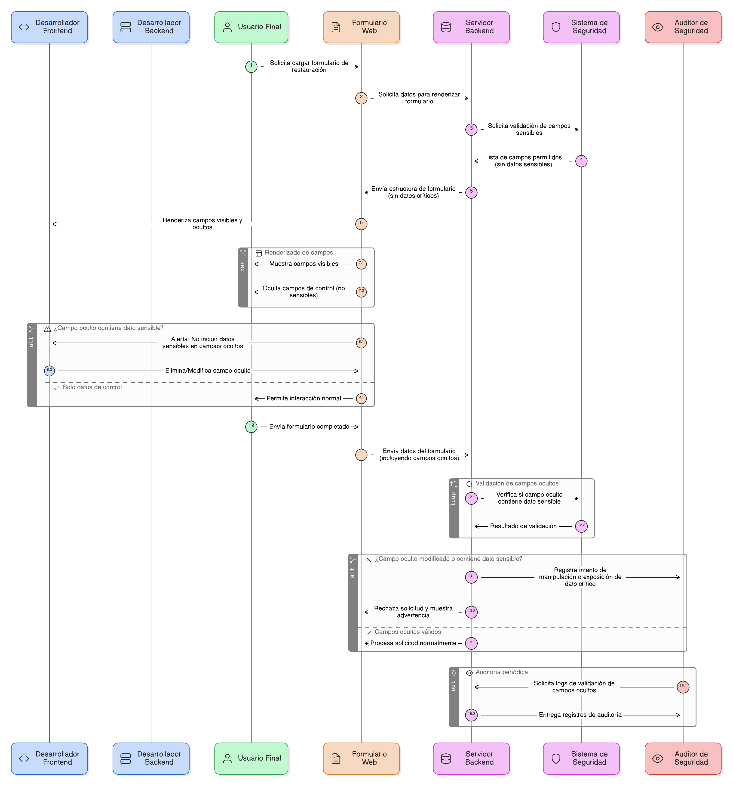
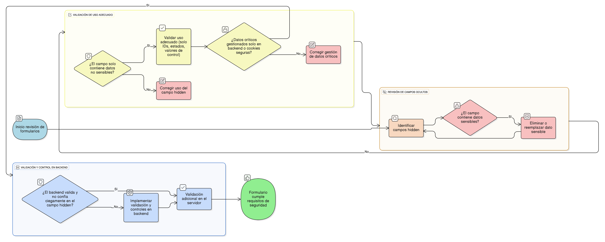

## HU-IDEAM-SNIF-REST-080

> **Identificador Historia de Usuario:** hu-ideam-snif-rest-080 \
> **Nombre Historia de Usuario:** Módulo de restauración - Gestión de Campos Ocultos y Datos Sensibles.

> **Área Proyecto:** Subdirección de Ecosistemas e Información Ambiental \
> **Nombre proyecto:** Realizar la construcción temática, mejoras informáticas y optimización del Módulo de restauración del SNIF del IDEAM. \
> **Líder funcional:** Wilmer Espitia Muñoz\
> **Analista de requerimiento de TI:** Sergio Alonso Anaya Estévez

## DESCRIPCIÓN HISTORIA DE USUARIO

> **Como:** desarrollador de frontend/backend.  \
> **Quiero:**  asegurar que los campos ocultos (hidden) del formulario no contengan información sensible.   \
> **Para:** prevenir la exposición involuntaria de datos críticos (como tokens o claves) a atacantes que puedan inspeccionar el código fuente del cliente.

## CRITERIOS DE ACEPTACIÓN

1.	**Restricción de Contenido**    
    1.1. Los campos de formulario de tipo hidden no deben exponer información sensible que pueda ser utilizada para comprometer el sistema (Ej: claves de acceso, contraseñas, *passphrases*).  
    1.2. Ningún campo hidden debe contener tokens de sesión, claves de API o credenciales de conexión.

2.	**Uso Adecuado de Campos Ocultos**  
    2.1. Los campos hidden solo deben usarse para datos de control no sensible (Ej: IDs de registro, estado de formulario) o valores esperados para validaciones en el servidor.    
    2.2. Los datos críticos deben gestionarse a través de variables de sesión seguras en el backend o mediante mecanismos de cookies protegidas.

3.	**Validación del Backend** 
    3.1. El backend no debe confiar ciegamente en el valor de un campo oculto, asumiendo que es inmutable.

    

## DIAGRAMA DE SECUENCIA

## DIAGRAMA DE FLUJO DEL PROCESO

## PROTOTIPO PRELIMINAR

## ANEXOS

- Guía de buenas prácticas para el manejo de tokens y variables de sesión.

