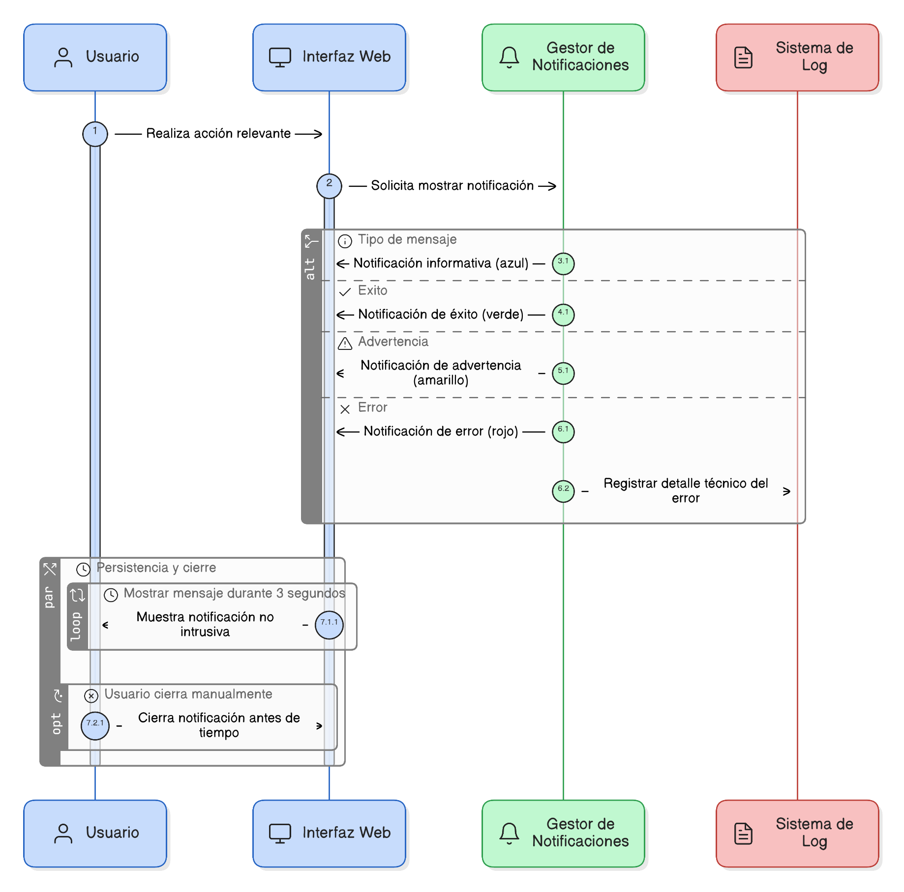
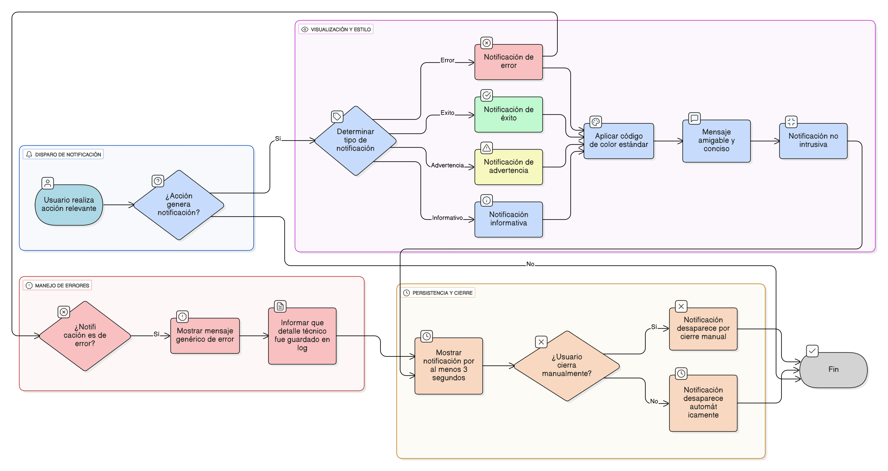

## HU-IDEAM-SNIF-REST-082

> **Identificador Historia de Usuario:** hu-ideam-snif-rest-082 \
> **Nombre Historia de Usuario:** Módulo de restauración - Visualización de Mensajes Informativos.

> **Área Proyecto:** Subdirección de Ecosistemas e Información Ambiental \
> **Nombre proyecto:** Realizar la construcción temática, mejoras informáticas y optimización del Módulo de restauración del SNIF del IDEAM. \
> **Líder funcional:** Wilmer Espitia Muñoz\
> **Analista de requerimiento de TI:** Sergio Alonso Anaya Estévez

## DESCRIPCIÓN HISTORIA DE USUARIO

> **Como:** usuario del sistema.  \
> **Quiero:** que el sistema me muestre notificaciones claras y rápidas sobre el resultado de mis interacciones.  \
> **Para:** recibir retroalimentación visual inmediata sin interrumpir mi trabajo.

## CRITERIOS DE ACEPTACIÓN

1.	**Tipos y Consistencia Visual**  
    1.1. El sistema debe mostrar notificaciones tipo toast o alert ante cualquier acción relevante.  
    1.2. Los mensajes deben seguir un código de color estándar: 
    - Verde: Éxito.
    - Rojo: Error.
    - Amarillo: Advertencia.
    - Azul: Informativo.  

    1.3. Los mensajes deben ser amigables y concisos para el usuario final

2.	**Persistencia y Desaparición**  
    2.1. Los mensajes se deben mostrar por un mínimo de 3 segundos (persistencia adecuada).  
    2.2. El usuario debe tener la opción de cerrar el mensaje manualmente antes de que expire el tiempo.  
    2.3. Los mensajes deben ser no intrusivos (no deben bloquear la interacción con el resto de la interfaz).

3.	**Referencia al Log**  
    3.1. En caso de notificaciones de Error, el mensaje mostrado debe ser genérico e informar al usuario que el detalle técnico fue guardado en el log.
    

## DIAGRAMA DE SECUENCIA

## DIAGRAMA DE FLUJO DEL PROCESO

## PROTOTIPO PRELIMINAR

## ANEXOS

- Especificación de textos de notificaciones estándar.
- Wireframe: Visualización de Mensajes Informativos.

