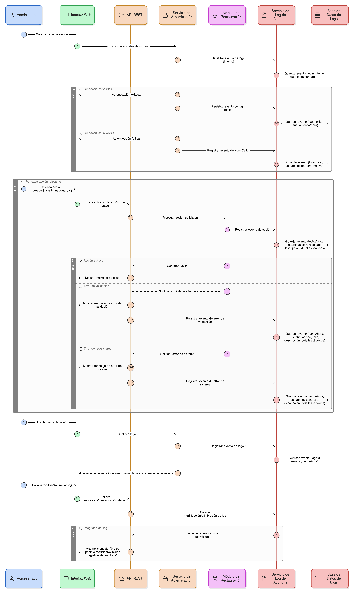
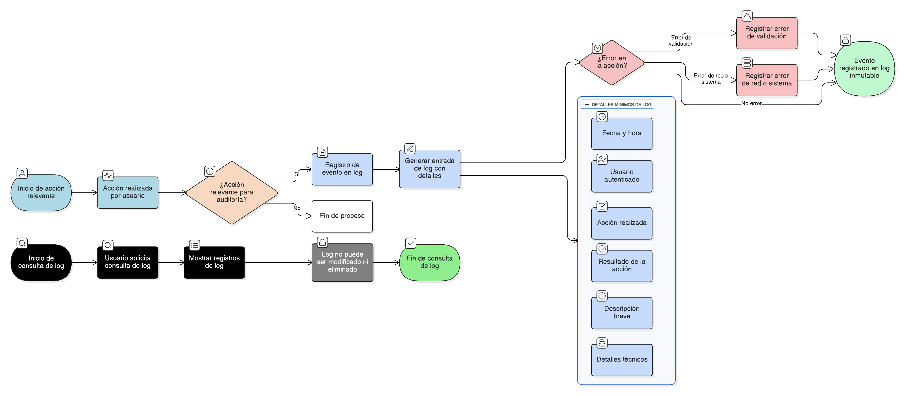

## HU-IDEAM-SNIF-REST-083

> **Identificador Historia de Usuario:** hu-ideam-snif-rest-083 \
> **Nombre Historia de Usuario:** Módulo de restauración - Registro de Eventos (Log de Auditoría).

> **Área Proyecto:** Subdirección de Ecosistemas e Información Ambiental \
> **Nombre proyecto:** Realizar la construcción temática, mejoras informáticas y optimización del Módulo de restauración del SNIF del IDEAM. \
> **Líder funcional:** Wilmer Espitia Muñoz\
> **Analista de requerimiento de TI:** Sergio Alonso Anaya Estévez

## DESCRIPCIÓN HISTORIA DE USUARIO

> **Como:** administrador del sistema.  \
> **Quiero:** que cada acción relevante y evento del sistema quede documentado de forma inmutable.  \
> **Para:** permitir la auditoría de seguridad, identificar el origen de los problemas y garantizar la trazabilidad de los cambios en los datos.

## CRITERIOS DE ACEPTACIÓN

1.	**Eventos a Registrar**  
    1.1. Cada acción relevante debe ser guardada en un log de auditoría (registro de eventos), incluyendo, pero sin limitarse a: 
    
    - Login/logout.
    - Guardar/crear/editar/eliminar registros.
    - Error de validación.
    - Error de red/sistema.  

2.	**Formato de Log (Detalle)**  
    2.1. Cada entrada del log debe incluir como mínimo:

    - Fecha/Hora (con precisión de segundos). 
    - Usuario autenticado.
    - Acción realizada.
    - Resultado (Éxito/Fallo).
    - Descripción (breve resumen).
    - Detalles Técnicos (tabla/objeto afectado, payload de la acción, si aplica).

3.	**Integridad del Log**  
    3.1. El log, una vez creado, no puede ser modificado ni eliminado desde la interfaz del usuario, garantizando su integridad.
    

## DIAGRAMA DE SECUENCIA

## DIAGRAMA DE FLUJO DEL PROCESO

## PROTOTIPO PRELIMINAR

## ANEXOS

- Estructura de la base de datos de auditoría.
- Wireframe: Registro de Eventos (Log de Auditoría).

