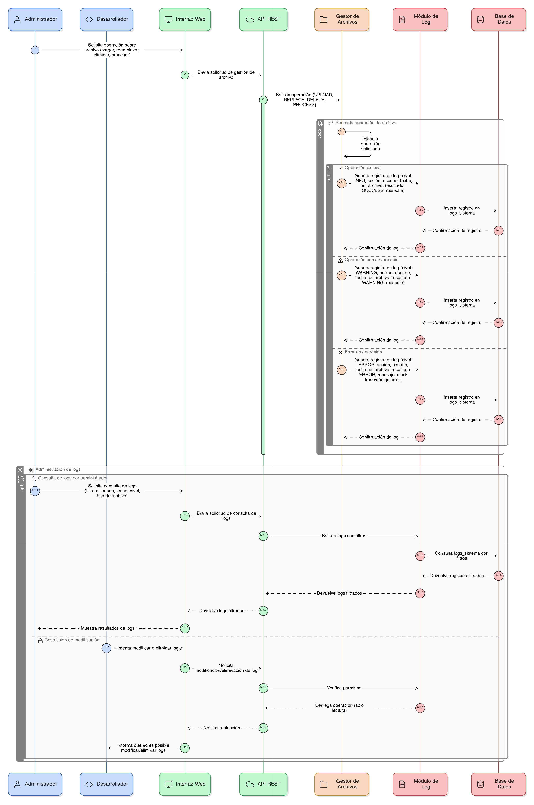
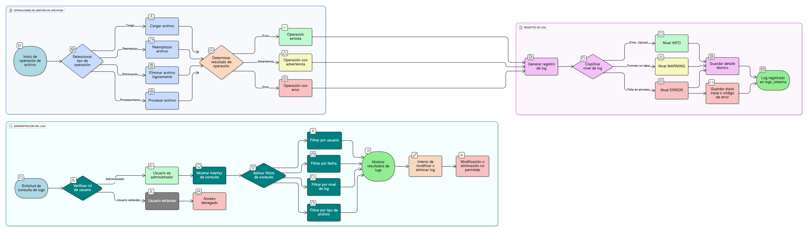

## HU-IDEAM-SNIF-REST-088

> **Identificador Historia de Usuario:** hu-ideam-snif-rest-088 \
> **Nombre Historia de Usuario:** Módulo de restauración - Detalle avanzado y administración del Log de procesamiento de archivos

> **Área Proyecto:** Subdirección de Ecosistemas e Información Ambiental \
> **Nombre proyecto:** Realizar la construcción temática, mejoras informáticas y optimización del Módulo de restauración del SNIF del IDEAM. \
> **Líder funcional:** Wilmer Espitia Muñoz\
> **Analista de requerimiento de TI:** Sergio Alonso Anaya Estévez

## DESCRIPCIÓN HISTORIA DE USUARIO

> **Como:** administrador del sistema y desarrollador. \
> **Quiero:**  un registro de log con detalle técnico y clasificación por nivel para todas las operaciones de gestión de archivos.  \
> **Para:** poder auditar acciones de archivos, depurar rápidamente errores de procesamiento y verificar la trazabilidad de los archivos con precisión.

## CRITERIOS DE ACEPTACIÓN

1. **Registro Obligatorio de Eventos**  
   1.1 Por cada operación de gestión de archivos (carga, reemplazo, eliminación, procesamiento), el sistema debe generar un registro en la tabla de logs (logs_sistema).   
   1.2 Las acciones a registrar deben incluir: UPLOAD, REPLACE, DELETE (lógico), y PROCESS (para archivos geográficos o complejos).

2. **Formato Mínimo del Log**  
   2.1 . El registro de log para archivos debe incluir los siguientes campos mínimos de detalle técnico: id_log (PK, autoincremental), fecha_hora * usuario, acción (UPLOAD, REPLACE, DELETE, PROCESS), resultado (SUCCESS, ERROR), id_archivo (FK a la tabla adjuntos) y mensaje (descripción corta). 

3. **Clasificación y Detalle de Error**  
   3.1 Los logs deben clasificarse por niveles: INFO (éxito, upload), WARNING (formato no ideal), y ERROR (falla en el servidor/proceso).   
   3.2 Si el proceso de carga/procesamiento falla (por formato no admitido o error del servidor), el sistema debe guardar el stack trace resumido o el código de error completo en el log.

4. **Administración del Log**  
   4.1 Solo los administradores (rol específico) pueden consultar los logs a través de la interfaz.   
   4.2 La consulta debe permitir el filtrado por usuario, fecha, nivel de log (INFO/ERROR) o tipo de archivo.
   4.3 Los logs no pueden ser modificados ni eliminados por usuarios estándar.

## DIAGRAMA DE SECUENCIA

## DIAGRAMA DE FLUJO DEL PROCESO

## PROTOTIPO PRELIMINAR

## ANEXOS

- Mapeo de errores de carga de archivos a los niveles de log (INFO/WARNING/ERROR).
