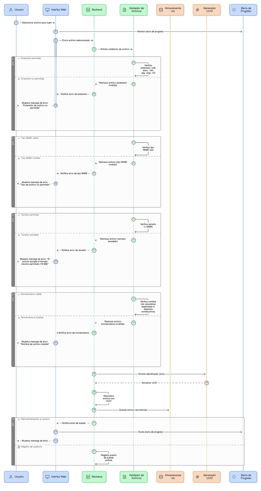
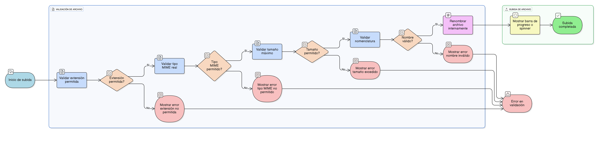

## HU-IDEAM-SNIF-REST-090

> **Identificador Historia de Usuario:** hu-ideam-snif-rest-090 \
> **Nombre Historia de Usuario:** Módulo de restauración - Validación de formato, tamaño y nomenclatura de archivos documentales

> **Área Proyecto:** Subdirección de Ecosistemas e Información Ambiental \
> **Nombre proyecto:** Realizar la construcción temática, mejoras informáticas y optimización del Módulo de restauración del SNIF del IDEAM. \
> **Líder funcional:** Wilmer Espitia Muñoz\
> **Analista de requerimiento de TI:** Sergio Alonso Anaya Estévez

## DESCRIPCIÓN HISTORIA DE USUARIO

> **Como:** sistema. \
> **Quiero:**  aplicar estrictas validaciones a los archivos documentales antes y durante la subida.   \
> **Para:** garantizar el cumplimiento de las políticas de formato, tamaño y seguridad de la información.

## CRITERIOS DE ACEPTACIÓN

1. **Validación de Tipo y Extensión**  
   1.1 Solo se deben aceptar archivos con las siguientes extensiones: .pdf, .docx, .xlsx, .jpg, .png, .txt.     
   1.2. El sistema debe validar el tipo MIME real del archivo para prevenir archivos maliciosos renombrados.

2. **Validación de Tamaño**  
   2.1 El tamaño máximo permitido es de 10 MB.         
   2.2. Si el archivo supera este límite, se debe mostrar el mensaje: “El archivo excede el tamaño máximo permitido (10 MB)”. (Ver (Ver [HU-IDEAM-SNIF-REST-082](/content/historias_usuario/HU-IDEAM-SNIF-REST-082/HU-IDEAM-SNIF-REST-082.md y (Ver [HU-IDEAM-SNIF-REST-088](/content/historias_usuario/HU-IDEAM-SNIF-REST-088/HU-IDEAM-SNIF-REST-088.md))))).

3. **Validación de Nomenclatura y Renombre**  
   3.1 No se deben permitir nombres de archivo con caracteres especiales o espacios consecutivos al subir.     
   3.2. El sistema debe renombrar internamente el archivo subido utilizando un identificador único (Ej: UUID o hash) antes de guardarlo en el disco.

4. **Retroalimentación de Subida**  
   4.1 Se debe mostrar una barra de progreso o un spinner (Ver (Ver [HU-IDEAM-SNIF-REST-076](/content/historias_usuario/HU-IDEAM-SNIF-REST-076/HU-IDEAM-SNIF-REST-076.md))) mientras la subida se está realizando.

## DIAGRAMA DE SECUENCIA

## DIAGRAMA DE FLUJO DEL PROCESO

## PROTOTIPO PRELIMINAR

## ANEXOS

- Lista de tipos MIME permitidos para cada extensión.
