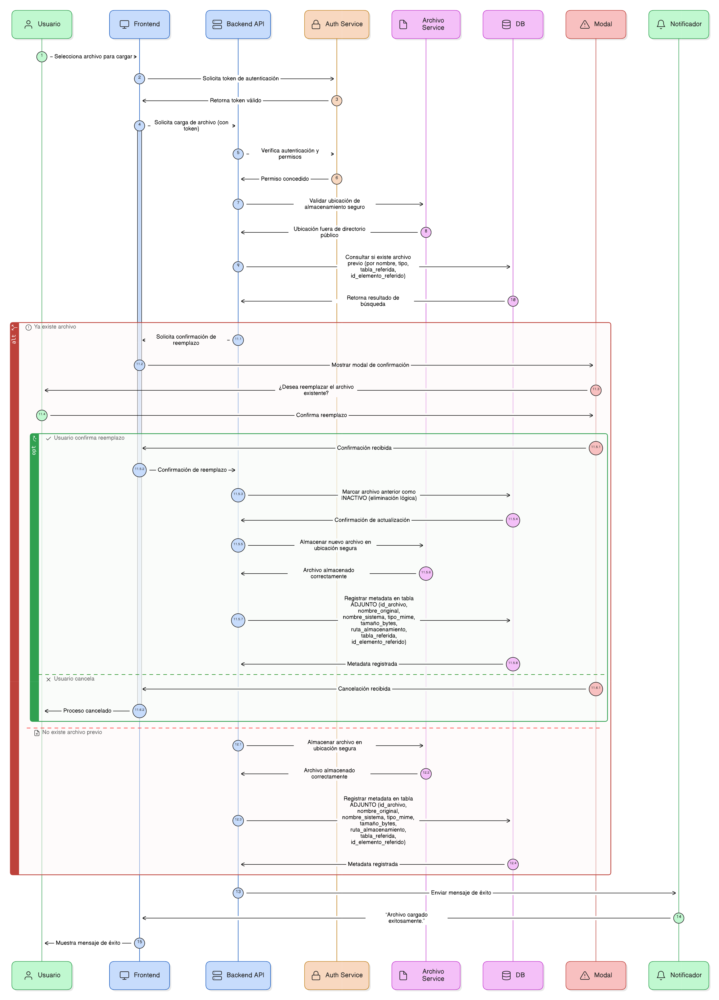
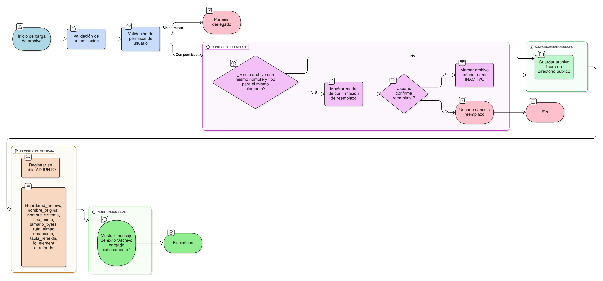

## HU-IDEAM-SNIF-REST-091

> **Identificador Historia de Usuario:** hu-ideam-snif-rest-091 \
> **Nombre Historia de Usuario:** Módulo de restauración - Gestión de archivos en disco y control de reemplazo

> **Área Proyecto:** Subdirección de Ecosistemas e Información Ambiental \
> **Nombre proyecto:** Realizar la construcción temática, mejoras informáticas y optimización del Módulo de restauración del SNIF del IDEAM. \
> **Líder funcional:** Wilmer Espitia Muñoz\
> **Analista de requerimiento de TI:** Sergio Alonso Anaya Estévez

## DESCRIPCIÓN HISTORIA DE USUARIO

> **Como:** desarrollador de backend. \
> **Quiero:**  almacenar de forma segura los archivos documentales y gestionar los casos de reemplazo de forma controlada.   \
> **Para:** asegurar que los archivos no sean accesibles públicamente y mantener la integridad de la información asociada al registro.

## CRITERIOS DE ACEPTACIÓN

1. **Almacenamiento Seguro**  
   1.1 Los archivos físicos deben almacenarse fuera del directorio público del servidor (no accesibles por URL directa).    
   1.2. El acceso a los archivos debe ser mediante endpoints autenticados (Ver AUTENTICACIÓN) que verifican los permisos del usuario antes de servir el archivo.

2. **Registro de Metadata**  
   2.1 La metadata del archivo debe registrarse en la tabla ADJUNTO (Ver HU-086), incluyendo: id_archivo, nombre_original, nombre_sistema, tipo_mime, tamaño_bytes, ruta_almacenamiento, y las claves de trazabilidad (tabla_referida, id_elemento_referido).

3. **Control de Reemplazo**  
   3.1 Si el usuario intenta subir un archivo con el mismo nombre y tipo sobre el mismo elemento/registro (tabla_referida + id_elemento_referido), el sistema debe mostrar una modal de confirmación para solicitar el reemplazo (Ver (Ver [HU-IDEAM-SNIF-REST-070](/content/historias_usuario/HU-IDEAM-SNIF-REST-070/HU-IDEAM-SNIF-REST-070.md))).      
   3.2. Si el usuario confirma el reemplazo, el archivo anterior debe ser marcado como eliminación lógica (estado = 'INACTIVO') y el nuevo archivo se registra.

4. **Notificación Final**  
   4.1 Al finalizar la carga exitosamente, se debe mostrar el mensaje: “Archivo cargado exitosamente.” (Ver HU-082).

## DIAGRAMA DE SECUENCIA

## DIAGRAMA DE FLUJO DEL PROCESO

## PROTOTIPO PRELIMINAR

## ANEXOS

- Especificación del endpoint seguro para la descarga de archivos.
