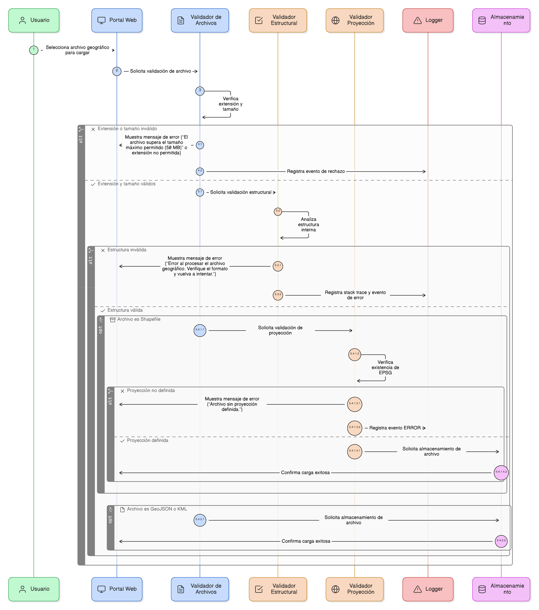
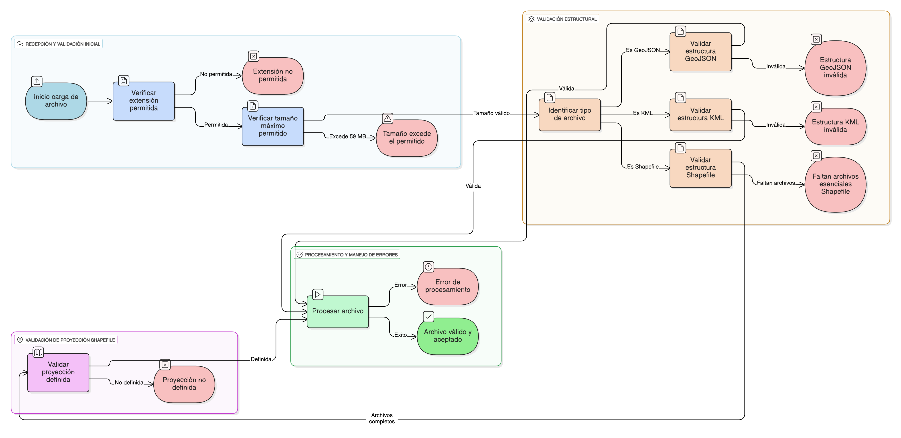

## HU-IDEAM-SNIF-REST-093

> **Identificador Historia de Usuario:** hu-ideam-snif-rest-093 \
> **Nombre Historia de Usuario:** Módulo de restauración - Validación estructural y de proyección para archivos geográficos

> **Área Proyecto:** Subdirección de Ecosistemas e Información Ambiental \
> **Nombre proyecto:** Realizar la construcción temática, mejoras informáticas y optimización del Módulo de restauración del SNIF del IDEAM. \
> **Líder funcional:** Wilmer Espitia Muñoz\
> **Analista de requerimiento de TI:** Sergio Alonso Anaya Estévez

## DESCRIPCIÓN HISTORIA DE USUARIO

> **Como:** sistema de procesamiento geoespacial. \
> **Quiero:**  verificar que los archivos cargados cumplan con las especificaciones de formato y contengan la información de proyección necesaria.   \
> **Para:** evitar errores en la estandarización y asegurar que las geometrías sean válidas en el mapa.

## CRITERIOS DE ACEPTACIÓN

1. **Restricción de Extensiones y Tamaño**  
   1.1  Solo se deben aceptar extensiones: .geojson, .kml, .zip (para Shapefile).    
   1.2. El límite máximo de tamaño es 50 MB. Si se excede, se muestra el mensaje: “El archivo supera el tamaño máximo permitido (50 MB).” (Ver HU-088).

2. **Validación Estructural**  
   2.1 El sistema debe validar la estructura interna del archivo antes de la ingesta: GeoJSON: Debe contener los campos type y features; KML: Debe contener Placemark con geometrías válidas; ZIP (Shapefile): Debe incluir los 4 archivos esenciales (.shp, .dbf, .shx, .prj).

3. **Validación de Proyección (Shapefile)**  
   3.1 Si el archivo cargado es un Shapefile, el sistema debe validar que contenga un Sistema de Referencia Espacial (EPSG) definido.    
   3.2. Si falta la proyección, se debe rechazar la carga con el mensaje: “Archivo sin proyección definida.” (Registrando con nivel ERROR en el log, ver HU-088).s.

4. **Manejo de Errores de Procesamiento**  
   4.1  Si el archivo no puede ser procesado (corrupto, formato inválido, etc.), se muestra el mensaje: “Error al procesar el archivo geográfico. Verifique el formato y vuelva a intentar.” y se registra el stack trace en el log.

## DIAGRAMA DE SECUENCIA

## DIAGRAMA DE FLUJO DEL PROCESO

## PROTOTIPO PRELIMINAR

## ANEXOS

- Listado de códigos EPSG válidos para Colombia (si aplica).
