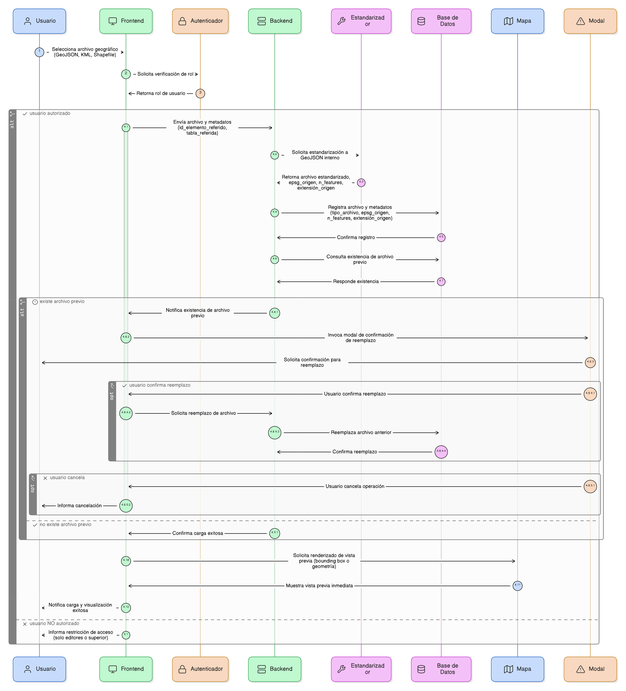
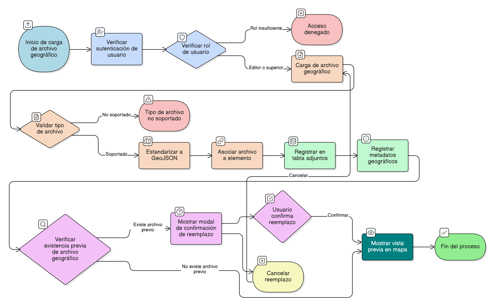

## HU-IDEAM-SNIF-REST-094

> **Identificador Historia de Usuario:** hu-ideam-snif-rest-094 \
> **Nombre Historia de Usuario:** Módulo de restauración - Estandarización, metadatos adicionales y control de acceso

> **Área Proyecto:** Subdirección de Ecosistemas e Información Ambiental \
> **Nombre proyecto:** Realizar la construcción temática, mejoras informáticas y optimización del Módulo de restauración del SNIF del IDEAM. \
> **Líder funcional:** Wilmer Espitia Muñoz\
> **Analista de requerimiento de TI:** Sergio Alonso Anaya Estévez

## DESCRIPCIÓN HISTORIA DE USUARIO

> **Como:** usuario del sistema.  \
> **Quiero:**  que mi archivo geográfico sea estandarizado y correctamente asociado al registro, y recibir una vista previa en el mapa.   \
> **Para:** confirmar que los datos se cargaron y se visualizan correctamente.

## CRITERIOS DE ACEPTACIÓN

1. **Estandarización y Persistencia**  
   1.1  El sistema debe estandarizar todos los archivos cargados (GeoJSON, KML, Shapefile) al formato GeoJSON interno para su almacenamiento y uso en el frontend.    
   1.2. El archivo queda enlazado al elemento correspondiente (proyecto, predio, zona) mediante id_elemento_referido y tabla_referida.

2. **Metadatos Geográficos Adicionales**  
   2.1 Se registra en la tabla adjuntos con los campos mínimos, además de los siguientes metadatos específicos para archivos geográficos: tipo_archivo = 'geográfico', epsg_origen, n_features (número de elementos cargados) y extensión_origen.

3. **Control de Acceso (Autenticación)**  
   3.1 Solo los usuarios con rol editor o superior pueden subir estos archivos geográficos (Ver AUTENTICACIÓN).

4. **Experiencia de Usuario (UX)**  
   4.1  Tras subir el archivo, el sistema debe mostrar una vista previa inmediata en el mapa, delimitando el bounding box o la geometría cargada.    
   4.2. Si ya existe un archivo geográfico para ese elemento y tipo, se debe invocar una modal de confirmación para el reemplazo (Ver [HU-IDEAM-SNIF-REST-070](/content/historias_usuario/HU-IDEAM-SNIF-REST-070/HU-IDEAM-SNIF-REST-070.md)).

## DIAGRAMA DE SECUENCIA

## DIAGRAMA DE FLUJO DEL PROCESO

## PROTOTIPO PRELIMINAR

## ANEXOS

- Protocolo de visualización de geometrías en el mapa (Ej: Leaflet o similar).
