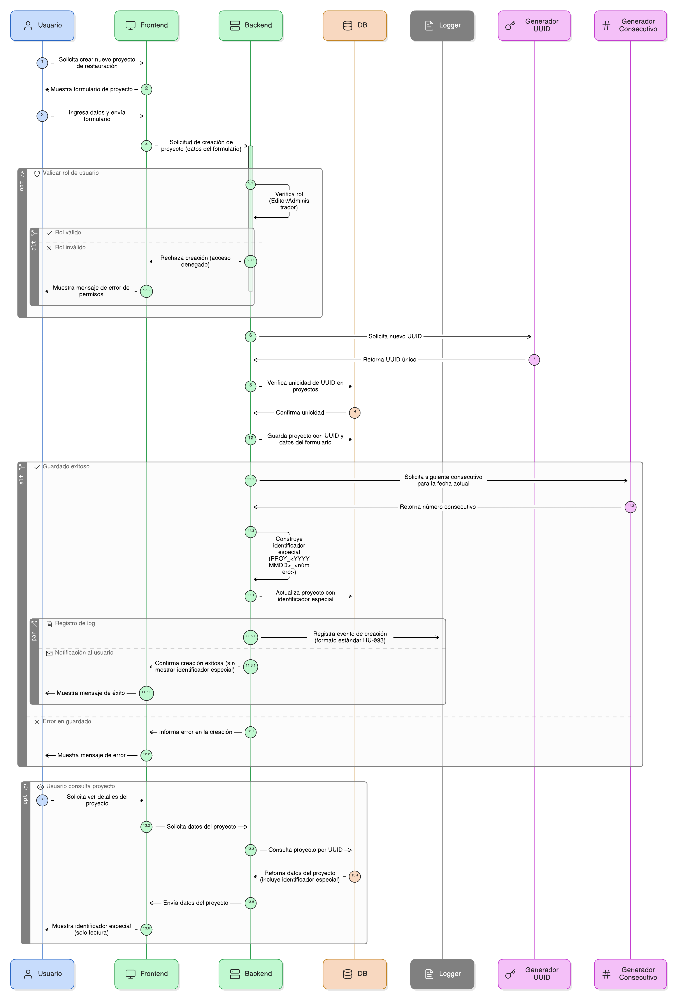
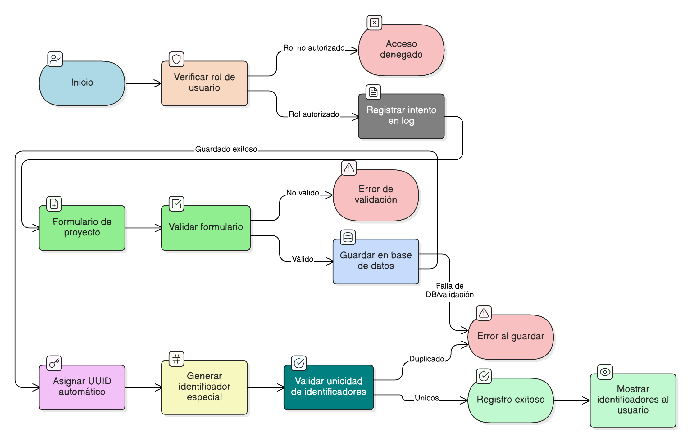

## HU-IDEAM-SNIF-REST-095

> **Identificador Historia de Usuario:** hu-ideam-snif-rest-095 \
> **Nombre Historia de Usuario:** Módulo de restauración - Formulario Proyecto: creación y asignación automática de identificadores

> **Área Proyecto:** Subdirección de Ecosistemas e Información Ambiental \
> **Nombre proyecto:** Realizar la construcción temática, mejoras informáticas y optimización del Módulo de restauración del SNIF del IDEAM. \
> **Líder funcional:** Wilmer Espitia Muñoz\
> **Analista de requerimiento de TI:** Sergio Alonso Anaya Estévez

## DESCRIPCIÓN HISTORIA DE USUARIO

> **Como:** usuario del sistema con rol adecuado. \
> **Quiero:**  registrar un nuevo proyecto de restauración.  \
> **Para:** iniciar la trazabilidad y la administración de los planes y sus atributos clave, obteniendo un identificador único y legible.

## CRITERIOS DE ACEPTACIÓN

1. **Control de acceso**  
   1.1 Solo los usuarios con el rol adecuado (Ej: Editor/Administrador) pueden crear o editar proyectos.   
   1.2 El registro en el log debe cumplir con el Formato de Log estándar definido en la HU-083.

2. **Asignación de UUID**  
   2.1 El sistema debe asignar un UUID automático e irrepetible al crear un nuevo formulario (guardado inicial). 

3. **Generador de identificador especial**  
   3.1 Al guardar el registro exitosamente, el sistema debe generar el identificador especial con la estructura: PROY_<YYYYMMDD>_<número consecutivo>.   
   3.2 Si ocurre un error durante el guardado (falla de DB/validación), el sistema no debe generar ni consumir el consecutivo para mantener la integridad.

4. **Validación de unicidad**  
   4.1 El campo del identificador especial (PROY_...) no es visible durante la creación o edición del formulario, solo después de que el registro ha sido guardado.   
   4.2 El campo del identificador especial no es editable por el usuario.

5. **Visibilidad y editabilidad**  
   5.1 El sistema debe validar que tanto el UUID como el identificador especial (PROY_...) sean únicos dentro de la tabla de proyectos. 

## DIAGRAMA DE SECUENCIA

## DIAGRAMA DE FLUJO DEL PROCESO

## PROTOTIPO PRELIMINAR

## ANEXOS

- Especificación del algoritmo de generación de consecutivo (<número consecutivo>).
