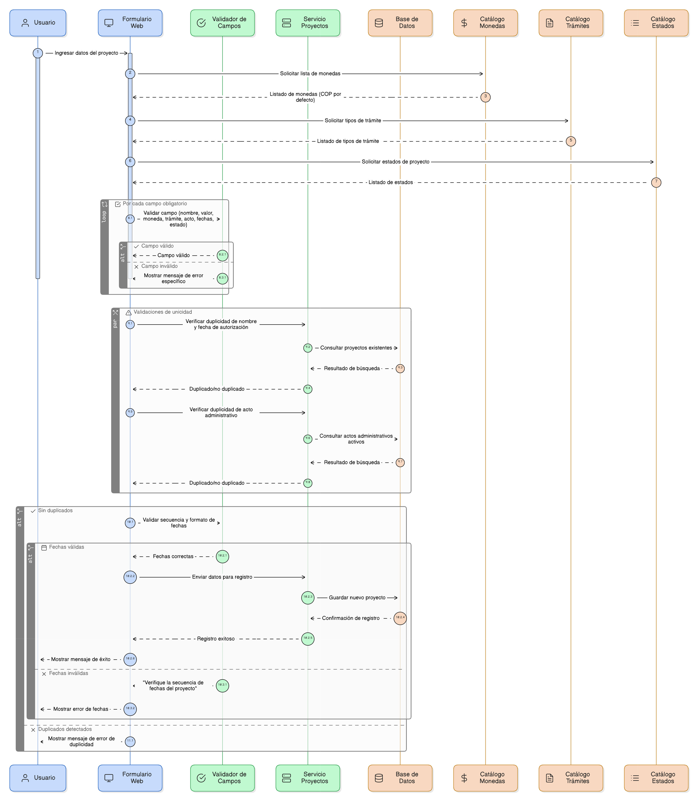
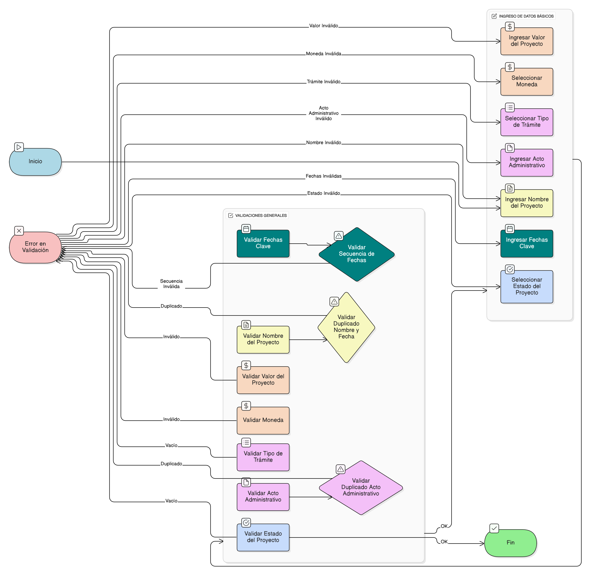

## HU-IDEAM-SNIF-REST-096

> **Identificador Historia de Usuario:** hu-ideam-snif-rest-096 \
> **Nombre Historia de Usuario:** Módulo de restauración - Formulario Proyecto: campos básicos y validaciones

> **Área Proyecto:** Subdirección de Ecosistemas e Información Ambiental \
> **Nombre proyecto:** Realizar la construcción temática, mejoras informáticas y optimización del Módulo de restauración del SNIF del IDEAM. \
> **Líder funcional:** Wilmer Espitia Muñoz\
> **Analista de requerimiento de TI:** Sergio Alonso Anaya Estévez

## DESCRIPCIÓN HISTORIA DE USUARIO

> **Como:** usuario del sistema. \
> **Quiero:**  ingresar la información básica del proyecto.  \
> **Para:** que el registro cumpla con los requisitos mínimos de identificación, financieros y legales.

## CRITERIOS DE ACEPTACIÓN

1. **Registro del Nombre del Proyecto**  
   1.1 El campo nombre del Proyecto debe ser obligatorio y no debe contener solo espacios.    
   1.2 Longitud: Mínimo 5 y Máximo 150 caracteres.  
   1.3. Caracteres permitidos: Solo letras, números, guiones y espacios (no caracteres especiales).   
   1.4. Validación de Duplicados: No se puede registrar otro proyecto con el mismo nombre y la misma fecha de autorización.

2. **Registro de Valor y Moneda**  
   2.1 El campo Valor del Proyecto debe ser obligatorio, aceptar solo números enteros positivos (sin decimales), y no debe ser 0 ni negativo.  
   2.2 Se permiten separadores de miles opcionales en el formato de número.   
   2.3 Mensaje de error: “Ingrese un valor válido en pesos colombianos”.  
   2.4. El campo Moneda es obligatorio. Se carga por defecto con “COP – Pesos Colombianos” y se alimenta desde la tabla de dominio dom_moneda. 

3. **Tipo de Trámite y Acto Administrativo**  
   3.1 El campo Tipo de Trámite es obligatorio y se alimenta desde la tabla dom_tipo_tramite.     
   3.2. Mensaje de error si está vacío: “Debe seleccionar un tipo de trámite”.    
   3.3. Acto Administrativo es obligatorio. Longitud máxima: 50 caracteres.  
   3.4. Formato validado por RegEx: ^[A-Za-z0-9\-]+$ (letras, números y guiones).  
   3.5. Se debe validar que no haya duplicados en el número del acto administrativo entre los proyectos activos.  

4. **Registro de Fechas Clave**  
   4.1 Los campos Fecha de Autorización, Registro, Inicio y Finalización son obligatorios.   
   4.2. Secuencia temporal estricta: Fecha de autorización ≤ Fecha de registro ≤ Fecha de inicio ≤ Fecha de finalización. Si se incumple, mostrar: “Verifique la secuencia de fechas del proyecto”.   
   4.3. Las fechas (excepto Finalización) no pueden ser futuras.

5. **Estado del Proyecto**  
   5.1 El campo Estado del Proyecto es obligatorio. Los valores provienen de una enumeración.   
   5.2. El valor debe mostrarse como texto legible y no es editable manualmente (solo selección).

## DIAGRAMA DE SECUENCIA

## DIAGRAMA DE FLUJO DEL PROCESO

## PROTOTIPO PRELIMINAR

## ANEXOS

- Listado de valores de la enumeración moneda, dom_tipo_tramite y estado_proyecto.
