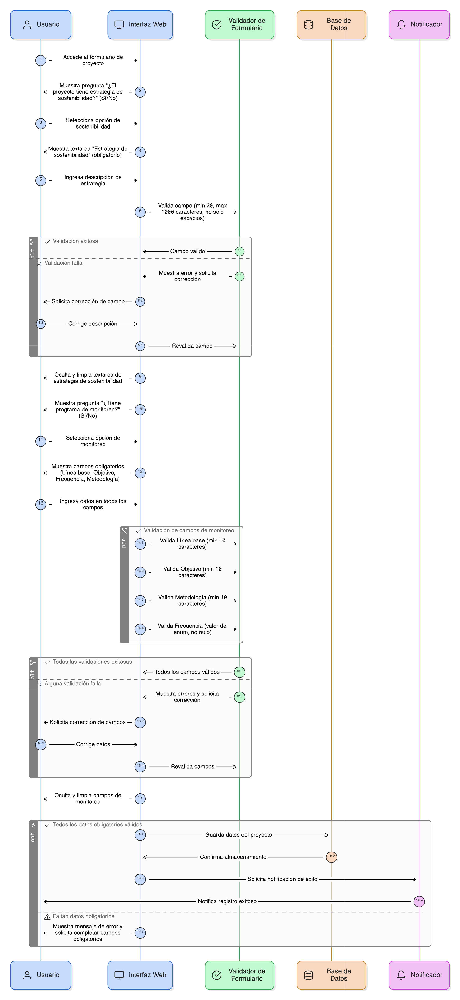
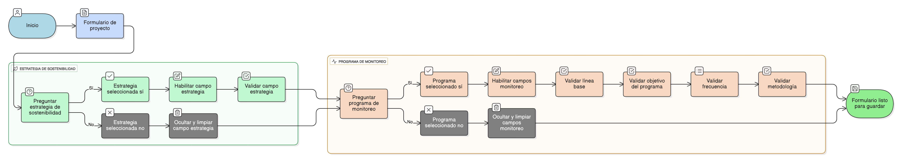

## HU-IDEAM-SNIF-REST-097

> **Identificador Historia de Usuario:** hu-ideam-snif-rest-097 \
> **Nombre Historia de Usuario:** Módulo de restauración - Formulario Proyecto: lógica condicional de sostenibilidad y monitoreo

> **Área Proyecto:** Subdirección de Ecosistemas e Información Ambiental \
> **Nombre proyecto:** Realizar la construcción temática, mejoras informáticas y optimización del Módulo de restauración del SNIF del IDEAM. \
> **Líder funcional:** Wilmer Espitia Muñoz\
> **Analista de requerimiento de TI:** Sergio Alonso Anaya Estévez

## DESCRIPCIÓN HISTORIA DE USUARIO

> **Como:** usuario del sistema. \
> **Quiero:**  ingresar la descripción de la estrategia de sostenibilidad y el programa de monitoreo, solo si el proyecto cuenta con ellos.  \
> **Para:** asegurar que solo se soliciten y registren los datos pertinentes al proyecto.

## CRITERIOS DE ACEPTACIÓN

1. **Estrategia de Sostenibilidad**  
   1.1 El sistema debe mostrar una lista obligatoria: “¿El proyecto tiene estrategia de sostenibilidad?” (Opciones: Sí / No).   
   1.2. Lógica Condicional: Si el usuario selecciona Sí, se habilita el textarea Estrategia de sostenibilidad. Si selecciona No, el textarea se oculta y limpia.   
   1.3. Validación Condicional: Si se selecciona Sí, el campo de texto es obligatorio, con longitud mínima de 20 y máxima de 1000 caracteres, y no puede contener solo espacios.

2. **Programa de Monitoreo**  
   2.1 El campo “¿Tiene programa de monitoreo?” es obligatorio (Sí/No).    
   2.2. Lógica Condicional: Si el usuario selecciona Sí, se habilitan los siguientes campos, todos obligatorios: Línea base (textarea), Objetivo del programa (textarea), Frecuencia (lista enum), Metodología (textarea).  
   2.3. Si se selecciona No, todos los campos anteriores se desactivan y se limpian.   
   2.4. Validaciones Específicas: Los textos tienen longitud mínima de 10 caracteres (si son obligatorios) y la frecuencia debe pertenecer al enum y no puede ser nula si la opción es Sí. 

## DIAGRAMA DE SECUENCIA

## DIAGRAMA DE FLUJO DEL PROCESO

## PROTOTIPO PRELIMINAR

## ANEXOS

- Listado de valores de la enumeración enum frecuencia_monitoreo.
