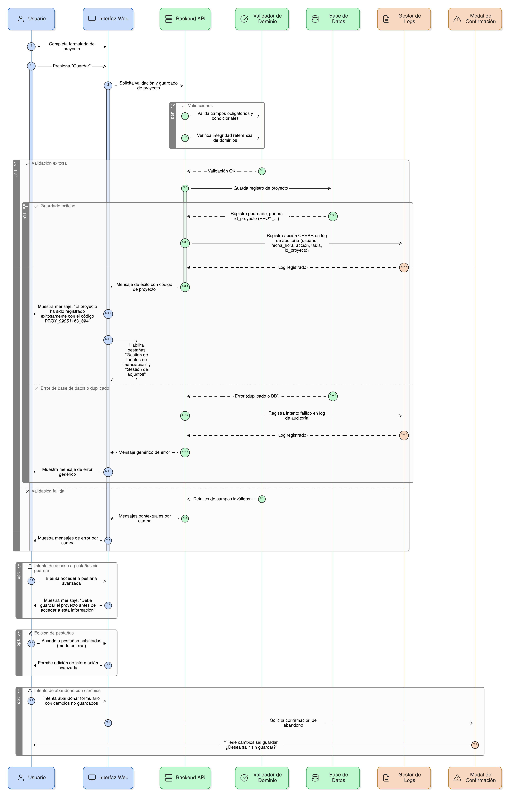
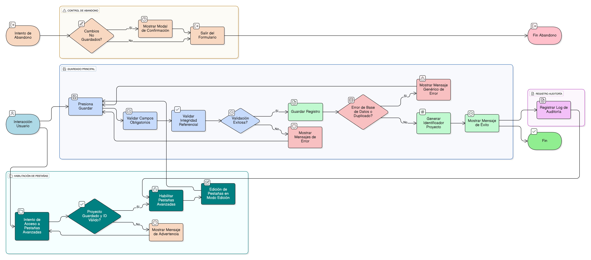

## HU-IDEAM-SNIF-REST-098

> **Identificador Historia de Usuario:** hu-ideam-snif-rest-098 \
> **Nombre Historia de Usuario:** Módulo de restauración - Formulario Proyecto: flujo de guardado y habilitación de pestañas 

> **Área Proyecto:** Subdirección de Ecosistemas e Información Ambiental \
> **Nombre proyecto:** Realizar la construcción temática, mejoras informáticas y optimización del Módulo de restauración del SNIF del IDEAM. \
> **Líder funcional:** Wilmer Espitia Muñoz\
> **Analista de requerimiento de TI:** Sergio Alonso Anaya Estévez

## DESCRIPCIÓN HISTORIA DE USUARIO

> **Como:** usuario del sistema. \
> **Quiero:**  guardar el formulario principal del proyecto y obtener una retroalimentación clara.   \
> **Para:** : asegurar el registro inicial y habilitar las opciones de gestión avanzada (financiamiento y adjuntos).

## CRITERIOS DE ACEPTACIÓN

1. **Flujo de Guardado Principal**  
   1.1 Al presionar Guardar, el sistema debe validar todos los campos obligatorios (incluyendo condicionales) y la integridad referencial de los dominios.   
   1.2. Si falla la validación, se muestran mensajes contextuales por campo (Ver HU-073).   
   1.3. Si todo es correcto, se guarda el registro, se genera el identificador (PROY_...), y se muestra mensaje de éxito: “El proyecto ha sido registrado exitosamente con el código PROY_20251108_004”.   
   1.4. Se deben controlar errores de base de datos o duplicados con mensajes genéricos (Ver [HU-IDEAM-SNIF-REST-071](/content/historias_usuario/HU-IDEAM-SNIF-REST-071/HU-IDEAM-SNIF-REST-071.md) y [HU-IDEAM-SNIF-REST-084](/content/historias_usuario/HU-IDEAM-SNIF-REST-084/HU-IDEAM-SNIF-REST-084.md)).

2. **Registro de Logs de Auditoría**  
   2.1 Toda operación (Crear, Editar) debe registrarse en el log de auditoría (Ver [HU-IDEAM-SNIF-REST-083](/content/historias_usuario/HU-IDEAM-SNIF-REST-083/HU-IDEAM-SNIF-REST-083.md)) con: usuario, fecha_hora, acción (CREAR/EDITAR), tabla_afectada (proyecto) e id_proyecto.   

3. **Habilitación de Pestañas**  
   3.1. Las pestañas "Gestión de fuentes de financiación" y "Gestión de adjuntos" solo se habilitan una vez que el proyecto ha sido guardado exitosamente y existe un id_proyecto válido.     
   3.2. Si el usuario intenta acceder a las pestañas sin guardar, se muestra el mensaje: “Debe guardar el proyecto antes de acceder a esta información".    
   3.3. Las pestañas pueden editarse en cualquier momento (modo edición).  
   
4. **Controles de Abandono**  
   4.1 Si el usuario intenta abandonar el formulario con cambios no guardados, se mostrará una modal de confirmación: “Tiene cambios sin guardar. ¿Desea salir sin guardar?” (Ver [HU-IDEAM-SNIF-REST-070](/content/historias_usuario/HU-IDEAM-SNIF-REST-070/HU-IDEAM-SNIF-REST-070.md)).  

## DIAGRAMA DE SECUENCIA

## DIAGRAMA DE FLUJO DEL PROCESO

## PROTOTIPO PRELIMINAR

## ANEXOS

- Mapeo de errores de validación a mensajes específicos.
