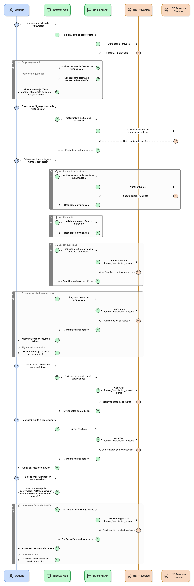
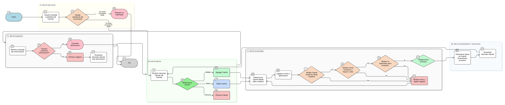

## HU-IDEAM-SNIF-REST-099

> **Identificador Historia de Usuario:** hu-ideam-snif-rest-099 \
> **Nombre Historia de Usuario:** Módulo de restauración - Gestión de Fuentes de Financiación

> **Área Proyecto:** Subdirección de Ecosistemas e Información Ambiental \
> **Nombre proyecto:** Realizar la construcción temática, mejoras informáticas y optimización del Módulo de restauración del SNIF del IDEAM. \
> **Líder funcional:** Wilmer Espitia Muñoz\
> **Analista de requerimiento de TI:** Sergio Alonso Anaya Estévez

## DESCRIPCIÓN HISTORIA DE USUARIO

> **Como:** usuario del sistema. \
> **Quiero:**  agregar, editar o eliminar múltiples fuentes de financiación asociadas al proyecto.   \
> **Para:** : registrar los aportes y recursos financieros de forma detallada.

## CRITERIOS DE ACEPTACIÓN

1. **Control de habilitación**  
   1.1 La pestaña solo se habilita una vez que el proyecto está guardado, es decir el id_proyecto existe.   
   1.2. El sistema debe validar que el proyecto  tenga un id_proyecto váliddo, antes de permitir agregar fuentes.   

2. **Funcionalidad de Adición y Edición**  
   2.1 El usuario puede agregar varias fuentes de financiación. \
   2.2 Cada fuente se selecciona desde la tabla maestra de fuentes de financiación y puede registrar un monto asignado (numérico, positivo) y una descripción opcional.  

3. **Validaciones**  
   3.1. Validar que cada fuente seleccionada exista en su respectiva tabla maestra.     
   3.2. Validar que el monto sea numérico y mayor a 0.    
   3.3. No permitir duplicar una misma fuente de financiación para un mismo proyecto.  
   
4. **Almacenamiento y Visualización**  
   4.1 Los datos se almacenan en la tabla fuente_financiacion_proyecto, referenciados por id_proyecto.  
   4.2 El sistema debe mostrar un resumen tabular de las fuentes agregadas con las opciones: Editar y Eliminar.

5. **Eliminación**  
   5.1 Al eliminar una fuente, se debe mostrar un mensaje de confirmación: “¿Desea eliminar esta fuente de financiación del proyecto?” (Ver [HU-IDEAM-SNIF-REST-070](/content/historias_usuario/HU-IDEAM-SNIF-REST-070/HU-IDEAM-SNIF-REST-070.md)).

## DIAGRAMA DE SECUENCIA

## DIAGRAMA DE FLUJO DEL PROCESO

## PROTOTIPO PRELIMINAR

## ANEXOS

- Mapeo de errores de validación a mensajes específicos.
- Estructura de la tabla fuente_financiacion_proyecto.
