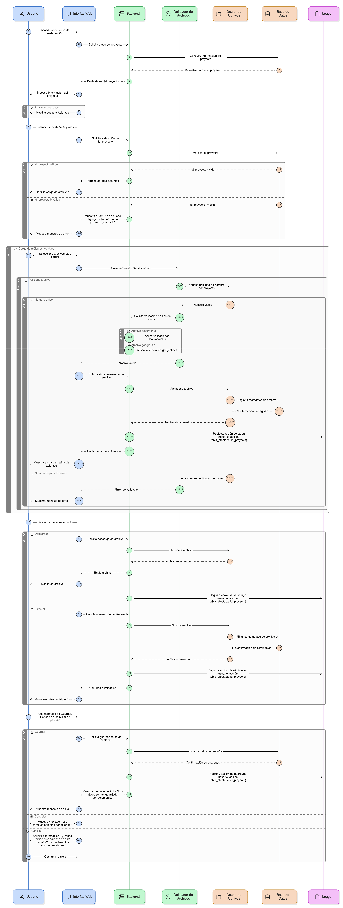
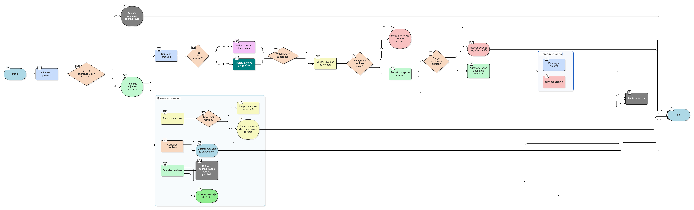

## HU-IDEAM-SNIF-REST-100

> **Identificador Historia de Usuario:** hu-ideam-snif-rest-100 \
> **Nombre Historia de Usuario:** Módulo de restauración - Pestaña Gestión de Adjuntos y Controles de Pestaña

> **Área Proyecto:** Subdirección de Ecosistemas e Información Ambiental \
> **Nombre proyecto:** Realizar la construcción temática, mejoras informáticas y optimización del Módulo de restauración del SNIF del IDEAM. \
> **Líder funcional:** Wilmer Espitia Muñoz\
> **Analista de requerimiento de TI:** Sergio Alonso Anaya Estévez

## DESCRIPCIÓN HISTORIA DE USUARIO

> **Como:** usuario del sistema. \
> **Quiero:** gestionar los documentos y archivos geográficos asociados al proyecto, y tener controles independientes para cada pestaña.   \
> **Para:** mantener la evidencia documental y tener flexibilidad al guardar la información.

## CRITERIOS DE ACEPTACIÓN

1. **Control de Habilitación y Trazabilidad**  
   1.1 La pestaña Adjuntos se habilita después de guardar el proyecto.   
   1.2. El sistema debe validar que el proyecto  tenga un id_proyecto váliddo, antes de permitir agregar adjuntos.   

2. **Gestión de Carga**  
   2.1 El usuario puede subir múltiples archivos (documentales y geográficos) \
   2.2 Para los archivos documentales se aplican las validaciones de carga de archivos no geográficos. Ver ([HU-IDEAM-SNIF-REST-090](/content/historias_usuario/HU-IDEAM-SNIF-REST-090/HU-IDEAM-SNIF-REST-090.md)). \
   2.3 Para los archivos se aplican las validaciones de carga de arhivos geográficos. Ver ([HU-IDEAM-SNIF-REST-093](/content/historias_usuario/HU-IDEAM-SNIF-REST-093/HU-IDEAM-SNIF-REST-093.md)). \

3. **Visualización y Funcionalidad**  
   3.1. El sistema muestra una tabla con los adjuntos cargados y opciones de Descargar y Eliminar.     
   3.2. Se debe validar la unicidad del nombre de archivo por proyecto.    
   3.3. Mostrar mensaje de error en caso de validación o carga fallida.  
   
4. **Controles de Acción de Pestaña**
   4.1 Cada pestaña debe tener sus propios controles de Guardar, Cancelar y Reiniciar, independientes del formulario principal.  
   4.2 Al Guardar se muestra mensaje de éxito: “Los datos se han guardado correctamente.”. \
   4.3 Al Cancelar se revierten los cambios no guardados y muestra: “Los cambios han sido cancelados.” No se afectan datos previos. \
   4.4 Al Reiniciar se limpia los campos de la pestaña activa, pidiendo una confirmación: “¿Desea reiniciar los campos de esta pestaña? Se perderán los datos no guardados.”. \
   4.5 Los botones se deshabilitan durante la operación de guardado para evitar duplicados.
 
5. **Log y Seguridad** \
   5.1 Toda operación de pestaña (Guardar, Cargar Adjunto) debe registrarse en logs con: usuario, acción, tabla_afectada e id_proyecto.

## DIAGRAMA DE SECUENCIA

## DIAGRAMA DE FLUJO DEL PROCESO

## PROTOTIPO PRELIMINAR

## ANEXOS

-	Estructura de la relación de adjuntos a la tabla proyecto.