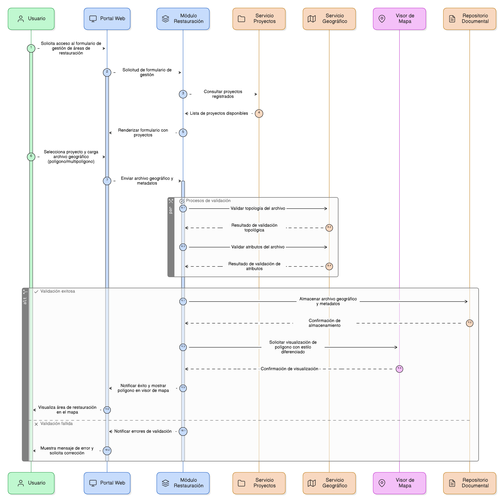
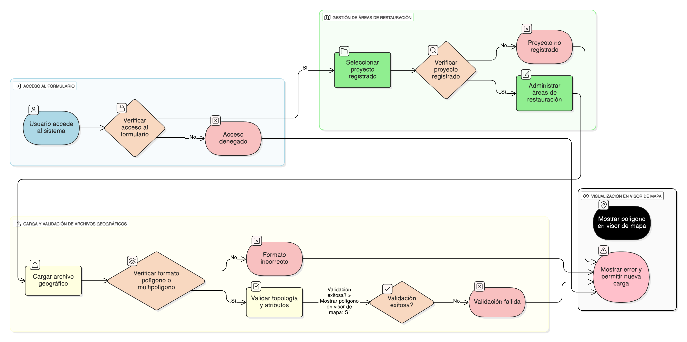

## HU-IDEAM-SNIF-REST-101

> **Identificador Historia de Usuario:** hu-ideam-snif-rest-101 \
> **Nombre Historia de Usuario:** Módulo de restauración - Formulario Gestión de Áreas de Restauración

> **Área Proyecto:** Subdirección de Ecosistemas e Información Ambiental \
> **Nombre proyecto:** Realizar la construcción temática, mejoras informáticas y optimización del Módulo de restauración del SNIF del IDEAM. \
> **Líder funcional:** Wilmer Espitia Muñoz\
> **Analista de requerimiento de TI:** Sergio Alonso Anaya Estévez

## DESCRIPCIÓN HISTORIA DE USUARIO

> **Como:** usuario del sistema. \
> **Quiero:** acceder al formulario para cargar, validar y gestionar todas las áreas de restauración asociadas a un proyecto, incluyendo sus atributos temáticos (acciones, técnicas, monitoreo, etc.).   \
> **Para:** registrar la información espacial y documental necesaria para el seguimiento completo de la restauración.

## CRITERIOS DE ACEPTACIÓN

1. **Funcionales generales**  
   1.1 Debe permitir el acceso al formulario. \
   1.2 Debe permitir cargar y administrar las áreas de restauración asociadas a proyectos previamente registrados. \
   1.3 Permitir la carga de archivo geográfico con geometría poligono o multipoligono. \
   1.4 Validar de topología y atributos de los archivos geográficos cargados. \
   1.5 Cuando la validación sea exitosa, cuando se completa la carga, entonces el sistema debe mostrar el polígono en el visor de mapa con un estilo diferenciado.

## DIAGRAMA DE SECUENCIA

## DIAGRAMA DE FLUJO DEL PROCESO

## PROTOTIPO PRELIMINAR

## ANEXOS

-	Historias de usuario del HU-102 a HU-114