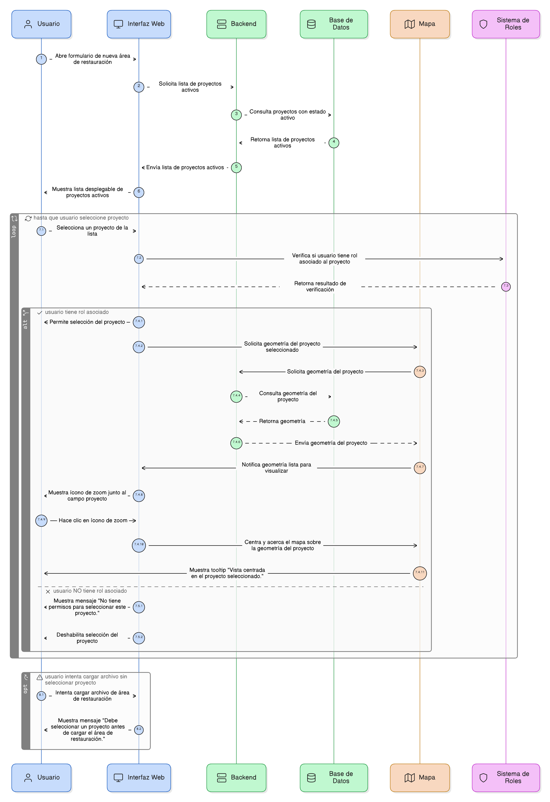
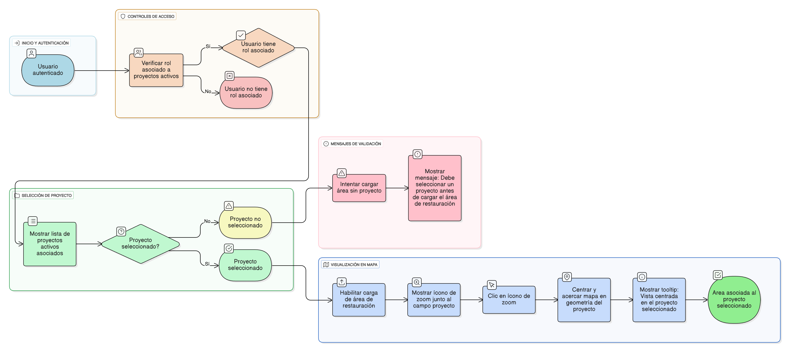

## HU-IDEAM-SNIF-REST-102

> **Identificador Historia de Usuario:** hu-ideam-snif-rest-102 \
> **Nombre Historia de Usuario:** Módulo de restauración - Selección de Proyecto y Controles de Acceso.

> **Área Proyecto:** Subdirección de Ecosistemas e Información Ambiental \
> **Nombre proyecto:** Realizar la construcción temática, mejoras informáticas y optimización del Módulo de restauración del SNIF del IDEAM. \
> **Líder funcional:** Wilmer Espitia Muñoz\
> **Analista de requerimiento de TI:** Sergio Alonso Anaya Estévez

## DESCRIPCIÓN HISTORIA DE USUARIO

> **Como:** usuario del sistema. \
> **Quiero:** seleccionar un proyecto activo para asociar una nueva área de restauración y visualizar su geometría en el mapa.   \
> **Para:** garantizar la correcta asociación de datos y contexto espacial.

## CRITERIOS DE ACEPTACIÓN

1. **Selección de proyecto**  
   1.1 El campo Proyecto es obligatorio. Si no se selecciona proyecto y se intenta cargar un archivo, el sistema debe mostrar: “Debe seleccionar un proyecto antes de cargar el área de restauración.”  
   1.2 El formulario debe mostrar una lista desplegable para poder seleccionar de los proyectos disponibles, que deben ser solo los que tienen un estado activo. \
   1.3 Solo usuarios con rol asociado al proyecto pueden seleccionar este mismo. \
   1.4 Al seleccionar un proyecto, debe aparecer un ícono de zoom junto al campo que permita que el mapa centre y haga automaticame un acercamiento sobre la geometría del proyecto seleccionado. Se debe mostrar un tooltip “Vista centrada en el proyecto seleccionado.”
.

## DIAGRAMA DE SECUENCIA

## DIAGRAMA DE FLUJO DEL PROCESO

## PROTOTIPO PRELIMINAR

## ANEXOS

-	[HU-IDEAM-SNIF-REST-101](/content/historias_usuario/HU-IDEAM-SNIF-REST-101/HU-IDEAM-SNIF-REST-101.md)