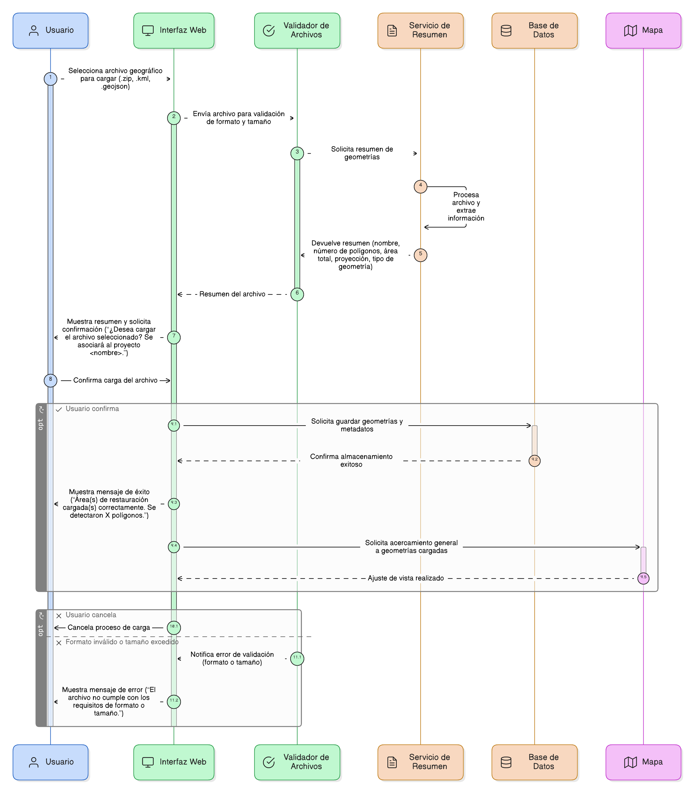
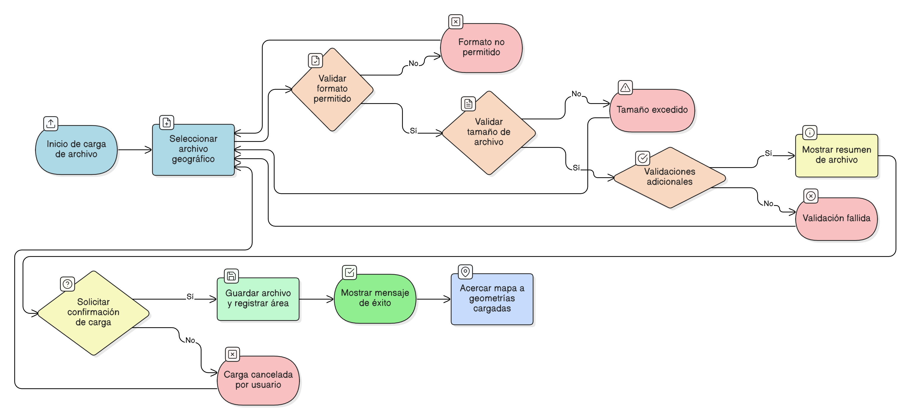

## HU-IDEAM-SNIF-REST-103

> **Identificador Historia de Usuario:** hu-ideam-snif-rest-103 \
> **Nombre Historia de Usuario:** Módulo de restauración - Carga de Archivo Geográfico (Formatos y Resumen).

> **Área Proyecto:** Subdirección de Ecosistemas e Información Ambiental \
> **Nombre proyecto:** Realizar la construcción temática, mejoras informáticas y optimización del Módulo de restauración del SNIF del IDEAM. \
> **Líder funcional:** Wilmer Espitia Muñoz\
> **Analista de requerimiento de TI:** Sergio Alonso Anaya Estévez

## DESCRIPCIÓN HISTORIA DE USUARIO

> **Como:** usuario del sistema. \
> **Quiero:** cargar un archivo geográfico para registrar el área de restauración.   \
> **Para:** verificar el formato del archivo y obtener un resumen de las geometrías antes de confirmar su ingreso al sistema.

## CRITERIOS DE ACEPTACIÓN

1. **Carga, Resumen y Confirmación**  
   1.1 El control de carga debe permitir los siguientes formatos: .zip (que contenga shapefile válido: .shp, .shx, .dbf), .kml o .geojson. \
   1.2 El sistema debe validar que el tamaño del archivo no exceda 20 MB. \
   1.3 Si el archivo pasa las validaciones (ver [HU-IDEAM-SNIF-REST-104](/content/historias_usuario/HU-IDEAM-SNIF-REST-104/HU-IDEAM-SNIF-REST-104.md)), el sistema debe mostrar un resumen antes de confirmar la carga, con los siguientes datos: Nombre del archivo, Número de polígonos detectados, Área total (ha), Proyección (EPSG), Tipo de geometría. \
   1.4 El sistema debe solicitar la confirmación del usuario antes de guardar, mostrando el siguiente mensaje: “¿Desea cargar el archivo seleccionado? Se asociará al proyecto <nombre>.” \
   1.5 Se debe mostrar mensaje de éxito: “Área(s) de restauración cargada(s) correctamente. Se detectaron X polígonos.”. \
   1.6 Tras la carga exitosa, el mapa debe realiza un acercamiento general para visualizar todas las geometrías cargadas.

## DIAGRAMA DE SECUENCIA

## DIAGRAMA DE FLUJO DEL PROCESO

## PROTOTIPO PRELIMINAR

## ANEXOS

-	[HU-IDEAM-SNIF-REST-101](/content/historias_usuario/HU-IDEAM-SNIF-REST-101/HU-IDEAM-SNIF-REST-101.md)
-  Mapeo de errores de validación a mensajes específicos.
